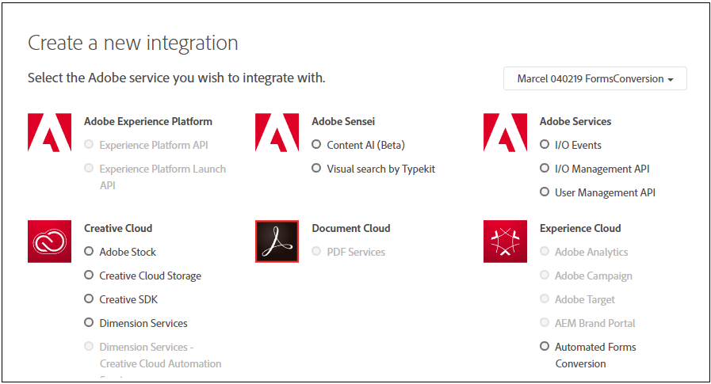

# De service Automated Forms Conversion configureren {#about-this-help}

In deze Help ziet u hoe een AEM-beheerder de service Automated Forms Conversion kan configureren om de conversie van PDF-formulieren naar adaptieve formulieren te automatiseren. Deze hulp is voor IT en beheerders AEM bij uw organisatie. De verstrekte informatie is gebaseerd op de veronderstelling dat iedereen die deze Hulp leest met de volgende technologieën vertrouwd is:

* Adobe Experience Manager- en AEM-pakketten installeren, configureren en beheren,

* Linux- en Microsoft Windows-besturingssystemen gebruiken

* SMTP-mailservers configureren

>[!VIDEO](https://video.tv.adobe.com/v/29267/)

**Bekijk de video of lees het artikel om de service Automated Forms Conversion te configureren**

## On-boarding{#onboarding}

De service is gratis beschikbaar voor klanten op locatie met AEM 6.4 Forms en AEM 6.5 Forms en Adobe Managed Service Enterprise-klanten. U kunt contact opnemen met het verkoopteam van Adobe of uw Adobe-vertegenwoordiger om toegang tot de service te vragen.

Adobe biedt uw organisatie toegang tot deze gegevens en verleent de persoon die in uw organisatie als beheerder is aangewezen de vereiste bevoegdheden. De beheerder kan toegang tot uw ontwikkelaars (gebruikers) van Vormen AEM van uw organisatie verlenen om met de dienst te verbinden.

## Vereisten {#prerequisites}

U hebt het volgende nodig om de Automated Forms Conversion Service te gebruiken:

* De geautomatiseerde dienst van de Omzetting van Vormen wordt toegelaten voor uw organisatie
* Een Adobe-id-account met beheerdersrechten voor de conversieservice
* Een up-to-date AEM 6.4 of AEM 6.5 auteurinstantie met het nieuwste AEM Service Pack
* Een AEM-gebruiker (in uw AEM-instantie) die lid is van een gebruikersgroep voor formulieren

## De omgeving instellen {#setuptheservice}

Voordat u de service gebruikt, moet u de instantie van uw AEM-auteur voorbereiden om verbinding te maken met de service die wordt uitgevoerd op Adobe Cloud. Voer de volgende stappen in de vermelde reeks uit om uw exemplaar voor de service voor te bereiden:

1. [Download en installeer AEM 6.4 of AEM 6.5](#aemquickstart)
1. [De nieuwste AEM Service Pack downloaden en installeren](#servicepack)
1. [Het nieuwste invoegpakket voor AEM Forms downloaden en installeren](#downloadaemformsaddon)
1. [Aangepaste thema&#39;s en sjablonen maken](#referencepackage)

### Download en installeer AEM 6.4 of AEM 6.5 {#aemquickstart}


De service Automated Forms Conversion wordt uitgevoerd op de auteur-instantie van AEM. U hebt AEM 6.4 of AEM 6.5 nodig om een instantie van de auteur van AEM in te stellen. Als AEM niet actief is, kunt u het downloaden van de volgende locaties:

* Als u een bestaande AEM-klant bent, downloadt u AEM 6.4 of AEM 6.5 van de [Adobe-licentiewebsite](http://licensing.adobe.com).

* Als u een Adobe-partner bent, gebruikt u het [Adobe Partner Training Program](https://adobe.allegiancetech.com/cgi-bin/qwebcorporate.dll?idx=82357Q) om AEM 6.4 of AEM 6.5 aan te vragen.

Nadat u AEM hebt gedownload, raadpleegt u het [implementeren en onderhouden](https://helpx.adobe.com/experience-manager/6-5/sites/deploying/using/deploy.html#defaultlocalinstall)van instructies voor het instellen van een AEM-auteurinstantie.

### Download en installeer de nieuwste AEM Service Pack {#servicepack}

Download en installeer het nieuwste AEM Service Pack. Voor gedetailleerde instructies zie, of [AEM 6.4 de Nota&#39;s](https://helpx.adobe.com/experience-manager/6-4/release-notes/sp-release-notes.html) van de Versie van het Pak van de Dienst of [AEM 6.5 de Nota&#39;s](https://helpx.adobe.com/experience-manager/6-5/release-notes/sp-release-notes.html)van de Versie van het Pak van de Dienst.

### AEM Forms add-on-pakket downloaden en installeren {#downloadaemformsaddon}

Een AEM-exemplaar bevat basisformuliermogelijkheden. Voor de conversieservice zijn alle mogelijkheden van AEM Forms vereist. Download en installeer het invoegpakket AEM Forms om alle mogelijkheden van AEM Forms te benutten. Het pakket is vereist om de conversieservice in te stellen en uit te voeren. Zie Mogelijkheden voor gegevensvastlegging [installeren en configureren voor gedetailleerde instructies.](https://helpx.adobe.com/experience-manager/6-5/forms/using/installing-configuring-aem-forms-osgi.html)

>[!NOTE]
> Als u een bestaande gebruiker van de service Automated Forms Conversion bent, installeert u de nieuwste invoegtoepassing voor AEM Forms om de service te blijven gebruiken. Het aansluitingspakket wordt samengevoegd met het pakket AEM Forms Add-on. Het extra schakelaarpakket wordt niet meer vereist.
> Zorg ervoor dat u de verplichte configuraties na de installatie uitvoert nadat u het invoegpakket hebt geïnstalleerd.


### Aangepaste thema&#39;s en sjablonen maken {#referencepackage}

Als u AEM in [productiemodus](https://helpx.adobe.com/experience-manager/6-5/sites/administering/using/production-ready.html) start (geen samplcontent-runmode), worden de referentiepakketten niet geïnstalleerd. De referentiepakketten bevatten voorbeeldthema&#39;s en sjablonen. Voor de service voor automatische formulierconversie zijn ten minste één thema en één sjabloon vereist om een PDF-formulier naar een adaptief formulier te converteren. Creeer een douanethema en een malplaatje van uw eigen en de [puntdienstconfiguratie](#configure-the-cloud-service) om douanesjablonen en thema&#39;s te gebruiken alvorens de dienst te gebruiken.

## De service configureren {#configure-the-service}

Voordat u verdergaat met het configureren van de service en het verbinden van uw lokale exemplaar met de service die wordt uitgevoerd op Adobe Cloud, dient u meer te weten te komen over de personen en rechten die nodig zijn om verbinding te maken met de service. De dienst gebruikt twee verschillende types van persona&#39;s, beheerders en ontwikkelaars:

* **Beheerders**: Beheerders zijn verantwoordelijk voor het beheer van Adobe-software en -services voor hun organisatie. Beheerders verlenen ontwikkelaars in hun organisatie toegang tot de service voor automatische Forms Conversion die op Adobe Cloud wordt uitgevoerd. Wanneer een beheerder voor een organisatie wordt voorzien, ontvangt de beheerder een e-mail met titel **[!UICONTROL 'You now have administrator rights to manage Adobe software and services for your organization']**. Als u een beheerder bent, controleer uw brievenbus e-mail met bovengenoemde titel en ga te werk om toegang tot ontwikkelaars van uw organisatie [te](#adduseranddevs)verlenen.


* **Ontwikkelaars**: Een ontwikkelaar maakt een lokale auteur-instantie van AEM Forms verbinding met de service Automated Forms Conversion die op Adobe Cloud wordt uitgevoerd. Wanneer een beheerder een ontwikkelaar rechten verleent om verbinding te maken met de service Automated Forms Conversion, wordt een e-mail met de titel U hebt nu toegang tot ontwikkelaars om de Adobe API-integratie voor uw organisatie te beheren, verzonden naar de ontwikkelaar. Als u een ontwikkelaar bent, controleert u uw postvak op e-mail met de bovenstaande titel en gaat u verder om uw lokale AEM-instantie [aan te sluiten bij de service Automated Forms Conversion op Adobe Cloud.](#connectafcadobeio)


### (Alleen voor beheerders) Toegang verlenen aan ontwikkelaars van uw organisatie {#adduseranddevs}

Nadat Adobe de toegang voor uw organisatie heeft ingeschakeld en de beheerder de vereiste bevoegdheden heeft verleend, kan de beheerder zich aanmelden bij de beheerconsole (zie de gedetailleerde instructies hieronder), een profiel maken en ontwikkelaars toevoegen aan het profiel. Ontwikkelaars kunnen een lokale versie van AEM Forms verbinden met de service Automated Forms Conversion op Adobe Cloud.

De ontwikkelaars zijn leden van uw organisatie die wordt aangewezen om de omzettingsdienst in werking te stellen. Alleen ontwikkelaars die zijn toegevoegd aan het Adobe Automated Forms Conversion-serviceprofiel hebben het recht om de service Automated Forms Conversion te gebruiken. Voer de volgende stappen uit om een profiel te maken en er ontwikkelaars aan toe te voegen:

1. Meld u aan bij [beheerconsole](https://adminconsole.adobe.com/). Gebruik de **Adobe-id** van de beheerder die u hebt ingericht om de service Automated Forms Conversion te gebruiken voor het aanmelden. Meld u niet aan met een andere id of federatieve id.
1. Klik op de **[!UICONTROL Automated Forms Conversion]** optie.
1. Klik **[!UICONTROL New Profile]** op het **[!UICONTROL Products]** tabblad.
1. Geef **[!UICONTROL Name]**, **[!UICONTROL Display Name]** en **[!UICONTROL Description]** voor het profiel op. Klik op **[!UICONTROL Done]**. Er wordt een profiel gemaakt.

   

1. Voeg ontwikkelaar toe aan het profiel. U voegt als volgt de ontwikkelaars toe:
   1. Navigeer in de [beheerconsole](https://adminconsole.adobe.com/enterprise)naar het tabblad Overzicht.
   1. Klik op **[!UICONTROL Assign Developers]** de vereiste productkaart.
   1. Voer het e-mailadres en (optioneel) de naam en achternaam van de ontwikkelaar in.
   1. Selecteer productprofielen. Tik op **[!UICONTROL Save]**.

Herhaal bovenstaande stappen voor alle gebruikers.  Zie [Ontwikkelaars](https://helpx.adobe.com/enterprise/using/manage-developers.html)beheren voor meer informatie over het toevoegen van ontwikkelaars.

Nadat een beheerder ontwikkelaars heeft toegevoegd aan het Adobe I/O-profiel, worden de ontwikkelaars via e-mail op de hoogte gesteld. Nadat ontwikkelaars de e-mail hebben ontvangen, kunnen ze op Adobe Cloud [een lokale AEM Forms-instantie](#connectafcadobeio)verbinden met de service Automated Forms Conversion.

### (Alleen voor ontwikkelaars) Verbind uw lokale AEM Forms-instantie met de service Automated Forms Conversion op Adobe Cloud {#connectafcadobeio}

Nadat een beheerder u toegang tot de ontwikkelaar biedt, kunt u uw lokale AEM Forms-instantie verbinden met de conversieservice Automated Forms die wordt uitgevoerd in Adobe Cloud. Voer de volgende stappen in de vermelde reeks uit om uw instantie van Vormen AEM met de dienst te verbinden:

* [E-mailmeldingen configureren](configure-service.md#configureemailnotification)
* [Gebruiker toevoegen aan de groep met gebruikers van het formulier](#adduserstousergroup)
* [Openbare certificaten verkrijgen](#obtainpubliccertificates)
* [Adobe I/O-integratie maken](#createintegration)
* [De cloudservice configureren](configure-service.md#configure-the-cloud-service)

#### E-mailmelding configureren {#configureemailnotification}

De service Automated Forms Conversion gebruikt de Day CQ-mailservice om e-mailmeldingen te verzenden. Deze e-mailmeldingen bevatten informatie over geslaagde of mislukte conversies. Sla deze stappen over als u geen melding wilt ontvangen. Voer de volgende stappen uit om de Day CQ Mail Service te configureren:

1. Ga naar AEM configuratiemanager op `http://localhost:4502/system/console/configMgr`
1. Open de configuratie van de Day CQ Mail Service. Geef een waarde op voor de velden **[!UICONTROL SMTP server host name]**, **[!UICONTROL SMTP server port]** en **[!UICONTROL From address]** velden. Klik op **[!UICONTROL Save]**.

   U kunt contact opnemen met uw e-mailserviceprovider of IT-beheerder voor informatie over de hostnaam en poort van SMTP-server. U kunt elk geldig e-mailadres gebruiken in het veld Van. Bijvoorbeeld notification@example.com of donotreply@example.com.

1. Open de **[!UICONTROL Day CQ Link Externalizer]** configuratie. Geef in het **[!UICONTROL Domains]** veld de werkelijke hostnaam of het werkelijke IP-adres en het poortnummer op voor lokale, auteur- en publicatieinstanties. Klik op **[!UICONTROL Save]**.

#### Gebruiker toevoegen aan de groep met gebruikers van het formulier {#adduserstousergroup}

Geef een e-mailadres op in het profiel van de AEM-gebruiker die is aangewezen om de service uit te voeren. Zorg ervoor dat de gebruiker lid is van de gebruikersgroep [Formulieren](https://helpx.adobe.com/experience-manager/6-4/forms/using/forms-groups-privileges-tasks.html) . E-mails worden verzonden naar het e-mailadres van de gebruiker die de conversie uitvoert. U kunt als volgt een e-mailadres voor de gebruiker opgeven en gebruiker toevoegen aan de gebruikersgroep voor formulieren:

1. Meld u aan bij de auteur-instantie van AEM Forms als AEM-beheerder. Meld u aan met uw lokale AEM-referenties. Gebruik Adobe-id niet om u aan te melden. Tap **[!UICONTROL Adobe Experience Manager]** > **[!UICONTROL Tools]** > **[!UICONTROL Security]** > **[!UICONTROL Users]**.

1. Selecteer een gebruiker die is toegewezen om de conversieservice uit te voeren en tik op **[!UICONTROL Properties]**. De pagina Gebruikersinstellingen bewerken wordt geopend.
1. Geef een e-mailadres op in het **[!UICONTROL Email]** veld en tik op **[!UICONTROL Save]**. De e-mails worden naar het opgegeven e-mailadres verzonden wanneer de conversie is voltooid of mislukt.
1. Tap the **Groups** tab. Typ en selecteer op het tabblad Groep de groep **gebruikers** van formulieren. Tik op **Opslaan en sluiten**. De gebruiker is nu lid van de groep met gebruikers van het formulier.

#### Openbare certificaten verkrijgen {#obtainpubliccertificates}

Met een openbaar certificaat kunt u uw profiel verifiëren op Adobe I/O.

1. Meld u aan bij de auteur-instantie van AEM Forms. Ga naar **[!UICONTROL Tools]**> **[!UICONTROL Security]** > **[!UICONTROL Adobe IMS Configurations]**. Tik op **[!UICONTROL Create]**. De **[!UICONTROL Adobe IMS Technical Account Configuration]** pagina wordt weergegeven.

   

1. Selecteer **[!UICONTROL Automated Forms Conversion Service]** in Cloudoplossing.

1. Selecteer het **[!UICONTROL Create new certificate]** selectievakje en geef een alias op. De alias fungeert als naam voor het dialoogvenster. Tik op **[!UICONTROL Create certificate]**. Er wordt een dialoogvenster weergegeven. Klik op **[!UICONTROL OK]**. Het certificaat wordt gemaakt.

1. Tik op **[!UICONTROL Download Public Key]** het certificaatbestand *AEM-Adobe-IMS.crt* en sla dit op uw computer op. Het certificaatbestand wordt gebruikt om integratie in Adobe I/O-console [te](#createintegration)maken. Tik op **[!UICONTROL Next]**.

1. Geef het volgende op:

   * Titel: Geef een titel op.
   * Autorisatieserver: [https://ims-na1.adobelogin.com](https://ims-na1.adobelogin.com)
   Laat de overige velden voorlopig leeg (later te verstrekken). Laat de pagina open.

   <!--
   Comment Type: draft

   <li> </li>
   -->

   <!--
   Comment Type: draft

   <li>Step text</li>
   -->

#### Adobe I/O-integratie maken {#createintegration}

Als u de service Automated Forms Conversion wilt gebruiken, maakt u een integratie in Adobe I/O. De integratie genereert API Key, Client Secret, Payload (JWT).

1. Meld u aan bij [https://console.adobe.io/](https://console.adobe.io/). Gebruik uw Adobe-id en ontwikkelaarsaccount die uw beheerder heeft ingericht om u aan te melden bij de Adobe I/O-console.

1. Tik op **[!UICONTROL View Integrations]**. Er verschijnt een scherm met alle beschikbare integraties.
1. Selecteer uw organisatie in de vervolgkeuzelijst onder **[!UICONTROL Integrations]**. Tik **[!UICONTROL New Integration]**, selecteer **[!UICONTROL Access an API]** en tik **[!UICONTROL Continue]**.
1. Selecteer **[!UICONTROL Experience Cloud]** > **[!UICONTROL Automated Forms Conversion]** en tik **[!UICONTROL Continue]**. Als de optie Formulierconversie automatiseren voor u is uitgeschakeld, controleert u of u de juiste organisatie hebt geselecteerd in het keuzemenu boven de **[!UICONTROL Adobe Services]** optie. Neem contact op met de beheerder als u uw organisatie niet kent.

   

1. Geef een naam en beschrijving voor de integratie op. Tik op het bestand AEM-Adobe-IMS.crt **[!UICONTROL Select a File from your computer]** en upload het bestand dat u hebt gedownload in de sectie [Openbare certificaten](#obtainpubliccertificates) verkrijgen.
1. Selecteer het profiel dat u hebt gemaakt terwijl u toegang [verleent aan ontwikkelaars van uw organisatie](#adduseranddevs) en tik op **[!UICONTROL Create Integration]**. De integratie wordt tot stand gebracht.
1. Tik **[!UICONTROL Continue to integration details]** om de integratiegegevens weer te geven. De pagina bevat API-sleutel, clientgeheim en andere informatie die vereist is om uw lokale AEM-instantie te verbinden met de service voor automatische Forms Conversion. De informatie op de pagina wordt gebruikt om configuratie IMS op uw lokale machine tot stand te brengen.

   

1. Open de pagina van de Configuratie IMS op uw lokale instantie. U hebt de pagina geopend aan het einde van de sectie. [Overheidscertificaat](#obtainpubliccertificates)verkrijgen.

   

1. Geef API-sleutel en clientgeheim op de technische pagina van Adobe IMS op. Gebruik de waarden die op de integratiepagina zijn opgegeven.

   **Voor nuttige lading, gebruik de code die op het JWT lusje van de integratiepagina wordt verstrekt.** Tik op  **[!UICONTROL Save]**. De IMS-configuratie wordt gemaakt. Sluit de integratiepagina.

   

   >[!CAUTION]
   >
   >Maak slechts één IMS-configuratie. Maak niet meer dan één IMS-configuratie.

1. Selecteer de IMS-configuratie en tik op **[!UICONTROL Check Health]**. Er wordt een dialoogvenster weergegeven. Tik op **[!UICONTROL Check]**. Bij een geslaagde verbinding wordt het bericht *Met succes* opgehaalde token weergegeven.

   

   <br/> <br/>

#### De cloudservice configureren {#configure-the-cloud-service}

Maak een cloudserviceconfiguratie om uw AEM-instantie aan te sluiten op de conversieservice. U kunt hiermee ook een sjabloon, thema en formulierfragmenten opgeven voor conversie. U kunt meerdere configuraties voor cloudservices maken, afzonderlijk voor elke set formulieren. U kunt bijvoorbeeld een aparte configuratie voor de formulieren van de verkoopafdeling en een aparte configuratie voor de formulieren voor klantenondersteuning hebben. Voer de volgende stappen uit om een configuratie van de wolkendienst tot stand te brengen:

1. Tik op uw AEM Forms-instantie op **[!UICONTROL Adobe Experience Manager]** > **[!UICONTROL Tools]**> **[!UICONTROL Cloud Services]** > **[!UICONTROL Automate Forms Conversion Configuration]**.
1. Tik op de **[!UICONTROL Global]** map en tik op **[!UICONTROL Create]**. De pagina voor het maken van de configuratie voor automatische formulieromzetting wordt weergegeven. De configuratie wordt gemaakt in de map Global. U kunt de configuratie ook maken in een andere map die al bestaat of een nieuwe map voor uw configuraties maken.

1. Geef op de **[!UICONTROL Create Automated Forms Conversion Configuration]** pagina een waarde op voor de volgende velden en tik op **[!UICONTROL Next]**.

   | Veld | Beschrijving |
   |--- |--- |
   | Titel | Unieke titel voor de configuratie. De titel wordt weergegeven in de gebruikersinterface waarmee de conversie wordt gestart. |
   | Naam | Unieke naam voor de configuratie. De configuratie wordt met de opgegeven naam opgeslagen in de CRX-gegevensopslagruimte. De naam kan identiek zijn aan de titel. |
   | Locatie miniatuur | Locatie van de miniatuur voor de configuratie. |
   | Service-URL | URL van de service Automated Forms Conversion op Adobe Cloud. Gebruik de `https://aemformsconversion.adobe.io/` URL. |
   | Sjabloonmodel | Standaardsjabloon die op geconverteerde formulieren moet worden toegepast. U kunt altijd een andere sjabloon opgeven voordat u de conversie start. Een sjabloon bevat basisstructuur en initiële inhoud voor een adaptief formulier. U kunt een sjabloon kiezen uit de sjablonen die u buiten het vak plaatst. U kunt ook een aangepaste sjabloon maken. |
   | Thema | Standaardthema dat op geconverteerde formulieren moet worden toegepast. U kunt altijd een ander thema opgeven voordat u de conversie start.  U kunt op het pictogram klikken om een thema te kiezen dat buiten het vak wordt weergegeven. U kunt ook een aangepast thema maken. |
   | Bestaande fragmenten | Plaats van bestaande fragmenten, indien aanwezig. |
   | Aangepast metamodel | Pad van het bestand .schema.json van het aangepaste metamodel. |


1. Geef op het **[!UICONTROL Advanced]** tabblad van de **[!UICONTROL Create Automated Forms Conversion Configuration]** pagina een waarde op voor het volgende veld:

   <table>
   <thead>
   <tr>
   <th>Veld</th>
   <th>Beschrijving</th>
   </tr>
   </thead>
   <tbody>
   <tr>
   <td >Document van record genereren</td>
   <td>Selecteer de optie om automatisch het Document van Verslag voor omgezette vormen te produceren. De optie is alleen beschikbaar voor XFA-formulieren (XDP en PDF-formulieren). Wanneer u de optie inschakelt nadat u een formulier hebt verzonden, kunt u uw klanten toestaan om de informatie die zij in het formulier hebben ingevuld, in gedrukte vorm of in documentindeling bij te houden voor toekomstig gebruik. Dit wordt bedoeld als document van verslag.</td>
   </tr>
   <tr>
   <td>Analyse inschakelen</td>
   <td>Selecteer de optie om Adobe Analytics in te schakelen voor alle geconverteerde formulieren. Controleer voordat u deze optie gebruikt of Adobe Analytics is ingeschakeld voor uw AEM Forms-instantie.</td>
   </tr>
   </tbody>
   </table>

   * Als de bron een op XFA-Gebaseerde vorm met uitbreiding .XDP is, dan behoudt de output DOR de XFA lay-out, anders gebruikt de omzettingsdienst een uit-van-de-doos malplaatje om DOR voor andere op XFA-Gebaseerde vormen te produceren.
   * Wanneer een XFA-formulier wordt verzonden, worden de gegevens van het formulier opgeslagen als een XML-element of een kenmerk. Bijvoorbeeld, `<Amount currency="USD"> 10.00 </Amount>`. De valuta wordt opgeslagen als een kenmerk en valutabedrag, 10,00 als een element. Gegevens van een adaptief formulier verzenden heeft geen kenmerken, het heeft alleen elementen. Als een XFA-formulier wordt geconverteerd naar een adaptief formulier, bevatten de adaptieve formulierverzendgegevens dus een element voor elk van deze kenmerken. Bijvoorbeeld:

   ```css
      {
         "Type": "Principal",
   
         "Amount": "10.00",
   
         "currency": "USD"
      }
   ```

1. Tik op **[!UICONTROL Create]**. De cloudconfiguratie wordt gemaakt. Uw AEM Forms-instantie is klaar om oude formulieren te converteren naar adaptieve formulieren.
