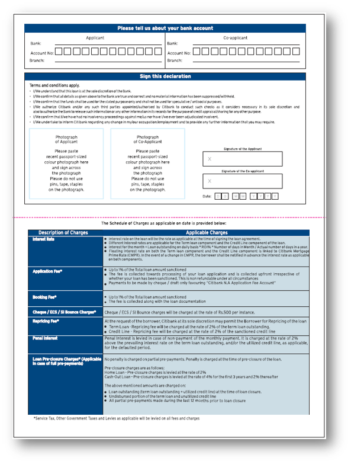
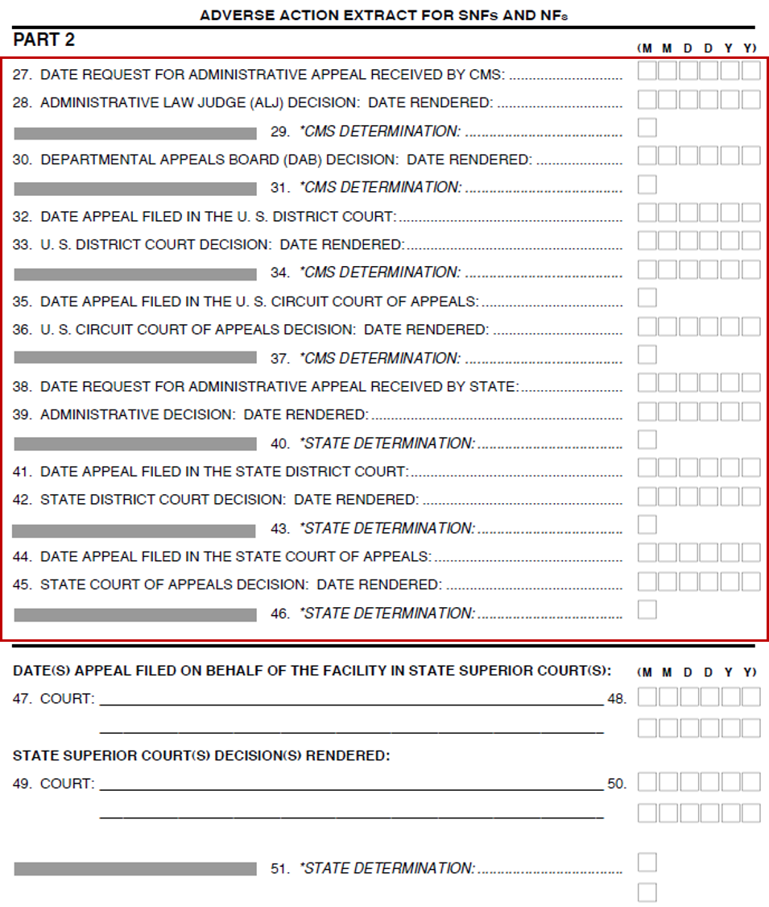

# [Best practices en overwegingen NIET publiceren]{#do-not-publish-best-practices-and-considerations}

Met de AEM Forms Automated Conversion-service wordt een PDF-formulier geconverteerd naar een adaptief formulier. De service gebruikt kunstmatige intelligentie en computerleeralgoritmen om de indeling en velden van het bronformulier te begrijpen. Elke computerleerservice leert voortdurend van brongegevens en produceert een verbeterde uitvoer bij elke klus. Deze diensten leren van ervaringen als mensen.

De service Automated Forms Conversion wordt getraind op een groot aantal formulieren. Het identificeert gemakkelijk gebieden in een bronvorm en produceert adaptieve vormen. Er zijn echter enkele velden en stijlen in PDF-formulieren die gemakkelijk zichtbaar zijn voor het oog, maar die moeilijk te begrijpen zijn voor de service. De service kan verschillende veldtypen of deelvensters toewijzen aan bepaalde velden of stijlen. Alle dergelijke veld- en stijlpatronen worden hieronder weergegeven.

De dienst zou beginnen correcte gebieden of panelen aan deze patronen te identificeren en toe te wijzen aangezien het het leren van de brongegevens houdt. Voorlopig kunt u de [redacteur van het Overzicht en van het Correct](review-correct-ui-edited.md) gebruiken om dergelijke kwesties te bevestigen. Voordat u de problemen gaat verhelpen of verder gaat lezen, moet u vertrouwd zijn met [adaptieve formuliercomponenten](https://helpx.adobe.com/experience-manager/6-5/forms/using/introduction-forms-authoring.html).

## Algemeen {#general}

<!--
Comment Type: draft

<ul>
<li>Service does not convert filled PDF forms to adaptive form. Use empty adaptive forms.Service does not convert colored PDF forms to adaptive form. Use black and white or grayscale adaptive forms.   </li>
<li>Service does not convert filled PDF forms to adaptive form. Use empty adaptive forms.</li>
<li>Service does not support scanned forms. Do not use scanned forms. </li>
<li>Service can fail to recognize text and fields in a dense form. Increase the width between text and fields of a dense form before starting the conversion.</li>
<li>Service does not extract images. Manually add images to converted forms.</li>
<li>Service does not extract text present within an image. Manually add text to the adaptive form.</li>
</ul>
-->

<table border="1" cellpadding="1" cellspacing="0" style="border-collapse: separate; border-spacing: 0px;" width="100%"> 
 <tbody>
  <tr>
   <td width="30%">Bekende patronen en resolutie</td> 
   <td width="70%">Voorbeeld</td> 
  </tr>
  <tr>
   <td>
<strong>Patroon</strong>
 
De service converteert gekleurde PDF-formulieren niet naar een adaptief formulier.
 
 
 
<strong>Resolutie</strong>
 
Gebruik PDF-formulieren in zwart-wit of grijswaarden. 
 </td> 
   <td style="text-align: left;"> </td> 
  </tr>
  <tr>
   <td>
<strong>Patroon</strong>
 
De service converteert ingevulde PDF-formulieren niet naar een adaptief formulier.
 
 
 
<strong>Resolutie</strong>
 
Gebruik lege adaptieve formulieren.
 </td> 
   <td style="text-align: left;"></td> 
  </tr>
  <tr>
   <td>
<strong>Patroon</strong>
 
De service kan tekst en velden in een dicht formulier niet herkennen.
 
 
 
<strong>Resolutie</strong>
 
Vergroot de breedte tussen tekst en velden in een dicht formulier voordat u de conversie start.
 </td> 
   <td style="text-align: left;"></td> 
  </tr>
  <tr>
   <td>
<strong>Patroon</strong>
 
De service ondersteunt geen gescande formulieren.
 
 
 
<strong>Resolutie</strong>
 
Gebruik geen gescande formulieren. 
 </td> 
   <td></td> 
  </tr>
  <tr>
   <td>
<strong>Patroon</strong>
 
De service extraheert geen afbeeldingen en tekst binnen afbeeldingen. 
 
 
 
<strong>Resolutie</strong>
 
Voeg handmatig afbeeldingen of tekst toe aan geconverteerde formulieren.
 </td> 
   <td></td> 
  </tr>
  <tr>
   <td>
<strong>Patroon</strong>
 
Tabellen met gestippelde of onduidelijke grenzen en randen worden niet omgezet.
 
<strong>Resolutie</strong>
 
Gebruik tabellen met duidelijke expliciete grenzen en randen. ondersteund.
 </td> 
   <td></td> 
  </tr>
 </tbody>
</table>

## Keuzegroep {#choice-group}

<table border="1" cellpadding="1" cellspacing="0" width="100%"> 
 <tbody>
  <tr>
   <td width="30%">Patroon</td> 
   <td width="70%">Voorbeeld</td> 
  </tr>
  <tr>
   <td>
<strong>Patroon</strong>
 
Opties voor keuzegroepen met andere vormen dan kader of cirkel worden niet omgezet in overeenkomende adaptieve formuliercomponenten. 
 
 
 
<strong>Resolutie</strong>
 
Wijzig de keuzeopties in een vak of cirkel of gebruik de revisie en de correctiefunctie om de vormen te identificeren.
 </td> 
   <td> </td> 
  </tr>
 </tbody>
</table>

## Form fields {#form-fields}

<table border="1" cellpadding="1" cellspacing="0" width="100%"> 
 <tbody>
  <tr>
   <td width="30%">Patroon</td> 
   <td width="70%">Voorbeeld</td> 
  </tr>
  <tr>
   <td width="25%">
<strong>Patroon</strong>
 
De dienst identificeert geen gebieden zonder duidelijke grenzen.
 
 
 
<strong>Resolutie</strong>
 
Gebruik Revisie en Correcte editor om dergelijke velden te identificeren.
 
 
 
 
 </td> 
   <td width="50%">  </td> 
  </tr>
  <tr>
   <td>
<strong>Patroon</strong>
 
Bij de service blijven sommige formuliervelden met bijschriften aan de onderkant of aan de rechterkant onbekend.
 
 
 
<strong>Resolutie</strong>
 
De redacteur van het Overzicht en van de Correctie van het gebruik om dergelijke gebieden te identificeren
 </td> 
   <td>    </td> 
  </tr>
  <tr>
   <td>
<strong>Patroon</strong>
 
De dienst voegt of wijst een verkeerd type aan sommige vormgebieden toe die zeer dicht bij elkaar worden geplaatst of geen duidelijke grenzen hebben. 
 
 
 
<strong>Resolutie</strong>
 
Gebruik Revisie en Correcte editor om dergelijke velden te identificeren.
 </td> 
   <td></td> 
  </tr>
  <tr>
   <td>
<strong>Patroon</strong>
 
De dienst kan er niet in slagen om gebieden met verre titels of een gestippelde lijn tussen de titel en inputgebied te erkennen.
 
 
 
<strong>Resolutie</strong>
 
Gebruik formuliervelden met duidelijke grenzen of gebruik Revisie en Correcte editor om dergelijke problemen op te lossen.
 </td> 
   <td></td> 
  </tr>
 </tbody>
</table>

## Lijsten {#lists}

<table border="1" cellpadding="1" cellspacing="0" width="100%"> 
 <tbody>
  <tr>
   <td width="30%">Patroon</td> 
   <td width="70%">Voorbeeld</td> 
  </tr>
  <tr>
   <td>
<strong>Patroon</strong>
 
Lijsten met formuliervelden worden samengevoegd of niet geconverteerd naar overeenkomende adaptieve formuliercomponenten
 
<strong>Resolutie</strong>
 
Gebruik formuliervelden met duidelijke grenzen of gebruik Revisie en Correcte editor om dergelijke problemen op te lossen.
 </td> 
   <td></td> 
  </tr>
  <tr>
   <td>
<strong>Patroon</strong>
 
De dienst kan een paar genestelde lijsten ongeïdentificeerd verlaten
 
 
 
<strong>Resolutie</strong>
 
Gebruik de Editor controleren en corrigeren om dergelijke problemen op te lossen.
 </td> 
   <td> </td> 
  </tr>
  <tr>
   <td>
<strong>Patroon</strong>
 
De dienst voegt sommige lijsten samen die keuzegroepen met elkaar bevatten
 
<strong>Resolutie</strong>
 
Gebruik de Editor controleren en corrigeren om dergelijke problemen op te lossen.
 </td> 
   <td> </td> 
  </tr>
 </tbody>
</table>

<!--
Comment Type: draft

<h3>Choice groups</h3>
-->

<!--
Comment Type: draft

<ul>
<li>Lists with form fields, nested lists, and nested choice groups are not supported.</li>
<li>Form fields with captions at bottom or right are not supported.</li>
<li>Form fiields without bordes are not supported.</li>
<li>Hidden form fields are not supported.</li>
<li>Button in PDF forms are not converted to adaptive form buttons.  </li>
<li>Tables with clear explicit boundaries and borders are supported.</li>
<li>Fields with far away captions are not supported.  </li>
<li>Choice groups with only box or circle shaped selectors are supported. </li>
</ul>
-->

