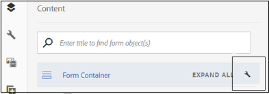

# Aanbevolen vooraf ingevulde en verzendworkflows voor gegevensbronnen voor adaptieve formulieren {#recommended-data-source-btased-prefill-and-submit-workflows-for-adaptive-forms}

U kunt de volgende gegevensbronnen gebruiken met adaptieve formulieren die zijn geconverteerd met de service Automated Forms Conversion:

* Formuliergegevensmodel, OData of een andere service van derden
* JSON-schema
* XSD-schema

Op basis van de gegevensbron kunt u desgewenst een adaptief formulier genereren met of zonder gegevensmodel.

In dit artikel worden de aanbevolen workflows beschreven voor het vooraf invullen van veldwaarden en verzendopties nadat u een gegevensbron hebt geselecteerd en een adaptief formulier hebt gegenereerd met behulp van de conversieservice.

<table> 
 <tbody> 
  <tr> 
   <th><strong>Gegevensbron</strong></th> 
   <th><strong>Aanbevolen workflow</strong></th> 
  </tr> 
  <tr> 
   <td><p>Formuliergegevensmodel, OData of een andere service van derden</p></td> 
   <td> 
    <p><strong>Optie 1</strong>: U selecteert formuliergegevensmodel, OData of een andere service van derden als gegevensbron. U <a href="#generate-adaptive-forms-with-no-data-binding">genereert een adaptief formulier zonder gegevensbinding</a> met de service voor automatische conversie van formulieren. U bindt de adaptieve formuliervelden handmatig aan entiteiten van het formuliergegevensmodel en gebruikt de optie Vooraf ingevulde service formuliergegevensmodel om veldwaarden vooraf in te vullen. Met de optie Verzenden met gebruik van het formuliergegevensmodel kunt u het aangepaste formulier verzenden.</p></td> 
  </tr>
  <tr> 
   <td></td> 
   <td> 
   <p><strong>Optie 2</strong>: U selecteert formuliergegevensmodel, OData of een andere service van derden als gegevensbron. U <a href="#generate-adaptive-forms-with-no-data-binding">genereert een adaptief formulier zonder gegevensbinding</a> met de service voor automatische conversie van formulieren. U bindt de aangepaste formuliervelden met de regeleditor aan het vooraf invullen van veldwaarden. Wijzig, indien nodig, de veldwaarden en verzend gegevens naar de crx-repository.</p>
    </td> 
  </tr>
  <tr> 
   <td></td> 
   <td> 
    <p>Voor geleidelijke instructies om deze werkschema's uit te voeren, zie gegevensbestand, OData van het <a href="#sqldatasource">Gebruik, of om het even welke derdedienst als gegevensbron.</a></p> </td> 
  </tr>
  <tr>
  <td><p>JSON Schema</p></td> 
   <td> 
    <p>U selecteert JSON-schema als gegevensbron. Gebaseerd op de geselecteerde gegevensbron:</p></td> 
  </tr>
  <tr>
  <td></td> 
   <td> 
    <p><strong>Optie 1</strong>: U <a href="#generate-adaptive-forms-with-no-data-binding">genereert een adaptief formulier zonder gegevensbinding</a> met de service Automated Forms Conversion en configureert het JSON-schema als gegevensbron. U bindt de adaptieve formuliervelden handmatig aan het JSON-schema en <a href="https://helpx.adobe.com/experience-manager/6-5/forms/using/prepopulate-adaptive-form-fields.html#Supportedprotocolsforprefillinguserdata" target="_blank">gebruikt de ondersteunde protocollen</a> om de veldwaarden vooraf in te vullen. Wijzig, indien nodig, de veldwaarden en verzend gegevens naar de crx-repository.</p></td> 
  </tr>
  <tr>
  <td></td> 
   <td> 
    <p>Zie JSON-schema <a href="#jsondatasource">gebruiken als gegevensbron voor stapsgewijze instructies om de workflows uit te voeren.</p></td> 
  </tr>
  <tr>
  <td></td> 
   <td> 
    <p><strong>Optie 2</strong>: U <a href="#generate-adaptive-forms-with-json-binding">genereert een adaptief formulier met JSON-gegevensbinding</a> met de service Automated Forms Conversion. De Prefill-service en het verzenden van formulieren werken naadloos. U hebt geen configuratiestappen nodig.</p> </td> 
  </tr>
   <tr>
  <td></td> 
   <td> 
    <p>Zie JSON-schema <a href="#jsonwithdatabinding">gebruiken als gegevensbron voor stapsgewijze instructies om de workflows uit te voeren.</a></p> </td> 
  </tr>
  <tr>
  <td><p>XSD-schema</p></td> 
   <td> 
    <p>U selecteert XSD-schema als gegevensbron. Op basis van de geselecteerde gegevensbron <a href="#generate-adaptive-forms-with-no-data-binding">genereert u een adaptief formulier zonder gegevensbinding</a> met de service Automated Forms Conversion en configureert u het XSD-schema als gegevensbron. U bindt de adaptieve formuliervelden handmatig aan het XSD-schema en <a href="https://helpx.adobe.com/experience-manager/6-5/forms/using/prepopulate-adaptive-form-fields.html#Supportedprotocolsforprefillinguserdata" target="_blank">gebruikt de ondersteunde protocollen</a> om de veldwaarden vooraf in te vullen. Wijzig, indien nodig, de veldwaarden en verzend gegevens naar de crx-repository.</p>
    </td> 
  </tr>
  <tr>
  <td></td> 
   <td> 
    <p>Zie XSD-schema als gegevensbron <a href="#xsddatasource">gebruiken voor stapsgewijze instructies om de workflows uit te voeren.</a></p>
    </td> 
  </tr>
 </tbody> 
</table>


Raadpleeg de volgende artikelen voor meer informatie over de service Automated Forms Conversion:

* [Inleiding tot de service Automated Forms Conversion](introduction.md)
* [De service Automated Forms Conversion configureren](configure-service.md)
* [Afdrukformulieren converteren naar aangepaste formulieren](convert-existing-forms-to-adaptive-forms.md)
* [Geconverteerde formulieren controleren en corrigeren](review-correct-ui-edited.md)

De in dit artikel verstrekte informatie is gebaseerd op de veronderstelling dat iedereen die het leest basiskennis heeft van concepten van adaptieve formulieren.

## Voorwaarden {#pre-requisites}

* Een [AEM-auteurinstantie configureren](https://helpx.adobe.com/experience-manager/6-5/sites/deploying/using/deploy.html)
* De service [Automated Forms Conversion configureren voor de AEM-auteur](configure-service.md)

## Monster van adaptief formulier {#sample-adaptive-form}

Download het volgende voorbeeld-PDF-bestand als u de gebruiksgevallen wilt uitvoeren om veldwaarden vooraf in een adaptief formulier in te vullen en naar de gegevensbron te verzenden.

Voorbeeldformulier voor het aanvragen van een lening

[Bestand ophalen](assets/sample_loan_application_form.pdf)

Het PDF-bestand fungeert als invoer voor de service Formulierconversie automatiseren. De service converteert dit bestand naar een adaptief formulier. De volgende afbeelding toont de voorbeeldtoepassing voor leningen in PDF-indeling.


## Gegevens voorbereiden voor formuliermodel {#prepare-data-for-form-model}

Met de integratie van gegevens in AEM-formulieren kunt u verschillende gegevensbronnen configureren en verbinden. Nadat u een adaptief formulier hebt gegenereerd met behulp van het conversieproces, kunt u het formuliermodel definiëren op basis van een formuliergegevensmodel, XSD of een JSON-schema. U kunt een gegevensbestand, de Dynamica van Microsoft, of een andere derdedienst gebruiken om een model van vormgegevens tot stand te brengen.

Deze zelfstudie gebruikt de MySQL-database als bron voor het maken van een formuliergegevensmodel. Maak een **toepassingsschema** in de database en voeg een **aanvraagtabel** toe aan het schema op basis van de velden die beschikbaar zijn in het adaptieve formulier.


U kunt de volgende verklaring gebruiken DDL om de **kandidaatlijst** in gegevensbestand tot stand te brengen.

```sql
CREATE TABLE `applicant` (
   `name` varchar(45) DEFAULT NULL,
   `address` varchar(45) DEFAULT NULL,
   `phonenumber` int(11) NOT NULL,
   `email` varchar(45) DEFAULT NULL,
   `occupation` varchar(45) DEFAULT NULL,
   `annualsalary` varchar(45) DEFAULT NULL,
   `familymembers` int(11) DEFAULT NULL,
   PRIMARY KEY (`phonenumber`)
 ) ENGINE=InnoDB DEFAULT CHARSET=utf8
```

Als u een XSD-schema gebruikt als formuliermodel voor het uitvoeren van de use cases, maakt u een XSD-bestand met de volgende tekst:

```xml
<?xml version="1.0" encoding="utf-8" ?>
    <xs:schema targetNamespace="http://adobe.com/sample.xsd"
                    xmlns="http://adobe.com/sample.xsd"
                    xmlns:xs="http://www.w3.org/2001/XMLSchema">

<xs:element name="sample" type="SampleType"/>

  <xs:complexType name="SampleType">
    <xs:sequence>
      <xs:element name="name" type="xs:string"/>
   <xs:element name="address" type="xs:string"/>
   <xs:element name="phonenumber" type="xs:int"/>
   <xs:element name="email" type="xs:string"/>
   <xs:element name="occupation" type="xs:string"/>
   <xs:element name="annualsalary" type="xs:string"/>
   <xs:element name="familymembers" type="xs:string"/>
 </xs:sequence>
  </xs:complexType>

  </xs:schema>
```

Of download het XSD-schema naar het lokale bestandssysteem.

Voorbeeld van XSD-schema voor toepassing van een lening

[Bestand ophalen](assets/loanapplication.xsd)

Zie Aangepaste formulieren [maken met behulp van XML-schema](https://helpx.adobe.com/experience-manager/6-5/forms/using/adaptive-form-xml-schema-form-model.html)voor meer informatie over het gebruik van XSD-schema als het formuliermodel in adaptieve formulieren.

Als u een JSON-schema gebruikt als formuliermodel voor het uitvoeren van de use cases, maakt u een JSON-bestand met de volgende tekst:

```JSON
{
    "$schema": "http://json-schema.org/draft-04/schema#",
    "definitions": {
        "loanapplication": {
            "type": "object",
            "properties": {
                "name": {
                    "type": "string"
                },
                "address": {
                    "type": "string"
                },
    "phonenumber": {
                    "type": "number"
                },
    "email": {
                    "type": "string"
                },
    "occupation": {
                    "type": "string"
                },
    "annualsalary": {
                    "type": "string"
                },
    "familymembers": {
                    "type": "number"
                }
            }
        }
 },
 "type": "object",
    "properties": {
        "employee": {
            "$ref": "#/definitions/loanapplication"
        }
    }
}
```

U kunt het JSON-schema ook downloaden naar het lokale bestandssysteem.

JSON-schema voor voorbeeldtoepassing

[Bestand ophalen](assets/demo_schema.json)

Zie Aangepaste formulieren [maken met het JSON-schema](https://helpx.adobe.com/experience-manager/6-5/forms/using/adaptive-form-json-schema-form-model.html)voor meer informatie over het gebruik van het JSON-schema als het formuliermodel in adaptieve formulieren.

## Aangepaste formulieren zonder gegevensbinding genereren {#generate-adaptive-forms-with-no-data-binding}

Met de service [Automated Forms Conversion kunt u het aanvraagformulier voor een](convert-existing-forms-to-adaptive-forms.md) voorbeeldlening [](#sample-adaptive-form) omzetten naar een adaptief formulier zonder gegevensbinding. Schakel het **[!UICONTROL Generate adaptive form(s) without data bindings]** selectievakje in om het adaptieve formulier zonder gegevensbinding te genereren.


Nadat u een adaptief formulier zonder gegevensbinding hebt gegenereerd, selecteert u een gegevensbron voor het adaptieve formulier:

* [Database, OData of een service van derden](#sqldatasource)
* [JSON-schema](#jsondatasource)
* [XSD-schema](#xsddatasource)

>[!NOTE]
> Als het adaptieve formulier dat u converteert met de service Automated Forms Conversion meerdere velden met dezelfde naam bevat, moet u ervoor zorgen dat deze velden zijn gebonden aan gegevensbronentiteiten om een mogelijk gegevensverlies tijdens de verzending te voorkomen.


### Gebruik gegevensbestand, OData, of om het even welke derdedienst als gegevensbron {#sqldatasource}

Hoofdlettergebruik: U genereert een adaptief formulier zonder gegevensbinding met de service Automated Forms Conversion en configureert de MYSQL-database als gegevensbron. U bindt de adaptieve formuliervelden handmatig aan formuliergegevensmodelentiteiten en gebruikt de **[!UICONTROL Form Data Model Prefill Service]** optie om veldwaarden vooraf in te vullen. U gebruikt de **[!UICONTROL Submit using Form Data Model]** optie om het aangepaste formulier te verzenden.

Voordat u het gebruiksgeval uitvoert:

* [MySQL-database configureren als gegevensbron](https://helpx.adobe.com/experience-manager/6-5/forms/using/configure-data-sources.html#configurerelationaldatabase)
* [Het formuliergegevensmodel maken](https://helpx.adobe.com/experience-manager/6-5/forms/using/work-with-form-data-model.html)

Op basis van het gebruiksgeval maakt u het gegevensmodel van het **toepassingsformulier** en bindt u het argument van de leesservice aan een **[!UICONTROL Literal]** waarde. De letterlijke waarde van het telefoonaantal moet van één van de verslagen zijn die in het **aanvragende** schema van het gegevensbestand MySQL worden gevormd. De diensten gebruiken de waarde als argument om details van de gegevensbron te halen. U kunt ook Kenmerk [gebruikersprofiel of Aanvraagkenmerk](https://helpx.adobe.com/experience-manager/6-5/forms/using/work-with-form-data-model.html#bindargument) selecteren in de **[!UICONTROL Binding To]** vervolgkeuzelijst


>[!NOTE]
>
>Zorg ervoor dat u **get** - en **invoegservices toevoegt** aan het formuliergegevensmodel, configureer de services en test deze voordat u het gebruiksgeval uitvoert.

Voer de volgende stappen uit:

1. Selecteer het geconverteerde aanvraagformulier **voor een** voorbeeldlening in de **[!UICONTROL output]** map en tik op **[!UICONTROL Properties]**.
1. Tik op het **[!UICONTROL Form Model]** tabblad, selecteer **[!UICONTROL Form Data Model]** de optie in de **[!UICONTROL Select From]** vervolgkeuzelijst en tik **[!UICONTROL Select Form Data Model]** om het gegevensmodel van het **toepassingsformulier** te selecteren. Tik **[!UICONTROL Save & Close]** om het formulier op te slaan.
1. Selecteer het aanvraagformulier voor de **voorbeeldlening** en tik op **[!UICONTROL Edit]**.
1. Tik op het **[!UICONTROL Content]** tabblad op het configuratiepictogram:

   

   1. Selecteer in de **[!UICONTROL Basic]** sectie een optie in de **[!UICONTROL Form Data Model Prefill service]** **[!UICONTROL Prefill Service]** vervolgkeuzelijst.

   1. Selecteer in de **[!UICONTROL Submission]** sectie een optie in de **[!UICONTROL Submit using Form Data Model]** **[!UICONTROL Submit Action]** vervolgkeuzelijst.

   1. Selecteer het gegevensmodel in het **[!UICONTROL Data Model to submit]** veld.
   1. Tik  om de eigenschappen op te slaan.

1. Tik op het tekstvak Naam van aanvrager en selecteer het pictogram  configureren (configureren).

   1. Selecteer in het veld Bindverwijzing de optie **Aanvrager** > **Naam** en tik op het pictogram  Voltooid om de eigenschappen op te slaan. Op dezelfde manier creeer een gegevensband voor het **Adres**, het Aantal **van de** Telefoon, **E-mail**, **Bezetting**, **Jaarloon (in dollars)****, enNo. van afhankelijke familieleden** met de entiteiten van het formuliergegevensmodel.
   

1. Tik **[!UICONTROL Preview]** om de vooraf ingevulde aangepaste waarden voor formuliervelden weer te geven.
1. Wijzig, indien nodig, de veldwaarden en verzend het adaptieve formulier. De veldwaarden worden verzonden naar de MySQL-database. U kunt de **kandidaatlijst** in het gegevensbestand verfrissen om de bijgewerkte waarden in de lijst te bekijken.

**** Hoofdlettergebruik: U genereert een adaptief formulier zonder gegevensbinding met de service Automated Forms Conversion en configureert de MYSQL-database als gegevensbron. U bindt de aangepaste formuliervelden met de regeleditor aan het vooraf invullen van veldwaarden. Wijzig, indien nodig, de veldwaarden en verzend gegevens naar de crx-repository.

Voer de volgende stappen uit om de [regeleditor](https://helpx.adobe.com/experience-manager/6-5/forms/using/rule-editor.html) te gebruiken om de service van het formuliergegevensmodel aan te roepen om velden en vooraf ingevulde waarden in een adaptieve vorm te binden:

1. Selecteer het aanvraagformulier voor de **voorbeeldlening** in de **[!UICONTROL output]** map en tik op **[!UICONTROL Edit]**.
1. Tik op het **[!UICONTROL Content]** tabblad op het configuratiepictogram:

   

   Selecteer in de **[!UICONTROL Basic]** sectie een optie in de **[!UICONTROL Form Data Model Prefill service]** **[!UICONTROL Prefill Service]** vervolgkeuzelijst.

1. Tik op het **[!UICONTROL Applicant Name]** tekstvak en tik op **[!UICONTROL Edit Rules]**.

   

1. Tik **[!UICONTROL Create]** op de pagina Regeleditor.
1. Op de **[!UICONTROL Rule Editor]** pagina:

   1. Selecteer een status voor het tekstvak Naam aanvrager. Dit leidt bijvoorbeeld tot **[!UICONTROL is initialized]** uitvoering van de **[!UICONTROL Then]** voorwaarde wanneer u het formulier in de **[!UICONTROL Preview]** modus genereert.

   1. Selecteer in de **[!UICONTROL Then]** sectie een optie in de **[!UICONTROL Invoke Service]** **[!UICONTROL Select Action]** vervolgkeuzelijst. Alle services op uw instantie Forms worden weergegeven in de vervolgkeuzelijst.

   1. Selecteer een **[!UICONTROL Get]** service in de sectie met de formuliergegevensmodellen. In het veld Invoer wordt een **telefoonnummer** weergegeven. Dit is de primaire sleutel die is gedefinieerd voor het gegevensmodel van de **aanvrager** . Het systeem haalt de waarden in het adaptieve formulier voor velden op in de sectie Uitvoer op basis van dit veld en vult deze waarden vooraf in.

   1. Maak een binding voor de adaptieve formuliervelden met de entiteiten van het formuliergegevensmodel met de sectie Uitvoer. Bind bijvoorbeeld **[!UICONTROL Applicant Name]** het aangepaste formulierveld met de **naamentiteit** .

   1. Tik **[!UICONTROL Done]**. Tik **[!UICONTROL Done]** opnieuw op de pagina van de Redacteur van de Regel.
   

1. Tik **[!UICONTROL Preview]** om de vooraf ingevulde aangepaste waarden voor formuliervelden weer te geven.

   >[!NOTE]
   >
   >Zorg ervoor dat de **[!UICONTROL Return Array]** eigenschap is ingesteld op OFF voor de eigenschap **get** service in het formuliergegevensmodel dat is gekoppeld aan het adaptieve formulier.

1. Wijzig, indien nodig, de veldwaarden en verzend het adaptieve formulier. De ingediende gegevens zijn beschikbaar op de volgende locatie in de crx-repository:

   `http://host name:port/crx/de/index.jsp#/content/forms/fp/admin/submit/data/latest file available in the folder`

### JSON-schema gebruiken als gegevensbron {#jsondatasource}

**** Hoofdlettergebruik: U genereert een adaptief formulier zonder gegevensbinding met de service Automated Forms Conversion en configureert het JSON-schema als gegevensbron. U bindt de adaptieve formuliervelden handmatig aan het JSON-schema en gebruikt de optie **Voorvertonen met gegevens** om de veldwaarden vooraf in te vullen. Wijzig, indien nodig, de veldwaarden en verzend gegevens naar de crx-repository.

Controleer voordat u het gebruiksgeval uitvoert of:

* [een geldig JSON-schema dat voldoet aan de JSON-schemastructuur](#prepare-data-for-form-model)
* [een adaptief formulier zonder gegevensbinding](#generate-adaptive-forms-with-no-data-binding)

Voer de volgende stappen uit:

1. Selecteer het geconverteerde aanvraagformulier **voor een** voorbeeldlening in de **uitvoermap** en tik op **[!UICONTROL Properties]**.
1. Tik op het **[!UICONTROL Form Model]** tabblad, selecteer **[!UICONTROL Schema]** de optie in de **[!UICONTROL Select From]** vervolgkeuzelijst en tik **[!UICONTROL Select Schema]** op om het JSON **-schema** demo.schema te uploaden dat is opgeslagen in het lokale bestandssysteem. Tik **[!UICONTROL Save & Close]** om het formulier op te slaan.
1. Selecteer het aanvraagformulier voor de **voorbeeldlening** en tik op **[!UICONTROL Edit]**.
1. Tik op het tekstvak Naam van aanvrager en selecteer het pictogram  configureren (configureren).

   Selecteer in het veld Bindverwijzing de optie **Aanvrager** > **Naam** en tik op het pictogram  Voltooid om de eigenschappen op te slaan. Op dezelfde manier creeer een gegevensband voor het **Adres**, het Aantal **van de** Telefoon, **E-mail**, **Bezetting**, **Jaarloon (in dollars)****, enNo. van afhankelijke familieleden** gebieden met de JSON schema-entiteiten.

1. Selecteer nogmaals het geconverteerde aanvraagformulier **voor een** voorbeeldlening in de **[!UICONTROL output]** map en selecteer **[!UICONTROL Preview]** > **[!UICONTROL Preview with Data]**.</br>

   Voorbeeldgegevensbestand downloaden</br>

   [Bestand ophalen](assets/json_data_file.txt)</br>

1. Wijzig, indien nodig, de veldwaarden en verzend het adaptieve formulier. De ingediende gegevens zijn beschikbaar op de volgende locatie in de crx-repository:

   `http://host name:port/crx/de/index.jsp#/content/forms/fp/admin/submit/data/latest file available in the folder`

### XSD-schema gebruiken als gegevensbron {#xsddatasource}

**** Hoofdlettergebruik: U genereert een adaptief formulier zonder gegevensbinding met de service Automated Forms Conversion en configureert het XSD-schema als gegevensbron. U bindt de adaptieve formuliervelden handmatig aan het XSD-schema en gebruikt de **voorbeeldweergave met gegevens** om veldwaarden vooraf in te vullen. Wijzig, indien nodig, de veldwaarden en verzend gegevens naar de crx-repository.

Controleer voordat u het gebruiksgeval uitvoert of:

* [een geldig XSD-schema dat compatibel is met de XML-schemastructuur](#prepare-data-for-form-model)
* [een adaptief formulier zonder gegevensbinding](#generate-adaptive-forms-with-no-data-binding)

Voer de volgende stappen uit:

1. Selecteer het geconverteerde aanvraagformulier **voor een** voorbeeldlening in de **[!UICONTROL output]** map en tik op **[!UICONTROL Properties]**.
1. Tik op het **[!UICONTROL Form Model]** tabblad, selecteer **[!UICONTROL Schema]** de optie in de **[!UICONTROL Select From]** vervolgkeuzelijst en tik **[!UICONTROL Select Schema]** om het XSD-schema van de **toepassing** te uploaden dat is opgeslagen in het lokale bestandssysteem. Selecteer basiselement voor het XSD-schema en tik **[!UICONTROL Save & Close]** om het formulier op te slaan.
1. Selecteer het aanvraagformulier voor de **voorbeeldlening** en tik op **[!UICONTROL Edit]**.
1. Tik op het tekstvak Naam van aanvrager en selecteer het pictogram  configureren (configureren).
Selecteer in het veld Bindverwijzing de optie **Verzoekende partij** > **Naam** en tik op  om de eigenschappen op te slaan. Op dezelfde manier creeer een gegevensband voor het **Adres**, het Aantal **van de** Telefoon, **E-mail**, **Bezetting**, **Jaarloon (in dollars)****, enNo. van afhankelijke familieleden** gebieden met de XSD schema-entiteiten.

1. Selecteer nogmaals het geconverteerde aanvraagformulier voor **voorbeeldleningen** in de **uitvoermap** en selecteer **[!UICONTROL Preview]** > **[!UICONTROL Preview with Data]**.</br>

   Voorbeeldgegevensbestand downloaden</br>

   [Bestand ophalen](assets/loan-application-data-xml-data.zip)</br>


1. Wijzig, indien nodig, de veldwaarden en verzend het adaptieve formulier. De ingediende gegevens zijn beschikbaar op de volgende locatie in de crx-repository:

   `http://host name:port/crx/de/index.jsp#/content/forms/fp/admin/submit/data/latest file available in the folder`

## Aangepaste formulieren genereren met JSON-binding {#generate-adaptive-forms-with-json-binding}

Met de service [Automated Forms Conversion kunt u het aanvraagformulier voor een](convert-existing-forms-to-adaptive-forms.md) voorbeeldlening [](#sample-adaptive-form) omzetten in een adaptief formulier met gegevensbinding. Zorg ervoor dat u het **[!UICONTROL Generate adaptive form(s) without data bindings]** selectievakje niet inschakelt terwijl u het adaptieve formulier genereert.


### JSON-schema gebruiken als gegevensbron {#jsonwithdatabinding}

**** Hoofdlettergebruik: U genereert een adaptief formulier met JSON-gegevensbinding met de service Automated Forms Conversion. De Prefill-service en het verzenden van formulieren werken naadloos. U hebt geen configuratiestappen nodig.

Zorg ervoor dat u [een adaptief formulier met gegevensbinding](#generate-adaptive-forms-with-json-binding)hebt voordat u het hoofdlettergebruik uitvoert.

Voer de volgende stappen uit:

1. Selecteer nogmaals het geconverteerde aanvraagformulier **voor een** voorbeeldlening in de **[!UICONTROL output]** map en selecteer **[!UICONTROL Preview]** > **[!UICONTROL Preview with Data]**.</br>

   Voorbeeldgegevensbestand downloaden</br>

   [Bestand ophalen](assets/loan_application_data_source_json_data_binding.txt)</br>

1. Wijzig, indien nodig, de veldwaarden en verzend het adaptieve formulier. De ingediende gegevens zijn beschikbaar op de volgende locatie in de crx-repository:

   `http://host name:port/crx/de/index.jsp#/content/forms/fp/admin/submit/data/latest file available in the folder`

## Verzonden JSON-formuliergegevens converteren naar XML-indeling {#convert-submitted-adaptive-form-data-to-xml}

Wanneer u waarden invoert in adaptieve formuliervelden en deze verzendt, zijn de gegevens beschikbaar in JSON-indeling in de crx-repository. U kunt de indeling van JSON-gegevens omzetten in XML met de API [org.apache.sling.commons.json.xml](https://sling.apache.org/apidocs/sling5/org/apache/sling/commons/json/xml/XML.html#toString) of de volgende voorbeeldcode:

```
import org.apache.sling.commons.json.JSONException;
import org.apache.sling.commons.json.JSONObject;
import org.apache.sling.commons.json.xml.XML;
 
public class ConversionUtils {
 
    public static String jsonToXML(String jsonString) throws JSONException {
        //https://sling.apache.org/apidocs/sling5/org/apache/sling/commons/json/xml/XML.html#toString(java.lang.Object)
        //jar - http://maven.ibiblio.org/maven2/org/apache/sling/org.apache.sling.commons.json/2.0.18/
        //Note: Need to extract boundData part before converting to XML
        return XML.toString(new JSONObject(jsonString));
    }
}
```
