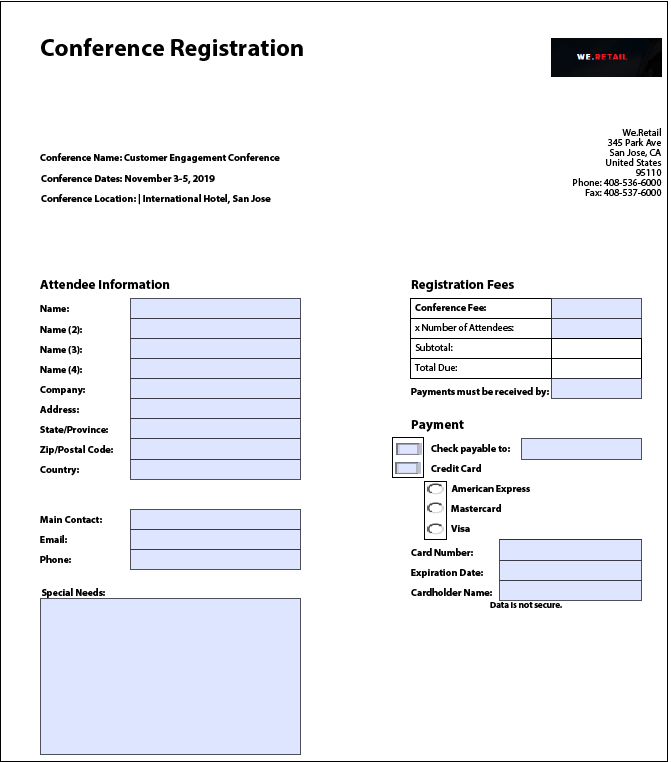
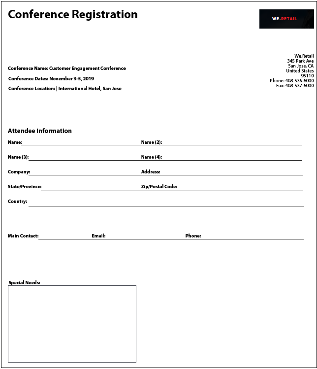

# Aanbevolen werkwijzen en bekende complexe patronen {#Best-practices-and-considerations2}

Dit document bevat richtlijnen en aanbevelingen die beheerders, auteurs en ontwikkelaars van formulieren kunnen gebruiken wanneer ze met [!DNL Automated Forms Conversion service]. Hierin worden de beste werkwijzen besproken, van het voorbereiden van bronformulieren tot het corrigeren van complexe patronen die enige extra inspanning vereisen voor automatische conversie. Deze beste praktijken dragen collectief aan de algemene prestaties en de output bij [!DNL Automated Forms Conversion service].

## Aanbevolen procedures

De conversieservice converteert PDF forms die beschikbaar zijn op uw AEM [!DNL Forms] Instantie voor adaptieve formulieren. Met de onderstaande aanbevolen procedures kunt u de conversiesnelheid en nauwkeurigheid verbeteren. Bovendien helpen deze beste praktijken u tijd besparen die aan na omzettingsactiviteiten wordt doorgebracht.

### Voordat u de bron uploadt

U kunt alle PDF forms tegelijk uploaden of, indien nodig, gefaseerd. Houd rekening met het volgende voordat u de formulieren uploadt:

* Houd het aantal formulieren in een map kleiner dan 15 en houd het totale aantal pagina&#39;s in een map kleiner dan 50.
* Houd de map kleiner dan 10 MB. Bewaar formulieren niet in submappen.
* Houd het aantal pagina&#39;s in een formulier kleiner dan 15.
* Indelen van brondocumenten in een batch van 8-15 documenten. Bronformulieren met algemene adaptieve formulierfragmenten in één batch bewaren.
* Upload de beveiligde formulieren niet. De service converteert formulieren die met een wachtwoord zijn beveiligd niet.
* Upload de [PDF Portfolio](https://helpx.adobe.com/nl/acrobat/using/overview-pdf-portfolios.html). De service zet een PDF-Portfolio niet om in een adaptieve vorm.
* Upload geen bronformulieren met spaties in de bestandsnaam. Verwijder de ruimte uit de naam van het bestand voordat u de formulieren uploadt.
* U mag geen gescande, gevulde en formulieren uploaden in een andere taal dan Engels, Frans, Duits, Spaans, Italiaans en Portugees. Dergelijke formulieren worden niet ondersteund.

Wanneer u een XDP-formulier gebruikt voor conversie, voert u de volgende stappen uit voordat u de XDP-bronformulieren uploadt:

* Analyseer het XDP-formulier en los visuele problemen op. Zorg ervoor dat het brondocument de beoogde besturingselementen en structuren gebruikt. Het bronformulier kan bijvoorbeeld selectievakjes hebben in plaats van keuzerondjes voor één selectie. Schakel selectievakjes in op keuzerondjes om een adaptief formulier met de gewenste onderdelen te maken.
* [Bindingen toevoegen aan het XDP-formulier](http://www.adobe.com/go/learn_aemforms_designer_65) voordat u de conversie start. Wanneer bindingen beschikbaar zijn in het XDP-bronformulier, past de service tijdens de conversie automatisch bindingen toe op de bijbehorende adaptieve formuliervelden. Hiermee bespaart u de tijd die nodig is om de bindingen handmatig toe te passen.
* [Adobe Sign-tags toevoegen](https://helpx.adobe.com/sign/using/text-tag.html) naar het XDP-bestand. De service converteert Adobe Sign-tags automatisch naar overeenkomende aangepaste formuliervelden. Adaptieve Forms ondersteunt een beperkt aantal Adobe Sign-velden. Voor de volledige lijst met ondersteunde velden gaat u naar [Adobe Sign in een adaptieve vorm gebruiken](https://experienceleague.adobe.com/docs/experience-manager-65/forms/adaptive-forms-advanced-authoring/working-with-adobe-sign.html?lang=en) documentatie.
* Complexe tabellen in XDP-documenten indien mogelijk omzetten in eenvoudige tabellen. Een tabel met formuliervelden in tabelcellen, cellen met een oneven grootte, cellen met een rij- of kolombereik, samengevoegde cellen, gedeeltelijke randen of geen zichtbare rand wordt als een complexe tabel beschouwd. Een tabel met een van de bovenstaande items wordt als een complexe tabel beschouwd.
<!-- * Use sub-forms in XDP documents to create panels in adaptive forms. Service converts each sub-form to one or more adaptive form panels during conversion. -->

### Voordat u de conversie start

* Aangepaste formuliersjablonen maken. Sjablonen helpen u bij het opgeven van een uniforme structuur voor de vormen van uw organisatie of afdeling.
* Geef de kop- en voettekst op in de aangepaste formuliersjablonen. De service negeert de voettekst voor de koptekst van brondocumenten en gebruikt de voettekst voor de koptekst die is opgegeven in de adaptieve formuliersjabloon.
* Maak adaptieve formulierthema&#39;s. Thema&#39;s zorgen voor een uniforme vormgeving van uw organisatie of afdeling.
* Formuliergegevensmodel configureren voor opslaan en ophalen van een gegevensbron. Maak en configureer lees- en schrijfservices voor het formuliergegevensmodel.
* Maak adaptieve formulierfragmenten en configureer de service voor het gebruik van adaptieve formulierfragmenten.
* Gemeenschappelijke workflowmodellen voorbereiden voor de formulieren die automatisering van bedrijfsprocessen vereisen.
* Indien nodig Adobe Analytics configureren

## Leer complexe patronen

AEM [!DNL Forms Automated Conversion service] gebruikt kunstmatige intelligentie en machine het leren algoritmen om de lay-out en de gebieden van de bronvorm te begrijpen. Elke computerleerservice leert voortdurend van brongegevens en produceert een verbeterde uitvoer bij elke klus. Deze diensten leren van ervaringen als mensen.

[!DNL Automated Forms Conversion service] is opgeleid voor een groot aantal formulieren. Het identificeert gemakkelijk gebieden in een bronvorm en produceert adaptieve vormen. Er zijn echter enkele velden en stijlen in PDF forms die gemakkelijk zichtbaar zijn voor het oog, maar moeilijk te begrijpen zijn voor de service. De service kan verschillende veldtypen of deelvensters toewijzen aan bepaalde velden of stijlen. Alle dergelijke veld- en stijlpatronen worden hieronder weergegeven.

De dienst zou beginnen correcte gebieden of panelen aan deze patronen te identificeren en toe te wijzen aangezien het het leren van de brongegevens houdt. Voorlopig kunt u [Reviseren en corrigeren](review-correct-ui-edited.md) editor om dergelijke problemen op te lossen. Voordat u de problemen gaat verhelpen of verder gaat lezen, moet u zich vertrouwd maken met [adaptieve formuliercomponenten](https://helpx.adobe.com/experience-manager/6-5/forms/using/introduction-forms-authoring.html).

### Algemene patronen {#general}

| Patroon | Voorbeeld |
|--- |--- |
| **Patroon**  De service zet gevulde PDF forms niet om in een adaptief formulier.   **Resolutie**  Gebruik lege adaptieve formulieren. |  |
| **Patroon**  De service kan tekst en velden in een dicht formulier niet herkennen.   **Resolutie**   Vergroot de breedte tussen tekst en velden in een dicht formulier voordat u de conversie start. |  |
| **Patroon**  De service ondersteunt geen gescande formulieren.   **Resolutie**  Gebruik geen gescande formulieren. |  |
| **Patroon**  De service extraheert geen afbeeldingen en tekst binnen afbeeldingen.   **Resolutie**   Voeg handmatig afbeeldingen of tekst toe aan geconverteerde formulieren. |  |
| **Patroon**  Tabellen met gestippelde of onduidelijke grenzen en randen worden niet omgezet.   **Resolutie**  Gebruik tabellen met duidelijke expliciete grenzen en randen. ondersteund. |  |
| **Patroon**   Adaptieve formulieren ondersteunen geen verticale tekst uit het vak. De service zet verticale tekst dus niet om in de bijbehorende adaptieve Forms-tekst.   **Resolutie**   Gebruik indien nodig een aangepaste formuliereditor om verticale tekst toe te voegen. |  |

### Keuzegroep  {#choice-group}

| Patroon | Resolutie |
|--- |--- |
| **Patroon**   Opties voor keuzegroepen met andere vormen dan kader of cirkel worden niet omgezet in overeenkomende adaptieve formuliercomponenten.   **Resolutie**   Wijzig de keuzeopties in een vak of cirkel of gebruik de revisie en de correctiefunctie om de vormen te identificeren. |  |

### Formuliervelden {#form-fields}

| Patroon | Resolutie |
|--- |--- |
| **Patroon**   De dienst identificeert geen gebieden zonder duidelijke grenzen.   **Resolutie**   Gebruik Revisie en Correcte editor om dergelijke velden te identificeren. |  |
| **Patroon**   De service kan bepaalde formuliervelden van keuzegroepen niet herkennen met bijschriften aan de onderzijde of rechterzijde van een formulier.   **Resolutie**   De redacteur van het Overzicht en van de Correctie van het gebruik om dergelijke gebieden te identificeren |  |
| **Patroon**   De dienst voegt of wijst een verkeerd type aan sommige vormgebieden toe die zeer dicht bij elkaar worden geplaatst of geen duidelijke grenzen hebben.   **Resolutie**   Gebruik Revisie en Correcte editor om dergelijke velden te identificeren. |  |
| **Patroon**   De dienst kan er niet in slagen om gebieden met verre titels of een gestippelde lijn tussen de titel en inputgebied te erkennen.   **Resolutie**   Gebruik formuliervelden met duidelijke grenzen of gebruik Revisie en Correcte editor om dergelijke problemen op te lossen. |  |

### Lijsten {#lists}

| Patroon | Resolutie |
|--- |--- |
| **Patroon**  Lijsten met formuliervelden worden samengevoegd of niet geconverteerd naar overeenkomende adaptieve formuliercomponenten   **Resolutie**  Gebruik formuliervelden met duidelijke grenzen of gebruik Revisie en Correcte editor om dergelijke problemen op te lossen. |  |
| **Patroon**  De dienst kan een paar genestelde lijsten ongeïdentificeerd verlaten   **Resolutie**   Gebruik de Editor controleren en corrigeren om dergelijke problemen op te lossen. |  |
| **Patroon**   De dienst voegt sommige lijsten samen die keuzegroepen met elkaar bevatten   **Resolutie**   Gebruik de Editor controleren en corrigeren om dergelijke problemen op te lossen. |  |

<!--
Comment Type: draft

<h3>Choice groups</h3>
-->

<!--
Comment Type: draft

<ul>
<li>Lists with form fields, nested lists, and nested choice groups are not supported.</li>
<li>Form fields with captions at bottom or right are not supported.</li>
<li>Form fields without borders are not supported.</li>
<li>Hidden form fields are not supported.</li>
<li>Button in PDF forms are not converted to adaptive form buttons.  </li>
<li>Tables with clear explicit boundaries and borders are supported.</li>
<li>Fields with far away captions are not supported.  </li>
<li>Choice groups with only box or circle shaped selectors are supported. </li>
</ul>
-->
