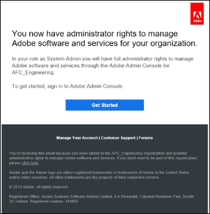
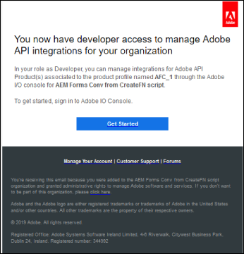

# De AFCS-service (Automated Forms Conversion) configureren {#about-this-help}

In dit artikel wordt beschreven hoe een AEM-beheerder AFCS (Automated Forms Conversion Service) kan configureren om de conversie van zijn PDF forms naar Adaptive Forms te automatiseren. Dit artikel is bestemd voor IT- en AEM-beheerders in uw organisatie. De verstrekte informatie is gebaseerd op de veronderstelling dat iedereen die dit artikel leest vertrouwd is met de volgende technologieën:

* Adobe Experience Manager- en AEM-pakketten installeren, configureren en beheren,

* Linux®- en Microsoft® Windows®-besturingssystemen gebruiken

<!--- >[!VIDEO](https://video.tv.adobe.com/v/29267/) 

**Watch the video or read the article to configure Automated Forms Conversion service (AFCS)** -->

## Onboarding{#onboarding}

De service is gratis beschikbaar voor AEM 6.5 Forms On-Premise term klanten en door Adobe beheerde Enterprise-klanten. Je kunt contact opnemen met het Adobe Sales-team of je Adobe-vertegenwoordiger om toegang tot de service aan te vragen. De service is ook gratis en vooraf ingeschakeld voor AEM Forms as a Cloud Service-klanten.

Adobe maakt toegang voor uw organisatie mogelijk en biedt de vereiste rechten aan de persoon die is aangewezen als beheerder in uw organisatie. De beheerder kan toegang verlenen aan uw AEM Forms-ontwikkelaars (gebruikers) van uw organisatie om verbinding te maken met de service.

## Vereisten {#prerequisites}

U hebt het volgende nodig om de AFCS (Automated Forms Conversion Service) te kunnen gebruiken:

* AFCS (Automated Forms Conversion Service) is ingeschakeld voor uw organisatie
* Een Adobe ID-account met beheerdersrechten voor de conversieservice
* Een up-to-run AEM 6.5 met de nieuwste versie van AEM Service Pack of AEM Forms as a Cloud Service authentieke versie met de nieuwste updates.
* Een AEM-gebruiker (op uw AEM-exemplaar) die lid is van een gebruikersgroep voor formulieren

## De omgeving instellen {#setuptheservice}

Voordat u de service gebruikt, moet u de AEM-auteur voorbereiden om verbinding te maken met de service die wordt uitgevoerd op Adobe Cloud. Voer de volgende stappen in de vermelde reeks uit om uw exemplaar voor de service voor te bereiden:

1. [Download en installeer AEM 6.5 of in AEM Forms as a Cloud Service](#aemquickstart)
1. [(Alleen voor AEM 6.5) Download en installeer de nieuwste AEM Service Pack](#servicepack)
1. [(Alleen voor AEM 6.5) Download en installeer het nieuwste invoegpakket voor AEM Forms](#downloadaemformsaddon)
1. [Aangepaste thema&#39;s en sjablonen maken](#referencepackage)

### 1. Download en installeer AEM 6.5 of in AEM Forms as a Cloud Service {#aemquickstart}


AFCS (Automated Forms Conversion Service) wordt uitgevoerd op de auteur-instantie van AEM. U hebt AEM 6.5 of AEM Forms as a Cloud Service nodig om een instantie van de AEM-auteur in te stellen.

* Als AEM 6.5 niet actief is, kunt u het downloaden van de onderstaande locaties. Nadat u AEM downloadt, voor instructies aan opstelling een de auteursinstantie van AEM, zie [ plaatsend en het handhaven ](https://helpx.adobe.com/experience-manager/6-5/sites/deploying/using/deploy.html#defaultlocalinstall):

   * Als u een bestaande klant van AEM bent, download AEM 6.5 van [ Adobe Vergunnende website ](http://licensing.adobe.com).

   * Als u een partner van Adobe bent, gebruik [ Programma van de Opleiding van de Partner van Adobe ](https://adobe.allegiancetech.com/cgi-bin/qwebcorporate.dll?idx=82357Q) om AEM 6.5 aan te vragen.

* Als u AEM Forms as a Cloud Service gebruikt, zie aan boord aan [ AEM Forms as a Cloud Service ](https://experienceleague.adobe.com/docs/experience-manager-forms-cloud-service/forms/setup-environment/setup-forms-cloud-service.html?lang=en#setup-environment) en [ opstelling een lokale ontwikkelomgeving ](https://experienceleague.adobe.com/docs/experience-manager-forms-cloud-service/forms/setup-environment/setup-local-development-environment.html?lang=en#setup-environment).

### 2. (Alleen voor AEM 6.5) Download en installeer AEM het nieuwste Service Pack {#servicepack}

Download en installeer het nieuwste AEM Service Pack. Voor gedetailleerde instructies zie [ AEM 6.5 de Nota&#39;s van de Versie van het Pak van de Dienst ](https://experienceleague.adobe.com/en/docs/experience-manager-65/content/release-notes/release-notes).

### 3. (Alleen voor AEM 6.5) Download en installeer het invoegpakket voor AEM Forms   {#downloadaemformsaddon}

Een AEM-exemplaar bevat basisformuliermogelijkheden. Voor de conversieservice zijn alle mogelijkheden van AEM Forms vereist. Download en installeer het invoegpakket voor AEM Forms om alle mogelijkheden van AEM Forms te benutten. Het pakket is vereist om de conversieservice in te stellen en uit te voeren. Voor gedetailleerde instructies, zie [ installeer en vorm gegevens vangen mogelijkheden.](https://experienceleague.adobe.com/en/docs/experience-manager-65/content/forms/install-aem-forms/osgi-installation/installing-configuring-aem-forms-osgi)
https://adminconsole.adobe.com/
>[!NOTE]
> Zorg ervoor dat u de verplichte configuraties na de installatie uitvoert nadat u het invoegpakket hebt geïnstalleerd.
>

<!-- ### (Optional) Download and install connector package  {#installConnectorPackage}

The connector package provides early access to the [Auto-detect logical sections](convert-existing-forms-to-adaptive-forms.md#run-the-conversion) features and improvements delivered in release AFC-2020.03.1. Do not install the package if you do not require feature and improvements delivered in AFC-2020.03.1.  You can [download the connector package from AEM Package Share](https://www.adobeaemcloud.com/content/marketplace/marketplaceProxy.html?packagePath=/content/companies/public/adobe/packages/cq650/featurepack/AFCS-Connector-2020.03.1). -->


### 4. Aangepaste thema&#39;s en sjablonen maken {#referencepackage}

De referentiepakketten bevatten voorbeeldthema&#39;s en sjablonen. AFCS (Automated Forms Conversion Service) vereist minstens één thema en één sjabloon om een PDF-formulier naar een adaptief formulier te converteren. Creeer een douanethema en malplaatje van uw eigen en punt [ de dienstconfiguratie ](#configure-the-cloud-service) om douanesjablonen en thema&#39;s te gebruiken alvorens de dienst te gebruiken.

U kunt het [ Assets van de Verwijzing van AEM Forms ](https://experience.adobe.com/#/downloads/content/software-distribution/en/aemcloud.html) pakket van de Verwijzing van 0} ook downloaden en installeren op uw instantie van de Auteur. Er worden enkele referentiethema&#39;s en sjablonen gemaakt.

## Toegang en machtigingen configureren

Voordat u verdergaat met het configureren van de service en het verbinden van uw exemplaar met de service die wordt uitgevoerd in Adobe Cloud, dient u meer te weten te komen over de personen en rechten die nodig zijn om verbinding te maken met de service. De dienst gebruikt twee verschillende types van persona&#39;s, beheerders en ontwikkelaars:

* **Beheerders**: De beheerders zijn verantwoordelijk voor het beheren van de software en de diensten van Adobe voor hun organisatie. Beheerders verlenen ontwikkelaars in hun organisatie toegang tot AFCS (Automated Forms Conversion Service) die werken op Adobe Cloud. Als een beheerder is ingericht voor een organisatie, ontvangt de beheerder een e-mail met de titel **[!UICONTROL 'You now have administrator rights to manage Adobe software and services for your organization']** . Als u een beheerder bent, controleer uw brievenbus voor e-mail met eerder vermelde titel en ga aan [ subsidietoegang tot ontwikkelaars van uw organisatie ](#adduseranddevs) te werk.



* **Ontwikkelaars**: Een ontwikkelaar verbindt een de auteurinstantie van AEM Forms met de Geautomatiseerde dienst van de Omzetting van Vormen (AFCS) die op de Wolk van Adobe loopt. Wanneer een beheerder rechten toekent aan een ontwikkelaar om verbinding te maken met AFCS (Automated Forms Conversion Service), wordt een e-mail met de titel U hebt nu toegang tot ontwikkelaars om de integratie van Adobe API voor uw organisatie te beheren, verzonden naar de ontwikkelaar. Als u een ontwikkelaar bent, controleer uw brievenbus voor e-mail met eerder vermelde titel en ga aan [ te werk verbindt uw lokale instantie van AEM met de Geautomatiseerde dienst van de Omzetting van Vormen op de Wolk van Adobe.](#connectafcadobeio)



### Toegang verlenen aan ontwikkelaars van uw organisatie

Nadat Adobe de toegang voor uw organisatie heeft ingeschakeld en de beheerder de vereiste bevoegdheden heeft verleend, kan de beheerder zich aanmelden bij Admin Console (zie de onderstaande gedetailleerde instructies), een profiel maken en ontwikkelaars toevoegen aan het profiel. Ontwikkelaars kunnen een exemplaar van AEM Forms verbinden met AFCS (Automated Forms Conversion Service) op Adobe Cloud.

De ontwikkelaars zijn leden van uw organisatie die wordt aangewezen om de omzettingsdienst in werking te stellen. Alleen ontwikkelaars die zijn toegevoegd aan het AFCS-profiel (Adobe Automated Forms Conversion service) mogen de AFCS-service (Automated Forms Conversion service) gebruiken.
Voer de onderstaande stappen uit om een profiel te maken en er ontwikkelaars aan toe te voegen. Er is minimaal één profiel vereist om vereiste toegang te verlenen aan ontwikkelaars van uw organisatie:

1. Login aan [ Admin Console ](https://adminconsole.adobe.com/). Het gebruik **Adobe ID** van beheerder provisioned om de Geautomatiseerde dienst van de Omzetting van Vormen (AFCS) aan login te gebruiken.
1. Klik op de optie **[!UICONTROL Automated Forms Conversion]** .
1. Klik op **[!UICONTROL New Profile]** op het tabblad **[!UICONTROL Products]** .
1. Geef **[!UICONTROL Name]** , **[!UICONTROL Display Name]** en **[!UICONTROL Description]** op voor het profiel. Klik op **[!UICONTROL Done]**. Bijvoorbeeld, creeer een profiel als **AFC_Flamingo_Test_Dev**.

   

1. Voeg ontwikkelaar toe aan het profiel. U voegt als volgt de ontwikkelaars toe:
   1. In [ Admin Console ](https://adminconsole.adobe.com/enterprise), navigeer aan het Overzicht tabel.
   1. Klik op **[!UICONTROL Assign Developers]** op de vereiste productkaart.
   1. Voer het e-mailadres en (optioneel) de naam en achternaam van de ontwikkelaar in.
   1. Selecteer productprofielen. Klik op **[!UICONTROL Save]** .

Herhaal bovenstaande stappen voor alle gebruikers. Voor meer details over het toevoegen van ontwikkelaars, zie [ ontwikkelaars ](https://helpx.adobe.com/enterprise/using/manage-developers.html) leiden.

Nadat een beheerder ontwikkelaars heeft toegevoegd aan het Adobe I/O-profiel, worden de ontwikkelaars via e-mail op de hoogte gesteld (indien geconfigureerd).

<!--
### Configure email notification for local AEM Forms instance

Automated Forms Conversion service (AFCS) uses the Day CQ mail service to send email notifications. These email notifications contain information about successful or failed conversions. If you choose not receive notification, skip these steps. Perform the following steps to configure the Day CQ Mail Service:

* **For AEM 6.5 Forms**:

   1. Go to AEM configuration manager at `http://[server]:[port]/system/console/configMgr`
   2. Open the Day CQ Mail Service configuration. Specify a value for the **[!UICONTROL SMTP server host name]**, **[!UICONTROL SMTP server port]**, and **[!UICONTROL From address]** fields. Click **[!UICONTROL Save]**.

      You can contact your email service provider or IT administrator for information about host name and port of SMTP server. You can use any valid email address in the from field. For example, notification@example.com or donotreply@example.com.

   3. Open the **[!UICONTROL Day CQ Link Externalizer]** configuration. In the **[!UICONTROL Domains]** field, specify the actual host name or IP address and port number for local, author, and publish instances. Click **[!UICONTROL Save]**.

* For AEM Forms as a Cloud Service, [log a support ticket to enable the email service](https://experienceleague.adobe.com/docs/experience-manager-cloud-service/implementing/developing/development-guidelines.html?lang=en#sending-email). -->

### Gebruiker toevoegen aan de groep met gebruikers van het formulier {#adduserstousergroup}

Geef een e-mailadres op in het profiel van de AEM-gebruiker die is aangewezen om de service uit te voeren. Zorg ervoor dat de gebruiker het lid van de **vorm-gebruikers** groep is. E-mails worden verzonden naar het e-mailadres van de gebruiker die de conversie uitvoert. U kunt als volgt een e-mailadres voor de gebruiker opgeven en gebruiker toevoegen aan de gebruikersgroep voor formulieren:

1. Meld u aan bij de AEM Forms-auteur als AEM-beheerder. Gebruik uw lokale AEM-gebruikersgegevens om u aan te melden.
1. Klik op **[!UICONTROL Adobe Experience Manager]** > **[!UICONTROL Tools]** > **[!UICONTROL Security]** > **[!UICONTROL Users]**.
1. Selecteer een gebruiker die is aangewezen om de conversieservice uit te voeren en klik op **[!UICONTROL Properties]** . De **geeft de pagina van de Montages van de Gebruiker uit** opent.
1. Geef een e-mailadres op in het veld **[!UICONTROL Email]** en klik op **[!UICONTROL Save]** . De e-mails worden naar het opgegeven e-mailadres verzonden wanneer de conversie is voltooid of mislukt.

   
1. Klik de **Groepen** tabel. In het uitgezochte groepslusje, type en selecteer de **vorm-gebruikers** groep.
1. Klik **sparen &amp; Sluiten**. De gebruiker is nu lid van de groep met gebruikers van het formulier.

    toe

## Verbind uw AEM Forms-exemplaar met de Automated Forms Conversion-service (AFCS) op Adobe Cloud

Nadat een beheerder u ontwikkelaarstoegang biedt, kunt u uw AEM Forms-exemplaar aansluiten op de AFCS-service (Automated Forms conversion Service) die wordt uitgevoerd op Adobe Cloud.
Voer de volgende stappen uit om een AEM Forms-instantie te verbinden met de service Automated Forms Conversion:

[1. Configureer de service-API&#39;s op Adobe Developer Console](#configure-the-service-apis-on-adobe-developer-console)

[2. Adobe IMS-configuraties maken](#2-create-adobe-ims-configurations)

[3. Configuratie voor automatische formulierconversie maken](#3-create-automated-forms-conversion-configuration)

### 1. Configureer de service-API&#39;s op Adobe Developer Console

Om de Geautomatiseerde dienst van de Omzetting van Vormen (AFCS) te gebruiken, creeer een project en voeg **Geautomatiseerde Dienst van de Configuratie van Forms** API aan het project op Adobe Developer Console toe. De integratie genereert API-sleutel, clientgeheim, technische account-id, bereik en organisatie-id.
Voer de volgende stappen uit om de API voor automatische formulierconversie op Adobe Developer Console te configureren:

1. Meld u aan bij https://developer.adobe.com/console. Gebruik uw Adobe ID, ontwikkelaarsaccount die uw beheerder heeft ingericht om u aan te melden bij de Adobe I/O-console.
1. Selecteer uw organisatie in de rechterbovenhoek. Neem contact op met de beheerder als u uw organisatie niet kent.
1. Klik op **[!UICONTROL Create new project]**. Er verschijnt een scherm om aan de slag te gaan met uw nieuwe project.

   

1. Klik op **[!UICONTROL Add API]**. Er verschijnt een scherm met een lijst van alle API&#39;s die voor uw account zijn ingeschakeld.
    toe

1. Selecteer **[!UICONTROL Automated Forms Conversion service]** en klik op **[!UICONTROL Next]** . Er verschijnt een scherm om de API te configureren.
   

1. Selecteer **Server-aan-Server** authentificatiemethode.
1. Geef de waarde **[!UICONTROL Credential Name]** op en klik op **[!UICONTROL Next]** .
   
1. Selecteer het Profiel van het a **Product**. Bijvoorbeeld, selecteer een profiel als **AFC_Flamingo_Test_Dev**.
1. Klik op **[!UICONTROL Save configured API]**.
   

   >[!NOTE]
   >
   > Selecteer het profiel dat u hebt gemaakt terwijl u toegang verleent aan ontwikkelaars van uw organisatie. Neem contact op met de beheerder als u niet weet welk profiel u moet selecteren.

1. Klik op **[!UICONTROL OAuth Server-to-Server]** om de API-sleutel, het clientgeheim en andere informatie weer te geven die nodig is om uw AEM-instantie te verbinden met de AFCS-service (Automated Forms Conversion).
   

   De informatie over de pagina wordt gebruikt om configuratie tot stand te brengen IMS, zoals die in [ wordt verklaard leidt tot Technische Configuratie IMS op de sectie van de Instantie van de Auteur van AEM ](#2-create-ims-technical-configuration-on-aem-author-instance).

   

### 2. Adobe IMS-configuraties maken

Meld u aan bij de auteur om de Adobe IMS-configuraties te maken. Gebruik **OAuth Credentials Details** om API Sleutel, Geheime cliënt, Technische identiteitskaart van de Rekening, Scopes, en identiteitskaart van de Organisatie terug te winnen.

1. Meld u aan bij de AEM Forms-auteur. Navigeer naar **[!UICONTROL Tools]** > **[!UICONTROL Security]** > **[!UICONTROL Adobe IMS Configurations]** .
1. Klik op **[!UICONTROL Create]**.

   

1. De pagina **[!UICONTROL Adobe IMS Technical Account Configuration]** wordt weergegeven.

   
1. Selecteer **[!UICONTROL Automated Forms Conversion Service]** in **Oplossing van de Wolk**.
1. Geef het volgende op:

   * **Titel**: Specificeer een titel.
   * **Server van de Vergunning**: [ https://ims-na1.adobelogin.com](https://ims-na1.adobelogin.com)
   * Haal het volgende van [ terug vormt de dienst APIs op Adobe Developer Console ](#1-configure-the-service-apis-on-adobe-developer-console) sectie:
      * **Identiteitskaart van de Cliënt**: Exemplaar en deeg **API Sleutel (identiteitskaart van de Cliënt)**.
      * **Geheim van de Cliënt**: Exemplaar en deeg **Geheime Cliënt**.
      * **Reikwijdte**: Exemplaar en deeg **Scopes**.
      * **Org identiteitskaart**: Exemplaar en deeg **Technische identiteitskaart van de Rekening**.

     

1. Klik op **[!UICONTROL Save]**. De configuratie van Adobe IMS wordt gemaakt.

   >[!CAUTION]
   >
   > Maak slechts één IMS-configuratie. Maak niet meer dan één IMS-configuratie.

1. Selecteer de **configuratie van Adobe IMS** en klik **[!UICONTROL Check Health]**. Er wordt een dialoogvenster weergegeven.
   

   A **de dialoogdoos van de Controle** verschijnt.

1. Klik op **[!UICONTROL Check]**.

   

   Bij een geslaagde verbinding wordt het bericht *Token retrieved successfully* weergegeven.

   

1. Klik **dicht**.

### 3. Configuratie voor automatische formulierconversie maken

Maak een configuratie voor automatische formulierconversie om uw AEM-instantie te verbinden met de conversieservice. U kunt hiermee ook een sjabloon, thema en formulierfragmenten opgeven voor conversie. U kunt meerdere configuraties voor cloudservices maken, afzonderlijk voor elke set formulieren.
U kunt bijvoorbeeld een aparte configuratie voor de formulieren van de verkoopafdeling en een aparte configuratie voor de formulieren voor klantenondersteuning hebben. Voer de volgende stappen uit om een configuratie van de wolkendienst tot stand te brengen:

1. Klik in uw AEM Forms-instantie op **[!UICONTROL Adobe Experience Manager]** > **[!UICONTROL Tools]** > **[!UICONTROL Cloud Services]** > **[!UICONTROL Automate Forms Conversion Configuration]** .
1. Selecteer de map **[!UICONTROL Global]** en klik op **[!UICONTROL Create]** .
De pagina aan **leidt tot de Automated Configuratie van de Omzetting van Vormen** verschijnt. De configuratie wordt gecreeerd in de **Globale** omslag. U kunt de configuratie ook maken in een andere map die bestaat of een map voor uw configuraties maken.
   
1. Geef op de pagina **[!UICONTROL Create Automated Forms Conversion Configuration]** een waarde op voor de volgende velden en klik op **[!UICONTROL Next]** .

   

   | Veld | Beschrijving |
   |--- |--- |
   | Titel | Unieke titel voor de configuratie. De titel wordt weergegeven in de gebruikersinterface waarmee de conversie wordt gestart. |
   | Naam | Unieke naam voor de configuratie. De configuratie wordt met de opgegeven naam opgeslagen in de CRX-Repository. De naam kan identiek zijn aan de titel. |
   | Locatie miniatuur | Locatie van de miniatuur voor de configuratie. |
   | Service-URL | URL van de AFCS (Automated Forms Conversion Service) op Adobe Cloud. Gebruik de URL `https://aemformsconversion.adobe.io/` . |
   | Sjabloon | Standaardsjabloon die op geconverteerde formulieren moet worden toegepast. U kunt altijd een andere sjabloon opgeven voordat u de conversie start. Een sjabloon bevat basisstructuur en initiële inhoud voor een adaptief formulier. U kunt een sjabloon kiezen uit de sjablonen die u buiten het vak plaatst. U kunt ook een aangepaste sjabloon maken. |
   | Thema | Standaardthema dat op geconverteerde formulieren moet worden toegepast. U kunt altijd een ander thema opgeven voordat u de conversie start.  U kunt op het pictogram klikken om een thema te kiezen dat buiten het vak wordt weergegeven. U kunt ook een aangepast thema maken. |
   | Bestaande fragmenten | Plaats van bestaande fragmenten, indien aanwezig. |
   | Aangepast metamodel | Pad van het bestand .schema.json van het aangepaste metamodel. U kunt aparte metamodellen maken voor de talen Engels, Frans, Duits, Spaans, Italiaans en Portugees. |

1. Geef op het tabblad **[!UICONTROL Advanced]** van de pagina **[!UICONTROL Create Automated Forms Conversion Configuration]** een waarde op voor het volgende veld:
   

   <table>
   <thead>
   <tr>
   <th>Veld</th>
   <th>Beschrijving</th>
   </tr>
   </thead>
   <tbody>
   <tr>
   <td >Document van record genereren</td>
   <td>Selecteer de optie om automatisch het Document van Verslag voor omgezette vormen te produceren. De optie is alleen voor XFA-formulieren (XDP en PDF forms). Wanneer u de optie inschakelt nadat u een formulier hebt verzonden, kunt u uw klanten toestaan om de informatie die zij in het formulier hebben ingevuld, in gedrukte vorm of in documentindeling bij te houden voor toekomstig gebruik. Dit wordt bedoeld als document van verslag.</td>
   </tr>
   <tr>
   <td>Analyse inschakelen</td>
   <td>(Voor AEM 6.5) Selecteer de optie om Adobe Analytics in te schakelen op alle geconverteerde formulieren. Controleer voordat u deze optie gebruikt of Adobe Analytics is ingeschakeld voor uw AEM Forms-exemplaar.</td>
   </tr>
   </tbody>
   </table>

   * Als de bron een op XFA-Gebaseerde vorm met uitbreiding .XDP is, dan behoudt de output DOR de XFA lay-out, anders gebruikt de omzettingsdienst een uit-van-de-doos malplaatje om DOR voor andere op XFA-Gebaseerde vormen te produceren.
   * Wanneer een XFA-formulier wordt verzonden, worden de gegevens van het formulier opgeslagen als een XML-element of een kenmerk. Bijvoorbeeld `<Amount currency="USD"> 10.00 </Amount>` . De valuta wordt opgeslagen als een kenmerk en valutabedrag, 10,00 als een element. Gegevens van een adaptief formulier verzenden heeft geen kenmerken, het heeft alleen elementen. Als een XFA-formulier wordt geconverteerd naar een adaptief formulier, bevatten de adaptieve formulierverzendgegevens dus een element voor elk van deze kenmerken. Bijvoorbeeld:

   ```css
      {
         "Type": "Principal",
   
         "Amount": "10.00",
   
         "currency": "USD"
      }
   ```

1. Klik op **[!UICONTROL Create]**. De cloudconfiguratie wordt gemaakt. Uw AEM Forms-exemplaar is gereed om oudere formulieren te converteren naar Adaptive Forms.
