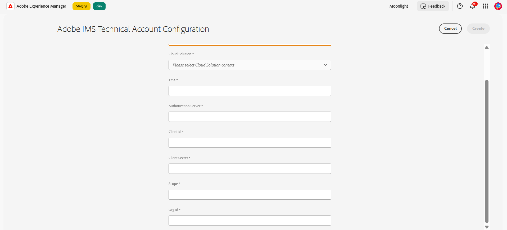

# De service Automatede form conversion (AFCS) configureren {#about-this-help}

In deze Help wordt beschreven hoe een AEM beheerder AFCS (Automatede form conversion Service) kan configureren om de conversie van zijn PDF forms naar adaptieve formulieren te automatiseren. Deze hulp is voor IT en AEM beheerders bij uw organisatie. De verstrekte informatie is gebaseerd op de veronderstelling dat iedereen die deze Hulp leest met de volgende technologieën vertrouwd is:

* Adobe Experience Manager- en AEM-pakketten installeren, configureren en beheren,

* Linux®- en Microsoft® Windows®-besturingssystemen gebruiken

* SMTP-mailservers configureren

<!--- >[!VIDEO](https://video.tv.adobe.com/v/29267/) 

**Watch the video or read the article to configure Automated Forms Conversion service (AFCS)** -->

## Onboarding{#onboarding}

De service is gratis beschikbaar voor AEM 6.4 Forms en AEM 6.5 Forms On-Premise-term klanten en Adobe-Managed Service Enterprise-klanten. U kunt het team van de Verkoop van de Adobe of uw vertegenwoordiger van de Adobe contacteren om toegang tot de dienst te verzoeken. De service is ook gratis en vooraf ingeschakeld voor AEM Forms as a Cloud Service klanten.

Adobe maakt toegang voor uw organisatie mogelijk en biedt de vereiste rechten aan de persoon die is aangewezen als beheerder in uw organisatie. De beheerder kan toegang verlenen aan uw AEM Forms-ontwikkelaars (gebruikers) van uw organisatie om verbinding te maken met de service.

## Vereisten {#prerequisites}

U hebt het volgende nodig om de service Automatede form conversion (AFCS) te gebruiken:

* De service automatede form conversion (AFCS) is ingeschakeld voor uw organisatie
* Een Adobe ID-account met beheerdersrechten voor de conversieservice
* Een actieve AEM 6.4, AEM 6.5 of AEM Forms as a Cloud Service-auteur met de nieuwste AEM Service Pack of de nieuwste updates.
* Een AEM gebruiker (op uw AEM) die lid is van een formulier-gebruikersgroep

## De omgeving instellen {#setuptheservice}

Voordat u de service gebruikt, moet u de AEM auteur voorbereiden om verbinding te maken met de service die wordt uitgevoerd op Adobe Cloud. Voer de volgende stappen in de vermelde reeks uit om uw exemplaar voor de service voor te bereiden:

1. [Download en installeer AEM 6.4, AEM 6.5 of aan boord van AEM Forms as a Cloud Service](#aemquickstart)
1. [Download en installeer de nieuwste AEM Service Pack](#servicepack)
1. [Download en installeer het nieuwste AEM Forms Add-on-pakket](#downloadaemformsaddon)
1. (facultatief) [ Download en installeer recentste schakelaarpakket ](#installConnectorPackage)
1. [Aangepaste thema&#39;s en sjablonen maken](#referencepackage)

### Download en installeer AEM 6.4 of AEM 6.5 of aan boord van AEM Forms as a Cloud Service {#aemquickstart}


De dienst van de automatede form conversion (AFCS) loopt op AEM auteursinstantie. U hebt AEM 6.4, AEM 6.5 of AEM Forms as a Cloud Service nodig om een AEM auteur-instantie in te stellen.

* Als u AEM 6.4 of AEM 6.5 niet in gebruik hebt, kunt u het downloaden van de onderstaande locaties. Nadat u AEM downloadt, voor instructies aan opstelling een AEM auteursinstantie, zie [ plaatsend en het handhaven ](https://helpx.adobe.com/experience-manager/6-5/sites/deploying/using/deploy.html#defaultlocalinstall):

   * Als u een bestaande AEM klant bent, download AEM 6.4 of AEM 6.5 van [ het Verlenen van vergunningen van de Adobe website ](http://licensing.adobe.com).

   * Als u een partner van de Adobe bent, gebruik [ Programma van de Opleiding van de Partner van de Adobe ](https://adobe.allegiancetech.com/cgi-bin/qwebcorporate.dll?idx=82357Q) om AEM 6.4 of AEM 6.5 te verzoeken.

* Als u AEM Forms as a Cloud Service aan [ AEM Forms as a Cloud Service ](https://experienceleague.adobe.com/docs/experience-manager-forms-cloud-service/forms/setup-environment/setup-forms-cloud-service.html?lang=en#setup-environment) gebruikt en [ opstelling een lokale ontwikkelomgeving ](https://experienceleague.adobe.com/docs/experience-manager-forms-cloud-service/forms/setup-environment/setup-local-development-environment.html?lang=en#setup-environment).

### (Alleen voor AEM 6.4 en AEM 6.5) Download en installeer AEM nieuwste Service Pack {#servicepack}

Download en installeer de nieuwste AEM Service Pack. Voor gedetailleerde instructies zie, of [ AEM 6.4 de Nota&#39;s van de Versie van het Pak van de Dienst ](https://helpx.adobe.com/experience-manager/6-4/release-notes/sp-release-notes.html) of [ AEM 6.5 de Nota&#39;s van de Versie van het Pak van de Dienst ](https://helpx.adobe.com/experience-manager/6-5/release-notes/sp-release-notes.html).

### (Alleen voor AEM 6.4 en AEM 6.5) Download en installeer het AEM Forms-invoegpakket  {#downloadaemformsaddon}

Een AEM-exemplaar bevat basisformuliermogelijkheden. Voor de conversieservice zijn alle mogelijkheden van AEM Forms vereist. Download en installeer het invoegpakket voor AEM Forms om alle mogelijkheden van AEM Forms te benutten. Het pakket is vereist om de conversieservice in te stellen en uit te voeren. Voor gedetailleerde instructies, zie [ gegevens installeren en vormen vangen mogelijkheden.](https://helpx.adobe.com/experience-manager/6-5/forms/using/installing-configuring-aem-forms-osgi.html)

>[!NOTE]
> Zorg ervoor dat u de verplichte configuraties na de installatie uitvoert nadat u het invoegpakket hebt geïnstalleerd.
>

<!-- ### (Optional) Download and install connector package  {#installConnectorPackage}

The connector package provides early access to the [Auto-detect logical sections](convert-existing-forms-to-adaptive-forms.md#run-the-conversion) features and improvements delivered in release AFC-2020.03.1. Do not install the package if you do not require feature and improvements delivered in AFC-2020.03.1.  You can [download the connector package from AEM Package Share](https://www.adobeaemcloud.com/content/marketplace/marketplaceProxy.html?packagePath=/content/companies/public/adobe/packages/cq650/featurepack/AFCS-Connector-2020.03.1). -->


### Aangepaste thema&#39;s en sjablonen maken {#referencepackage}

Als u AEM 6.4 of AEM 6.5 op [ productiemodus ](https://helpx.adobe.com/experience-manager/6-5/sites/administering/using/production-ready.html) (nosamplcontent run mode) begint, worden de verwijzingspakketten niet geïnstalleerd. De referentiepakketten bevatten voorbeeldthema&#39;s en sjablonen. Voor de service automatede form conversion (AFCS) zijn minstens één thema en één sjabloon nodig om een PDF-formulier om te zetten in een adaptief formulier. Creeer een douanethema en malplaatje van uw eigen en punt [ de dienstconfiguratie ](#configure-the-cloud-service) om douanesjablonen en thema&#39;s te gebruiken alvorens de dienst te gebruiken.

U kunt het [ Assets van de Verwijzing van AEM Forms ](https://experience.adobe.com/#/downloads/content/software-distribution/en/aemcloud.html) pakket van de Verwijzing van 0} ook downloaden en installeren op uw instantie van de Auteur. Er worden enkele referentiethema&#39;s en sjablonen gemaakt.

## De service configureren {#configure-the-service}

Voordat u verdergaat om de service te configureren en uw lokale instantie te verbinden met de service die wordt uitgevoerd op Adobe Cloud, moet u meer weten over de personen en rechten die nodig zijn om verbinding te maken met de service. De dienst gebruikt twee verschillende types van persona&#39;s, beheerders en ontwikkelaars:

* **Beheerders**: De beheerders zijn verantwoordelijk voor het beheren van de software en de diensten van de Adobe voor hun organisatie. Beheerders verlenen toegang aan ontwikkelaars in hun organisatie om verbinding te maken met AFCS (Automatede form conversion Service) die worden uitgevoerd op Adobe Cloud. Als een beheerder is ingericht voor een organisatie, ontvangt de beheerder een e-mail met de titel **[!UICONTROL 'You now have administrator rights to manage Adobe software and services for your organization']** . Als u een beheerder bent, controleer uw brievenbus voor e-mail met eerder vermelde titel en ga aan [ subsidietoegang tot ontwikkelaars van uw organisatie ](#adduseranddevs) te werk.


* **Ontwikkelaars**: Een ontwikkelaar verbindt een lokale de auteurinstantie van AEM Forms met de dienst van de Automatede form conversion (AFCS) die op de Wolk van de Adobe loopt. Wanneer een beheerder rechten toekent aan een ontwikkelaar om verbinding te maken met de service Automatede form conversion (AFCS), wordt een e-mail met de titel U hebt nu toegang tot ontwikkelaars om de integratie van de Adobe-API voor uw organisatie te beheren, verzonden naar de ontwikkelaar. Als u een ontwikkelaar bent, controleer uw brievenbus voor e-mail met eerder vermelde titel en ga aan [ te werk verbindt uw lokale AEM instantie met de dienst van de Automatede form conversion op de Wolk van de Adobe.](#connectafcadobeio)


### (Alleen voor beheerders van AEM 6.4 en AEM 6.5) Toegang verlenen aan ontwikkelaars van uw organisatie {#adduseranddevs}

Nadat de Adobe toegang voor uw organisatie toelaat en vereiste voorrechten aan de beheerder verstrekt, kan de beheerder zich aanmelden in Admin Console (gedetailleerde instructies hieronder), een profiel creëren, en ontwikkelaars toevoegen aan het profiel. Ontwikkelaars kunnen een lokale versie van AEM Forms verbinden met AFCS (Automatede form conversion Service) op Adobe Cloud.

De ontwikkelaars zijn leden van uw organisatie die wordt aangewezen om de omzettingsdienst in werking te stellen. Alleen ontwikkelaars die zijn toegevoegd aan het AFCS-profiel (Adobe Automatede form conversion Service) hebben het recht om de AFCS-service (Automatede form conversion Service) te gebruiken. Voer de onderstaande stappen uit om een profiel te maken en er ontwikkelaars aan toe te voegen. Er is minimaal één profiel vereist om vereiste toegang te verlenen aan ontwikkelaars van uw organisatie:

1. Login aan [ Admin Console ](https://adminconsole.adobe.com/). Het gebruik **Adobe ID** van beheerder provisioned aan de dienst van de Automatede form conversion (AFCS) aan login. Geen andere id of Federated ID aan login.
1. Klik op de optie **[!UICONTROL Automated Forms Conversion]** .
1. Klik op **[!UICONTROL New Profile]** op het tabblad **[!UICONTROL Products]** .
1. Geef **[!UICONTROL Name]** , **[!UICONTROL Display Name]** en **[!UICONTROL Description]** op voor het profiel. Klik op **[!UICONTROL Done]**. Er wordt een profiel gemaakt.

   

1. Voeg ontwikkelaar toe aan het profiel. U voegt als volgt de ontwikkelaars toe:
   1. In de [ Admin Console ](https://adminconsole.adobe.com/enterprise), navigeer aan het Overzicht tabel.
   1. Klik op **[!UICONTROL Assign Developers]** op de vereiste productkaart.
   1. Voer het e-mailadres en (optioneel) de naam en achternaam van de ontwikkelaar in.
   1. Selecteer productprofielen. Tik op **[!UICONTROL Save]** .

Herhaal bovenstaande stappen voor alle gebruikers. Voor meer details over het toevoegen van ontwikkelaars, zie [ ontwikkelaars ](https://helpx.adobe.com/enterprise/using/manage-developers.html) leiden.

Nadat een beheerder ontwikkelaars heeft toegevoegd aan het Adobe I/O-profiel, worden de ontwikkelaars via e-mail op de hoogte gesteld. Na het ontvangen van e-mail, kunnen de ontwikkelaars aan [ te werk gaan om een lokale instantie van AEM Forms met de dienst van de Automatede form conversion op de Wolk van de Adobe ](#connectafcadobeio) te verbinden.

### (Alleen voor ontwikkelaars) Sluit uw lokale AEM Forms-instantie aan op AFCS (Automatede form conversion Service) op Adobe Cloud {#connectafcadobeio}

Nadat een beheerder u ontwikkelaarstoegang verleent, kunt u uw lokale instantie van AEM Forms met de dienst van de Automatede form conversion (AFCS) verbinden die op de Wolk van de Adobe loopt. Voer de volgende stappen in de vermelde reeks uit om uw AEM Forms-instantie te verbinden met de service:

* [E-mailmeldingen configureren](configure-service.md#configureemailnotification)
* [Gebruiker toevoegen aan de groep met gebruikers van het formulier](#adduserstousergroup)
* [Openbare certificaten verkrijgen](#obtainpubliccertificates)
* [De service-API&#39;s configureren op Adobe Developer Console](#createintegration)
* [De cloudservice configureren](configure-service.md#configure-the-cloud-service)

#### E-mailmelding configureren {#configureemailnotification}

De service automatede form conversion (AFCS) gebruikt de CQ-mailservice op de dag om e-mailmeldingen te verzenden. Deze e-mailmeldingen bevatten informatie over geslaagde of mislukte conversies. Sla deze stappen over als u geen melding wilt ontvangen. Voer de volgende stappen uit om de Day CQ Mail Service te configureren:

* Voor AEM 6.4 Forms of AEM 6.5 Forms:

   1. Ga naar AEM configuratiebeheer op `http://localhost:4502/system/console/configMgr`
   1. Open de configuratie van de Day CQ Mail Service. Geef een waarde op voor de velden **[!UICONTROL SMTP server host name]** , **[!UICONTROL SMTP server port]** en **[!UICONTROL From address]** . Klik op **[!UICONTROL Save]**.

      U kunt contact opnemen met uw e-mailserviceprovider of IT-beheerder voor informatie over de hostnaam en poort van SMTP-server. U kunt elk geldig e-mailadres gebruiken in het veld Van. Bijvoorbeeld notification@example.com of donotreply@example.com.

   1. Open de **[!UICONTROL Day CQ Link Externalizer]** -configuratie. Geef in het veld **[!UICONTROL Domains]** de werkelijke hostnaam of het werkelijke IP-adres en het poortnummer op voor lokale, auteur- en publicatieinstanties. Klik op **[!UICONTROL Save]**.

* Voor AEM Forms as a Cloud Service, [ logboek een steunkaartje om de e-maildienst ](https://experienceleague.adobe.com/docs/experience-manager-cloud-service/implementing/developing/development-guidelines.html?lang=en#sending-email) toe te laten.

#### Gebruiker toevoegen aan de groep met gebruikers van het formulier {#adduserstousergroup}

Geef een e-mailadres op in het profiel van de AEM gebruiker die is aangewezen om de service uit te voeren. Zorg ervoor dat de gebruiker het lid van de [ gebruikers ](https://experienceleague.adobe.com/docs/experience-manager-65/forms/manage-administer-aem-forms/forms-groups-privileges-tasks.html) groep van vormen is. E-mails worden verzonden naar het e-mailadres van de gebruiker die de conversie uitvoert. U kunt als volgt een e-mailadres voor de gebruiker opgeven en gebruiker toevoegen aan de gebruikersgroep voor formulieren:

1. Meld u als AEM beheerder aan bij de auteur-instantie van AEM Forms. Gebruik uw lokale AEM om u aan te melden. Gebruik Adobe ID niet voor aanmelding. Tik op **[!UICONTROL Adobe Experience Manager]** > **[!UICONTROL Tools]** > **[!UICONTROL Security]** > **[!UICONTROL Users]** .

1. Selecteer een gebruiker die is toegewezen om de conversieservice uit te voeren en tik op **[!UICONTROL Properties]** . De pagina Gebruikersinstellingen bewerken wordt geopend.
1. Geef een e-mailadres op in het veld **[!UICONTROL Email]** en tik op **[!UICONTROL Save]** . De e-mails worden naar het opgegeven e-mailadres verzonden wanneer de conversie is voltooid of mislukt.
1. Tik de **Groepen** tabel. In het uitgezochte groepslusje, type en selecteer de **vorm-gebruikers** groep. Tik **sparen &amp; sluit**. De gebruiker is nu lid van de groep met gebruikers van het formulier.

#### (Alleen voor AEM 6.4 en AEM 6.5) Overheidscertificaten verkrijgen {#obtainpubliccertificates}

Met een openbaar certificaat kunt u uw profiel verifiëren op Adobe I/O.

1. Meld u aan bij de AEM Forms-auteur. Navigeer naar **[!UICONTROL Tools]** > **[!UICONTROL Security]** > **[!UICONTROL Adobe IMS Configurations]** . Tik op **[!UICONTROL Create]**. De pagina **[!UICONTROL Adobe IMS Technical Account Configuration]** wordt weergegeven.

   

1. Selecteer **[!UICONTROL Automated Forms Conversion Service]** in Cloudoplossing.

1. Selecteer het selectievakje **[!UICONTROL Create new certificate]** en geef een alias op. De alias fungeert als naam voor het dialoogvenster. Tik op **[!UICONTROL Create certificate]**. Er wordt een dialoogvenster weergegeven. Klik op **[!UICONTROL OK]**. Het certificaat wordt gemaakt.

1. Tik **[!UICONTROL Download Public Key]** en sla het *AEM-Adobe-IMS.crt* certificaatdossier op uw machine op. Het certificaatdossier wordt gebruikt om [ de dienst APIs op Adobe Developer Console ](#createintegration) te vormen. Tik op **[!UICONTROL Next]** .

1. Geef het volgende op:

   * Titel: geef een titel op.
   * De Server van de vergunning: [ https://ims-na1.adobelogin.com](https://ims-na1.adobelogin.com) \

   Laat de overige velden voorlopig leeg (later te verstrekken). Laat de pagina open.

   <!--
   Comment Type: draft

   <li> </li>
   -->

   <!--
   Comment Type: draft

   <li>Step text</li>
   -->

#### (Alleen voor AEM 6.4 en AEM 6.5) De service-API&#39;s configureren op Adobe Developer Console {#createintegration}

Om de dienst van de Automatede form conversion (AFCS) te gebruiken, creeer een project en voeg Geautomatiseerde de Dienst API van de Configuratie van Forms aan het project op Adobe Developer Console toe. De integratie genereert API Key, Client Secret, Payload (JWT).

1. Login aan [ https://console.adobe.io/ ](https://console.adobe.io/). Gebruik uw Adobe ID, ontwikkelaarsaccount die uw beheerder heeft ingericht om u aan te melden bij de Adobe I/O-console voor aanmelding.
1. Selecteer uw organisatie in de rechterbovenhoek. Neem contact op met de beheerder als u uw organisatie niet kent.
1. Tik op **[!UICONTROL Create new project]**. Er verschijnt een scherm om aan de slag te gaan met uw nieuwe project. Tik op **[!UICONTROL Add API]**. Er verschijnt een scherm met een lijst van alle API&#39;s die voor uw account zijn ingeschakeld.
1. Selecteer **[!UICONTROL Automated Forms Conversion service]** en tik op **[!UICONTROL Next]** . Er verschijnt een scherm om de API te configureren.
1. Selecteer de [!UICONTROL Upload your public key] optie, upload het AEM-Adobe-IMS.crt dossier in [ wordt gedownload verkrijgt Openbare Certificaten ](#obtainpubliccertificates) sectie en tikt **[!UICONTROL Next]** dat. De optie Create a new Service Account (JWT) credential wordt weergegeven. Tik op **[!UICONTROL Next]** .
1. Selecteer een productprofiel en tik op **[!UICONTROL Save configured API]** . Selecteer het profiel dat wordt gecreeerd terwijl [ toegang tot ontwikkelaars van uw organisatie ](#adduseranddevs) verleent. Neem contact op met de beheerder als u niet weet welk profiel u moet selecteren.
1. Tik op **[!UICONTROL Service Account (JWT)]** om de API-sleutel, het clientgeheim en andere informatie weer te geven die nodig is om uw lokale AEM-instantie aan te sluiten op AFCS (Automatede form conversion Service). De informatie op de pagina wordt gebruikt om configuratie IMS op uw lokale machine tot stand te brengen.

1. Open de pagina van de Configuratie IMS op uw lokale instantie. U hebt de pagina open gelaten aan het einde van de sectie voor [Openbaar certificaat verkrijgen](#obtainpubliccertificates).

   

1. Geef API-sleutel en clientgeheim op de technische pagina van Adobe IMS op. Gebruik de waarden die zijn opgegeven in Service Account (JWT) van de Adobe Developer-consolepagina.

   >[!NOTE]
   >
   >
   >Gebruik voor het laden de code op het tabblad Generate JWT van de pagina Service Account (JWT) van Adobe Developer Console.

1. Tik op **[!UICONTROL Save]**. De IMS-configuratie wordt gemaakt.

   >[!CAUTION]
   >
   >Maak slechts één IMS-configuratie. Maak niet meer dan één IMS-configuratie.

1. Selecteer de IMS-configuratie en tik op **[!UICONTROL Check Health]** . Er wordt een dialoogvenster weergegeven. Tik op **[!UICONTROL Check]**. Bij een geslaagde verbinding wordt het bericht *Token retrieved successfully* weergegeven.

   

   <br/> <br/>

#### De Cloud Service configureren {#configure-the-cloud-service}

Creeer een configuratie van de Cloud Service om uw AEM instantie aan de omzettingsdienst te verbinden. U kunt hiermee ook een sjabloon, thema en formulierfragmenten opgeven voor conversie. U kunt meerdere configuraties voor cloudservices maken, afzonderlijk voor elke set formulieren. U kunt bijvoorbeeld een aparte configuratie voor de formulieren van de verkoopafdeling en een aparte configuratie voor de formulieren voor klantenondersteuning hebben. Voer de volgende stappen uit om een configuratie van de wolkendienst tot stand te brengen:

1. Tik in uw AEM Forms-instantie op **[!UICONTROL Adobe Experience Manager]** > **[!UICONTROL Tools]** > **[!UICONTROL Cloud Services]** > **[!UICONTROL Automate Forms Conversion Configuration]** .
1. Tik op de map **[!UICONTROL Global]** en tik op **[!UICONTROL Create]** . De pagina om de configuratie van de Automatede form conversion tot stand te brengen verschijnt. De configuratie wordt gemaakt in de map Global. U kunt de configuratie ook maken in een andere map die bestaat of een map voor uw configuraties maken.

1. Geef op de pagina **[!UICONTROL Create Automated Forms Conversion Configuration]** een waarde op voor de volgende velden en tik op **[!UICONTROL Next]** .

   | Veld | Beschrijving |
   |--- |--- |
   | Titel | Unieke titel voor de configuratie. De titel wordt weergegeven in de gebruikersinterface waarmee de conversie wordt gestart. |
   | Naam | Unieke naam voor de configuratie. De configuratie wordt met de opgegeven naam opgeslagen in de CRX-Repository. De naam kan identiek zijn aan de titel. |
   | Locatie miniatuur | Locatie van de miniatuur voor de configuratie. |
   | Service-URL | URL van de AFCS-service (Automatede form conversion service) op Adobe Cloud. Gebruik de URL `https://aemformsconversion.adobe.io/` . |
   | Sjabloon | Standaardsjabloon die op geconverteerde formulieren moet worden toegepast. U kunt altijd een andere sjabloon opgeven voordat u de conversie start. Een sjabloon bevat basisstructuur en initiële inhoud voor een adaptief formulier. U kunt een sjabloon kiezen uit de sjablonen die u buiten het vak plaatst. U kunt ook een aangepaste sjabloon maken. |
   | Thema | Standaardthema dat op geconverteerde formulieren moet worden toegepast. U kunt altijd een ander thema opgeven voordat u de conversie start.  U kunt op het pictogram klikken om een thema te kiezen dat buiten het vak wordt weergegeven. U kunt ook een aangepast thema maken. |
   | Bestaande fragmenten | Plaats van bestaande fragmenten, indien aanwezig. |
   | Aangepast metamodel | Pad van het bestand .schema.json van het aangepaste metamodel. U kunt aparte metamodellen maken voor de talen Engels, Frans, Duits, Spaans, Italiaans en Portugees. |

1. Geef op het tabblad **[!UICONTROL Advanced]** van de pagina **[!UICONTROL Create Automated Forms Conversion Configuration]** een waarde op voor het volgende veld:

   <table>
   <thead>
   <tr>
   <th>Veld</th>
   <th>Beschrijving</th>
   </tr>
   </thead>
   <tbody>
   <tr>
   <td >Document van record genereren</td>
   <td>Selecteer de optie om automatisch het Document van Verslag voor omgezette vormen te produceren. De optie is alleen beschikbaar voor XFA-formulieren (XDP en PDF forms). Wanneer u de optie inschakelt nadat u een formulier hebt verzonden, kunt u uw klanten toestaan om de informatie die zij in het formulier hebben ingevuld, in gedrukte vorm of in documentindeling bij te houden voor toekomstig gebruik. Dit wordt bedoeld als document van verslag.</td>
   </tr>
   <tr>
   <td>Analyse inschakelen</td>
   <td>(Alleen voor AEM 6.4 en AEM 6.5) Selecteer de optie om Adobe Analytics in te schakelen op alle geconverteerde formulieren. Controleer voordat u deze optie gebruikt of Adobe Analytics is ingeschakeld voor uw AEM Forms-exemplaar.</td>
   </tr>
   </tbody>
   </table>

   * Als de bron een op XFA-Gebaseerde vorm met uitbreiding .XDP is, dan behoudt de output DOR de XFA lay-out, anders gebruikt de omzettingsdienst een uit-van-de-doos malplaatje om DOR voor andere op XFA-Gebaseerde vormen te produceren.
   * Wanneer een XFA-formulier wordt verzonden, worden de gegevens van het formulier opgeslagen als een XML-element of een kenmerk. Bijvoorbeeld `<Amount currency="USD"> 10.00 </Amount>` . De valuta wordt opgeslagen als een kenmerk en valutabedrag, 10,00 als een element. Gegevens van een adaptief formulier verzenden heeft geen kenmerken, het heeft alleen elementen. Als een XFA-formulier wordt geconverteerd naar een adaptief formulier, bevatten de adaptieve formulierverzendgegevens dus een element voor elk van deze kenmerken. Bijvoorbeeld:

   ```css
      {
         "Type": "Principal",
   
         "Amount": "10.00",
   
         "currency": "USD"
      }
   ```

1. Tik op **[!UICONTROL Create]**. De cloudconfiguratie wordt gemaakt. Uw AEM Forms-exemplaar is gereed om oudere formulieren te converteren naar adaptieve formulieren.
