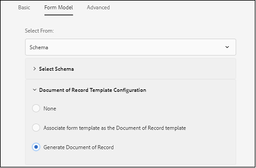
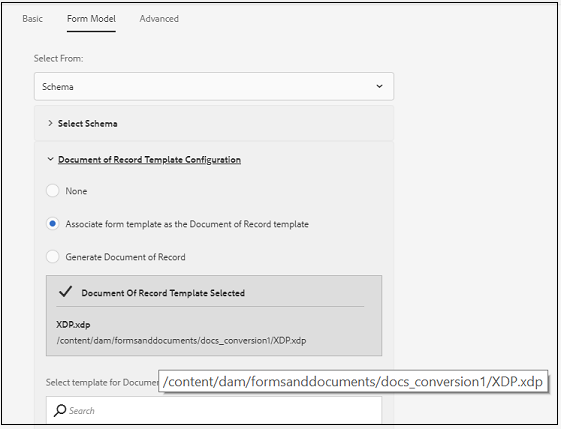

# Aanbevolen workflows om document van recordgeneratie voor adaptieve workflows in te schakelen {#recommended-workflows-dor-generation}

Met het Document of Record (DoR) kunt u een record bijhouden van de gegevens die u opgeeft en kunt u deze in een adaptief formulier verzenden, zodat u er later naar kunt verwijzen.
Het DoR gebruikt een basissjabloon om zijn lay-out te bepalen. U kunt een DoR genereren door een standaardsjabloon te gebruiken of een andere sjabloon aan het aangepaste formulier te koppelen.

Voor meer informatie bij het produceren van een DoR, zie [Document met record genereren voor adaptieve formulieren](https://helpx.adobe.com/experience-manager/6-5/forms/using/generate-document-of-record-for-non-xfa-based-adaptive-forms.html).

De [automatede form conversion](/help/using/introduction.md) converteert de volgende bronformulieren naar adaptieve formulieren:

* niet-interactieve PDF forms
* Acro Forms
* Op XFA gebaseerde PDF forms

Op basis van het bronformulier dat u gebruikt voor conversie, kunt u een DoR genereren met:

* een standaardsjabloon
* het bronformulier als sjabloon - Als u deze optie selecteert, koppelt de conversieservice het bronformulier automatisch aan het omgezette adaptieve formulier als de DoR-sjabloon.
* andere sjablonen aan het omgezette adaptieve formulier koppelen

De volgende lijst illustreert een voorbeeld van hoe het malplaatje van Dor dat u gebruikt de lay-out van geproduceerde DoR beïnvloedt:

<table> 
 <tbody>
 <tr>
  <td>
<strong>Bronformulier</strong>
</td>
  <td>
<strong>Gegenereerde DoR</strong>
</td> 
   </tr>
  <tr>
   <td></td>
   <td>
Als u het standaardmalplaatje gebruikt om DoR te produceren: </td>
   </tr>
   <tr>
   <td></td>
   <td>
Als u bronvorm als malplaatje gebruikt om DoR te produceren: 
</td>
   </tr>
  </tbody>
</table>

Als u het bronformulier als sjabloon gebruikt, behoudt het DoR-bestand de indeling van het bronformulier, zoals in de tabel wordt geïllustreerd.
In dit artikel worden de aanbevolen paden beschreven voor het genereren van een DoR op basis van de drie typen bronformulieren.

<table> 
 <tbody> 
  <tr> 
   <th><strong>Bronformulier</strong></th> 
   <th><strong>Methoden om DoR te genereren</strong></th> 
  </tr> 
  <tr> 
   <td>
Niet-interactieve PDF forms
</td> 
   <td> 
    <ul> 
     <li><a href="#generate-document-of-record-using-cloud-configuration">genereren van doR inschakelen vóór adaptieve formulierconversie om een doR te genereren met behulp van een standaardsjabloon</a></li> 
     <li><a href="#edit-adaptive-form-properties-generate-document-of-record">Adaptieve formuliereigenschappen bewerken na adaptieve formulierconversie om het genereren van DoR mogelijk te maken met behulp van de standaardinstelling of een andere formuliersjabloon</a></li> 
    </ul> </td> 
  </tr>
  <tr> 
   <td>
PDF forms op basis van Acro Forms of XFA
</td> 
   <td> 
    <ul> 
     <li><a href="#use-input-form-as-template-to-generate-document-of-record">Het genereren van doR inschakelen vóór de adaptieve formulierconversie om DoR te genereren met het bronformulier als sjabloon</a></li> 
     <li><a href="#edit-adaptive-form-properties-to-generate-document-of-record">Adaptieve formuliereigenschappen bewerken na adaptieve formulierconversie om het genereren van DoR mogelijk te maken met de standaardsjabloon, het bronformulier als sjabloon of een andere formuliersjabloon</a></li> 
    </ul> </td> 
  </tr>    
 </tbody> 
</table>

## Document met record genereren voor niet-interactieve PDF forms {#generate-document-of-record-non-interactive-pdf}

Als u een niet-interactief PDF formulier gebruikt als bronformulier voor de service Automatede form conversion, kunt u:

* Schakel het genereren van DoR vóór de adaptieve formulierconversie in om een standaardsjabloon voor DoR te genereren
* of bewerk adaptieve formuliereigenschappen na adaptieve formulierconversie om het genereren van een doR mogelijk te maken met behulp van standaard of een ander formuliersjabloon

### genereren van doR inschakelen vóór conversie om DoR te genereren met de standaardsjabloon {#generate-document-of-record-using-cloud-configuration}

1. Selecteren **[!UICONTROL Tools]** > **[!UICONTROL Cloud Services]** > **[!UICONTROL Automated Forms Conversion Configuration]** > Eigenschappen van cloudconfiguratie gebruikt voor conversie > **[!UICONTROL Advanced]** > **[!UICONTROL Generate Document of Record]** optie.

   

1. Tikken **[!UICONTROL Save & Close]** om de instellingen op te slaan.

1. [De conversie uitvoeren](/help/using/convert-existing-forms-to-adaptive-forms.md). Zorg ervoor dat u de wolkenconfiguratie gebruikt die in stap 1 van deze instructies wordt uitgegeven.
Bij het verzenden van het geconverteerde adaptieve formulier wordt de DoR automatisch gegenereerd met de standaardsjabloon.

### Aangepaste formuliereigenschappen bewerken na conversie om DoR-generatie in te schakelen {#edit-adaptive-form-properties-generate-document-of-record}

Als u het genereren van doR niet inschakelt voordat u het bronformulier omzet in een adaptief formulier, kunt u dit nog steeds doen na de conversie.

1. [De conversie uitvoeren](/help/using/convert-existing-forms-to-adaptive-forms.md) op het niet-interactieve PDF formulier om een adaptief formulier te genereren.

1. Selecteer het adaptieve formulier in het dialoogvenster **[!UICONTROL output]** map en tik **[!UICONTROL Properties]**.

1. In de **[!UICONTROL Form Model]** tabblad, vouwt u de **[!UICONTROL Document of Record Template Configuration]** en selecteert u **[!UICONTROL Generate Document of Record]**.

   

1. Tikken **[!UICONTROL Save & Close]** om de instellingen op te slaan.

Bij het verzenden van het geconverteerde adaptieve formulier wordt de DoR automatisch gegenereerd met de standaardsjabloon. Als u een andere DoR-sjabloon wilt koppelen aan het geconverteerde adaptieve formulier, kunt u **[!UICONTROL Associate form template as the Document of Record template]** optie.

## Document met record genereren voor PDF forms op basis van Acro Forms of XFA {#generate-document-of-record-acroform-xfaform}

Als u een Acro-formulier of een XFA-gebaseerd PDF formulier gebruikt als bronformulier voor de service Automatede form conversion, kunt u:

* Schakel het genereren van DoR vóór de adaptieve formulierconversie in om een DoR te genereren met het bronformulier als sjabloon

* of bewerk adaptieve formuliereigenschappen na adaptieve formulierconversie om het genereren van DoR mogelijk te maken met de standaardsjabloon, het bronformulier als sjabloon of een andere formuliersjabloon

### genereren van doR inschakelen vóór conversie om doR te genereren met behulp van bronformuliersjabloon {#use-input-form-as-template-to-generate-document-of-record}

1. Selecteren **[!UICONTROL Tools]** > **[!UICONTROL Cloud Services]** > **[!UICONTROL Automated Forms Conversion Configuration]** > Eigenschappen van cloudconfiguratie gebruikt voor conversie > **[!UICONTROL Advanced]** > **[!UICONTROL Generate Document of Record]** optie.

1. Tikken **[!UICONTROL Save & Close]** om de instellingen op te slaan.

1. [De conversie uitvoeren](/help/using/convert-existing-forms-to-adaptive-forms.md). Zorg ervoor dat u de wolkenconfiguratie gebruikt die in stap 1 van deze instructies wordt uitgegeven.
De conversieservice koppelt het Acro Form- of XFA-gebaseerde PDF-formulier automatisch aan het geconverteerde adaptieve formulier als de DoR-sjabloon.
U kunt de adaptieve formuliereigenschappen openen om de DoR-sjabloon weer te geven in het dialoogvenster **[!UICONTROL Document of Record Template Configuration]** deel van **[!UICONTROL Form Model]** tab.

   

   Bij het verzenden van het geconverteerde adaptieve formulier wordt de DoR automatisch gegenereerd met behulp van de bronformuliersjabloon.

### Aangepaste formuliereigenschappen bewerken na conversie om DoR-generatie in te schakelen {#edit-adaptive-form-properties-to-generate-document-of-record}

1. [De conversie uitvoeren](/help/using/convert-existing-forms-to-adaptive-forms.md) op het niet-interactieve PDF formulier om een adaptief formulier te genereren.

1. Selecteer het adaptieve formulier in het dialoogvenster **[!UICONTROL output]** map en tik **[!UICONTROL Properties]**.

1. In de **[!UICONTROL Form Model]** tabblad, vouwt u de **[!UICONTROL Document of Record Template Configuration]** en selecteert u **[!UICONTROL Generate Document of Record]** om het produceren van Dor toe te laten gebruikend het standaardmalplaatje.
U kunt ook de **[!UICONTROL Associate form template as the Document of Record template]** en selecteert u de sjabloon om het genereren van doR-bestanden in te schakelen met de bronformuliersjabloon of een andere formuliersjabloon.

1. Tikken **[!UICONTROL Save & Close]** om de instellingen op te slaan.
