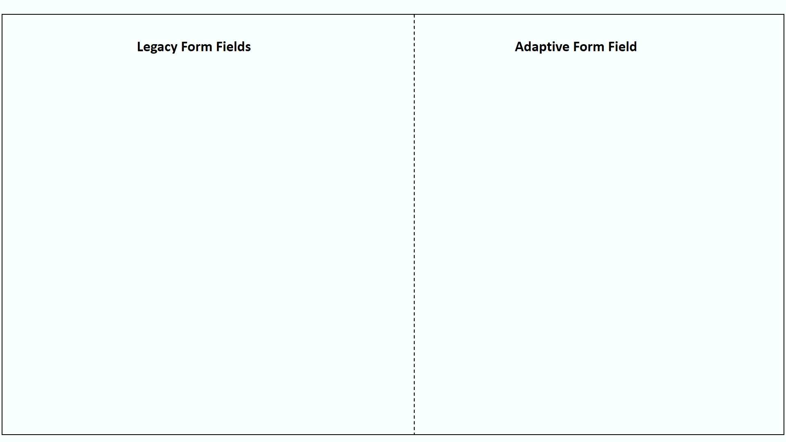
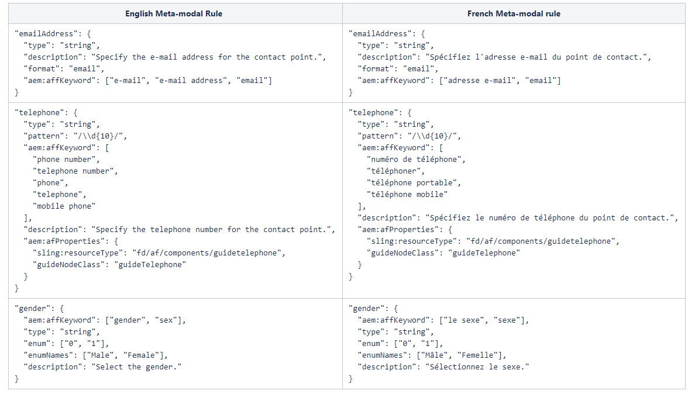

# Het standaard metamodel uitbreiden {#extend-the-default-meta-model}

Met de service automatede form conversion kunt u formulierobjecten herkennen en uitnemen van bronformulieren. Met Semantic-mapper kan de service bepalen hoe de geëxtraheerde objecten in een adaptieve vorm worden weergegeven. Een bronformulier kan bijvoorbeeld vele verschillende soorten representaties van een datum hebben. Met de semantische mapfunctie kunt u alle weergaven van datumformulierobjecten van het bronformulier toewijzen aan datumcomponent van de adaptieve formulieren. Met Semantic mapper kan de service ook validaties, regels, gegevenspatronen, Help-tekst en toegankelijkheidseigenschappen vooraf configureren en toepassen op adaptieve formuliercomponenten tijdens conversie.



Meta-model is een JSON-schema. Voordat u begint met meta-model, moet u controleren of u goed bent omgedraaid met JSON. U moet ervaring hebben met het maken, bewerken en lezen van gegevens die zijn opgeslagen in de JSON-indeling.

## Standaardmetamodel {#default-meta-model}

De dienst van de automatede form conversion heeft een standaard meta-model. Het is een JSON-schema en bevindt zich op Adobe Cloud met andere onderdelen van de service Automatede form conversion. U kunt een exemplaar van het metamodel op uw lokale AEM server vinden bij: http://&lt;server>:&lt;port>/aem/forms.html/content/dam/formsanddocuments/metamodel/`global.schema.json`. U kunt ook [klik hier](assets/en.globalschema.json) om tot het Engelse taalschema toegang te hebben of te downloaden. Het metamodel voor [Frans](assets/fr.globalschema.json), [Duits](assets/de.globalschema.json) [Spaans](assets/es.globalschema.json), [Italiaans](assets/it.globalschema.json), en [Portugees](assets/pt_br.globalschema.json) talen kunnen ook worden gedownload .

Het schema van meta-model wordt afgeleid uit schemaentiteiten in https://schema.org/docs/schemas.html. Het heeft Persoon, PostalAddress, LocalBusiness, en meer entiteiten zoals die op https://schema.org worden bepaald. Elke entiteit van het metamodel volgt het JSON-schemaobjecttype. De volgende code vertegenwoordigt een structuur van een metamodel van het steekproef:

```
   "Entity": {
      "id": "Entity",
      "properties": {
        "name": {
          "type": "string"
        },

        "description": {
          "type": "string",
          "description": "Description of the item"
        }
      }
    }
```

## Het standaardmetamodel downloaden {#download-the-default-meta-model}

Voer de volgende stappen uit om het standaard meta-model aan het lokale dossiersysteem te downloaden:

1. Meld u aan bij uw AEM Forms-exemplaar.
1. Ga naar de **[!UICONTROL Forms]** > **[!UICONTROL Forms & Documents]** **>** **[!UICONTROL Meta Model]** map.
1. Selecteer **[!UICONTROL global.schema.json]** bestand en tik **[!UICONTROL Download]**. Er wordt een dialoogvenster voor downloaden weergegeven. Selecteer **[!UICONTROL Download asset(s) as binary files]** optie. Tik op **[!UICONTROL Download]**. Er wordt een archief gedownload.

   <!--
   Comment Type: draft

   <li><p>Extract the archive and open the global.schema.json file for editing. </p> </li>
   -->

   <!--
   Comment Type: draft

   <li>Step text</li>
   -->

## Het metamodel begrijpen {#understanding-the-meta-model}

Een metamodel verwijst naar een JSON-schemabestand dat entiteiten bevat. Alle entiteiten in het JSON-schemabestand bevatten een naam en een id. Elke entiteit kan meerdere eigenschappen bevatten. De entiteiten en de eigenschappen kunnen variëren op basis van het domein. U kunt een schemabestand met trefwoorden en veldconfiguraties uitbreiden om schema-eigenschappen toe te wijzen aan adaptieve formuliercomponenten.

```
"Event": {
      "id": "Eventid",
      "allOf": [
        {
          "$ref": "#Entity"
        },
        {
          "properties": {
            "startDate": {
              "type": "string",
              "format": "date",
              "description": "Specify the start date and time of the event in ISO 8601 date format."
            },
            "endDate": {
              "type": "string",
              "format": "date",
              "description": "Specify the end date and time of the event in ISO 8601 date format."
            },
            "location": {
              "$ref": "#PostalAddress",
              "description": "Specify the location of the event."
            }
          }
        }
      ]
    }
```

In dit voorbeeld: **Gebeurtenis** staat voor de naam van een entiteit met een waarde voor **id** als **Eventid**. De gebeurtenisentiteit bevat meerdere eigenschappen:

* startDate
* endDate
* locatie

De **allOf** in het metamodel maakt overerving tussen entiteiten mogelijk.

Elke eigenschap kan verder het volgende bevatten:

* [Eigenschappen van JSON-schema](#jsonschemaproperties)
* [Op trefwoorden gebaseerde zoekopdracht om eigenschappen toe te passen op gegenereerde adaptieve formuliervelden](#keywordsearch)
* [Aanvullende eigenschappen](#additionalproperties)


Gebaseerd op de trefwoorden waarnaar wordt verwezen met **aem:affKeyword**, voert de conversieservice een zoekbewerking uit op de bronformuliervelden. De conversieservice past de eigenschappen van het JSON-schema en aanvullende eigenschappen toe op de velden die aan de zoekcriteria voldoen.

In dit voorbeeld zoekt de conversieservice naar de telefoon, de telefoon, de mobiele telefoon, de werktelefoon, de thuistelefoon, het telefoonnummer, het telefoonnummer en het telefoonnummer van de trefwoorden in het bronformulier. Op basis van de velden die deze trefwoorden bevatten, past de conversieservice het type, het patroon en de naam:afProperties toe op de adaptieve formuliervelden na de conversie.

### JSON-schemaeigenschappen voor gegenereerde adaptieve formuliervelden {#jsonschemaproperties}

Het metamodel ondersteunt de volgende gemeenschappelijke eigenschappen van het JSON-schema voor adaptieve formuliervelden die worden gegenereerd met behulp van de service Automatede form conversion:

<table> 
 <tbody> 
  <tr> 
   <th><strong>Eigenschapnaam</strong></th> 
   <th><strong>Beschrijving</strong></th> 
  </tr> 
  <tr> 
   <td><p>titel</p></td> 
   <td> 
    <p>De tekst die in de eigenschap title in een metamodel wordt genoemd, fungeert als trefwoord voor zoekacties in de gegenereerde adaptieve formuliervelden. U kunt bijvoorbeeld het label van een adaptief formulierveld wijzigen. Zie voor meer informatie <strong>Het label van een formulierveld wijzigen</strong> in <a href="#custommetamodelexamples">Voorbeelden van aangepaste metamodel.</a></p> </td> 
  </tr>
  <td><p>beschrijving</p></td> 
   <td> 
    <p>Met de eigenschap description wordt de Help-tekst voor het gegenereerde adaptieve formulierveld ingesteld. Zie voor meer informatie <strong>Help-tekst toevoegen aan een formulierveld</strong> in <a href="#custommetamodelexamples">Voorbeelden van aangepaste metamodel.</a></p> </td> 
  </tr>
  <td><p>type</p></td> 
   <td> 
    <p>De eigenschap type definieert het gegevenstype voor het gegenereerde adaptieve formulierveld. De mogelijke waarden voor de eigenschap title zijn:</p>
    <ul> 
     <li>tekenreeks: Hiermee wordt een adaptief formulierveld van het tekstgegevenstype gegenereerd.</li> 
     <li>getal: Hiermee genereert u een adaptief formulierveld met een numeriek gegevenstype.</li>
     <li>integer: Genereert een adaptief formulierveld van een numeriek gegevenstype met subtype ingesteld op geheel getal.</li>
     <li>Booleaans: Genereert een schakeloptie voor adaptieve formulieren.</li>
     </ul><p>Voor meer informatie bij het gebruiken van het typebezit in meta-model, zie <strong>Het type van een formulierveld wijzigen</strong> in <a href="#custommetamodelexamples">Voorbeelden van aangepaste metamodel.</a></p></td> 
  </tr>
  <td><p>patroon</p></td> 
   <td> 
    <p>De eigenschap pattern beperkt de waarde voor het gegenereerde adaptieve formulierveld op basis van een reguliere expressie. De volgende code in het metamodel beperkt bijvoorbeeld de waarde voor het gegenereerde adaptieve formulierveld tot tien cijfers:<br>"patroon": "/\\d{10}/"<br>Op dezelfde manier beperkt de volgende code in het metamodel de waarde van een gebied tot een specifieke datumformaat.<br> "patroon": "date{DD MMMM, YYYY}",</p> </td> 
  </tr>
  <td><p>format</p></td> 
   <td> 
    <p>De eigenschap format beperkt de waarde voor het gegenereerde adaptieve formulierveld op basis van een benoemd patroon in plaats van een reguliere expressie. De mogelijke waarden voor de opmaakeigenschap zijn:<ul><li>e-mail: Hiermee genereert u een adaptieve e-mailformuliercomponent.</li><li>hostnaam: Hiermee genereert u een adaptief tekstvak-formuliercomponent.</li></ul>Voor meer informatie bij het gebruiken van het formaatbezit in meta-model, zie <strong>De indeling van een formulierveld wijzigen</strong> in <a href="#custommetamodelexamples">Voorbeelden van aangepaste metamodel.</a></p> </td> 
  </tr>
  <td><p>enum en enumNames</p></td> 
   <td> 
    <p>De eigenschappen enum en enumNames beperken de waarden van drop-down, controledoos, of radioknoopgebieden tot een vaste reeks. Waarden die in enumNames worden vermeld, worden weergegeven in de gebruikersinterface. De waarden die worden vermeld gebruikend het enum bezit worden gebruikt voor berekening.<br>Zie voor meer informatie <strong>Een formulierveld converteren naar meerkeuzevakken in het adaptieve formulier</strong>, <strong>Een tekstveld omzetten in een vervolgkeuzelijst in het aangepaste formulier</strong>, en <strong>Aanvullende opties toevoegen aan de vervolgkeuzelijst</strong> in <a href="#custommetamodelexamples">Voorbeelden van aangepaste metamodel.</a></p> </td> 
  </tr>
 </tbody> 
</table>

### Op trefwoorden gebaseerde zoekopdracht om eigenschappen toe te passen op gegenereerde adaptieve formuliervelden {#keywordsearch}

De dienst van de automatede form conversion voert een sleutelwoordonderzoek op de bronvorm tijdens omzetting uit. Nadat de velden die aan de zoekcriteria voldoen, zijn gefilterd, past de conversieservice de eigenschappen die voor die velden in het metamodel zijn gedefinieerd toe op de gegenereerde adaptieve formuliervelden.

Er wordt naar trefwoorden verwezen met de **aem:affKeyword** eigenschap.

```
{
  "numberfields": {
      "type": "number",
      "aem:affKeyword": ["Bank account number"]
 }
}
```

In dit voorbeeld gebruikt de conversiedienst de tekst binnen **aem:affKeyword** als zoekwoord. Na het ophalen van de **Bankrekeningnummer** tekst in het formulier converteert de conversieservice het veld naar een **getal** tekst met de **type** eigenschap.

### Aanvullende eigenschappen voor gegenereerde adaptieve formuliervelden {#additionalproperties}

U kunt de **aem:afProperties** eigenschap in het metamodel om de volgende aanvullende eigenschappen te definiëren voor adaptieve formuliervelden die worden gegenereerd met behulp van de Automatede form conversion-service:

<table> 
 <tbody> 
  <tr> 
   <th><strong>Eigenschapnaam</strong></th> 
   <th><strong>Beschrijving</strong></th> 
  </tr> 
  <tr> 
   <td><p>multiLine</p></td> 
   <td> 
    <p>Met de eigenschap multiLine wordt een bronformulierveld na conversie omgezet in een veld met meerdere regels in het adaptieve formulier. Zie voor meer informatie <strong>Een tekenreeksveld omzetten in een veld met meerdere regels</strong> in <a href="#custommetamodelexamples">Voorbeelden van aangepaste metamodel.</a></p> </td> 
  </tr>
  <td><p>verplicht</p></td> 
   <td> 
    <p>Met de eigenschap mandatory wordt de invoer voor een adaptief formulierveld na conversie als verplicht ingesteld.<br>Zie voor meer informatie <strong>Validaties toevoegen aan adaptieve formuliervelden</strong> in <a href="#custommetamodelexamples">Voorbeelden van aangepaste metamodel.</a></p>
    </td> 
  </tr>
  <td><p>jcr:titel</p></td> 
   <td> 
    <p>Met de eigenschap jcr:title, met de eigenschap JSON-schema voor de titel, kunt u het label van een adaptief formulierveld wijzigen na conversie.<br>Zie voor meer informatie <strong>Het label van een formulierveld wijzigen</strong> in <a href="#custommetamodelexamples">Voorbeelden van aangepaste metamodel.</a><br>Zie <a href="https://helpx.adobe.com/experience-manager/6-5/forms/using/adaptive-form-json-schema-form-model.html" target="_blank">Aangepaste formulieren maken met JSON-schema</a> voor informatie over meer eigenschappen die u met JSON-schema op adaptieve formuliervelden kunt toepassen.</p>
    <p></p></td> 
  </tr>
  <td><p>sling:resourceType en guideNodeClass</p></td> 
   <td> 
    <p>sling:resourceType en guideNodeClass eigenschappen laten u toe om een vormgebied aan een overeenkomstige adaptieve vormcomponent in kaart te brengen.<br>Zie voor meer informatie <strong>Een formulierveld converteren naar meerkeuzevakken in het adaptieve formulier</strong> en <strong>Een tekstveld omzetten in een vervolgkeuzelijst in het aangepaste formulier</strong> in <a href="#custommetamodelexamples">Voorbeelden van aangepaste metamodel.</a></p> </td> 
  </tr>
  <td><p>validatePictureClause</p></td> 
   <td> 
    <p>Met de eigenschap validatePictureClause wordt een validatie ingesteld voor de indeling die is toegestaan in het adaptieve formulierveld na conversie.<br>Zie voor meer informatie <strong>Validaties toevoegen aan adaptieve formuliervelden</strong> in <a href="#custommetamodelexamples">Voorbeelden van aangepaste metamodel.</p> </td> 
  </tr>
 </tbody> 
</table>

## Een aangepast model in uw eigen taal maken{#language-specific-meta-model}

U kunt een taalspecifiek metamodel maken. Een dergelijk metamodel helpt u toewijzingsregels te maken in de taal van uw keuze. Met de service automatede form conversion kunt u metamodellen maken in de volgende talen:

* Engels(en)
* Frans(fr)
* Duits(de)
* Spaans
* Italiaans(it)
* Portugees (pt-br)

Voeg de *aem:Language* metatag markering aan de bovenkant een meta-model om zijn taal te specificeren. Bijvoorbeeld,

```JSON
"metaTags": {
        "aem:Language": "fr"
    }
```

Wanneer geen taal wordt gespecificeerd, is de dienst van mening dat meta-model in het Engels taal is.

### Overwegingen bij het maken van een taalspecifiek metamodel

* Zorg ervoor dat elke sleutel in het Engels heet. Bijvoorbeeld emailAddress.
* Zorg ervoor dat alle entiteitverwijzingen en vooraf gedefinieerde waarden van alle id-sleutel alleen ASCII-tekens bevatten. Bijvoorbeeld &quot;id&quot;: &quot;ContactPoint&quot; / &quot;$ref&quot;: &quot;#ContactPoint&quot;.
* Zorg ervoor dat alle waarden die overeenkomen met de volgende toetsen zich in de opgegeven taal van het metamodel bevinden:
   * aem:affKeyword
   * titel
   * beschrijving
   * enumNames
   * shortDescription
   * validatePictureClauseMessage

  Wanneer de taal van het metamodel bijvoorbeeld Frans is (&quot;aem:Language&quot;: &quot;fr&quot;), moet u ervoor zorgen dat alle beschrijvingen en berichten in het Frans zijn gesteld.

* Alles garanderen [Eigenschappen van JSON-schema](#jsonschemaproperties) alleen ondersteunde waarden gebruiken. De eigenschap type kan bijvoorbeeld alleen geselecteerde waarden van String, Number, Integer en Boolean omvatten.

In de volgende afbeelding ziet u voorbeelden van het metamodel voor de Engelse taal en het overeenkomstige metamodel voor de Franse taal:



## Aangepaste formuliervelden wijzigen met behulp van een aangepast metamodel {#modify-adaptive-form-fields-using-custom-meta-model}

Uw organisatie kan patronen en bevestigingen naast die hebben die in het standaard meta-model worden vermeld. U kunt het standaardmetamodel uitbreiden om een patroon, validaties en entiteiten toe te voegen die specifiek zijn voor uw organisatie. Tijdens de conversie past de service automatede form conversion het aangepaste metamodel toe op de formuliervelden. U kunt het metamodel blijven bijwerken aangezien de nieuwe patronen, de bevestigingen, en de entiteiten specifiek voor uw organisatie worden ontdekt.

De service automatede form conversion gebruikt een standaardmetamodel dat op de volgende locatie is opgeslagen om bronformuliervelden tijdens de conversie toe te wijzen aan de aangepaste formuliervelden:

http://&lt;server>:&lt;port>/aem/forms.html/content/dam/formsanddocuments/metamodel/global.schema.json

U kunt echter een aangepast metamodel opslaan in een map en de eigenschappen van de conversieservice wijzigen om tijdens de conversie het aangepaste metamodel te gebruiken.

### Aangepast metamodel gebruiken tijdens conversie {#use-custom-meta-model-during-conversion}

Voer de volgende stappen uit om een aangepast meta-model tijdens omzetting te gebruiken:

1. Een map maken in **[!UICONTROL Forms]** > **[!UICONTROL Forms & Documents]** en uploadt u het aangepaste JSON-schemabestand naar het metamodel.
1. Open de eigenschappen van de conversieservice met:

   **[!UICONTROL Tools]** > **[!UICONTROL Cloud Services]** > **[!UICONTROL Automated Forms Conversion Configuration]** > **&lt;properties of=&quot;&quot; selected=&quot;&quot; configuration=&quot;&quot;>**

1. In de **[!UICONTROL Basic]** , geeft u de locatie van het aangepaste metamodel op in het dialoogvenster **[!UICONTROL Custom Meta-model]** veld en tik **[!UICONTROL Save & Close]**.
1. [De conversie uitvoeren](convert-existing-forms-to-adaptive-forms.md#start-the-conversion-process) om het aangepaste metamodel toe te passen op het conversieproces.

### Voorbeelden van aangepaste metamodel {#custommetamodelexamples}

Enkele voorbeelden die vaak worden gebruikt om aangepaste eigenschappen voor formuliervelden te wijzigen, zijn:

* Het label van een formulierveld wijzigen
* Het type van een formulierveld wijzigen
* Help-tekst toevoegen aan een formulierveld
* Een formulierveld converteren naar keuzerondjes met meerdere keuzerondjes in het adaptieve formulier
* De indeling van een formulierveld wijzigen
* Validaties toevoegen aan adaptieve formuliervelden
* Een formulierveld converteren naar opties voor vervolgkeuzelijsten in het aangepaste formulier
* Aanvullende opties toevoegen aan de vervolgkeuzelijst
* Een tekenreeksveld omzetten in een veld met meerdere regels

#### Het label van een formulierveld wijzigen {#modify-the-label-of-a-form-field}

**Voorbeeld:** Wijzig het bankrekeningnummer in het formulier in het aangepaste formulier na de conversie.

In dit aangepaste metamodel gebruikt de conversieservice het **titel** eigenschap als een zoekwoord. Na het ophalen van de **Bankrekeningnummer** tekst in het formulier vervangt de conversieservice de tekst door de **Klantrekeningnummer** tekenreeks die wordt vermeld met de **jcr:titel** eigenschap in de **aem:afProperties** sectie.

```
{
  "numberfields": {
      "type": "number",
   "title": "Bank account number",
   "aem:afProperties" : {
    "jcr:title" : "Customer account number"
   }
   }
}
```

#### Het type van een formulierveld wijzigen {#modify-the-type-of-a-form-field}

**Voorbeeld**: De **Bankrekeningnummer** tekstveld in het formulier vóór conversie naar een nummertypeveld in het adaptieve formulier na conversie.

In dit aangepaste metamodel gebruikt de conversieservice de tekst binnen **aem:affKeyword** als zoekwoord. Na het ophalen van de **Bankrekeningnummer** tekst in het formulier converteert de conversieservice het veld naar een getaltype met behulp van de **type** eigenschap.

```
{
  "numberfields": {
      "type": "number",
      "aem:affKeyword": ["Bank account number"]
 }
}
```

#### Help-tekst toevoegen aan een formulierveld {#add-help-text-to-a-form-field}

**Voorbeeld**: Voeg Help-tekst toe aan het dialoogvenster **Bankrekeningnummer** veld van het adaptieve formulier.

In dit aangepaste metamodel gebruikt de conversieservice de tekst binnen **aem:affKeyword** als zoekwoord. Na het ophalen van de **Bankrekeningnummer** tekst in het formulier voegt de conversieservice de Help-tekst toe aan het aangepaste formulierveld met behulp van de **beschrijving** eigenschap.

```
{
  "numberfields": {
      "type": "number",
      "aem:affKeyword": ["Bank account number"],
   "description": "Specify your bank account number."
 }
}
```

#### Een formulierveld converteren naar meerkeuzevakken in het adaptieve formulier {#convert-a-form-field-to-multiple-choice-check-boxes-in-the-adaptive-form}

**Voorbeeld**: Zet de **Land** veld van het type tekenreeks in het formulier vóór conversie naar selectievakjes in het adaptieve formulier na conversie.

In dit aangepaste metamodel gebruikt de conversieservice tekst binnen **aem:affKeyword** als zoekwoord. Na het ophalen van de **Land** tekst in het formulier converteert de conversieservice het veld naar de volgende selectievakjes met behulp van de **enum** eigenschap:

* India
* Engeland
* Australië
* Nieuw-Zeeland

**sling:resourceType** en **guideNodeClass** eigenschappen wijzen een formulierveld toe aan de adaptieve formuliercomponent van het selectievakje.

```
{
"title": {
    "aem:affKeyword": [
      "country"
    ],
    "type" : "string",
    "enum": [
      "India",
      "England",
      "Australia",
      "New Zealand"
    ],
    "aem:afProperties": {
      "sling:resourceType": "fd/af/components/guidecheckbox",
      "guideNodeClass": "guidecheckbox"
    }
  }
}
```

#### De indeling van een formulierveld wijzigen {#modify-the-format-of-a-form-field}

**Voorbeeld**: De opmaak van de **E-mailadres** naar een e-mailindeling.

In dit aangepaste metamodel gebruikt de conversieservice tekst binnen **aem:affKeyword** als zoekwoord. Na het ophalen van de **E-mailadres** tekst in het formulier converteert de conversieservice het veld naar een e-mailindeling in de vorm van **format** eigenschap.

```
{
   "additionalDetails" : {
      "aem:affKeyword": ["E-mail Address"],
       "type" : "string",
       "format" : "email"
  } 
}
```

#### Validaties toevoegen aan adaptieve formuliervelden {#add-validations-to-adaptive-form-fields}

**Voorbeeld 1:** Een validatie toevoegen aan de **Postcode** van het adaptieve formulier.

In dit aangepaste metamodel gebruikt de conversieservice tekst binnen **aem:affKeyword** als het zoekwoord. Na het ophalen van de **Postcode** tekst in het formulier voegt de conversieservice een validatie toe aan het veld met behulp van de **validatePictureClause** eigenschap gedefinieerd in het dialoogvenster **aem:afProperties** sectie. De invoer die u opgeeft voor de **Postcode** in het adaptieve formulier na conversie moeten zes tekens worden opgenomen.

```
{
   "postalCode" : {
      "aem:affKeyword": ["Postal Code"],
      "type" : "string",
      "aem:afProperties" : {
        "validatePictureClause" : "\\d{6}"
      } 
   }
}
```

**Voorbeeld 2:** Een validatie toevoegen aan de **Bankrekeningnummer** van het adaptieve formulier.

In dit aangepaste metamodel gebruikt de conversieservice tekst binnen **aem:affKeyword** als het zoekwoord. Na het ophalen van de **Bankrekeningnummer** tekst in het formulier voegt de conversieservice een validatie toe aan het veld met behulp van de **verplicht** eigenschap gedefinieerd in het dialoogvenster **aem:afProperties** sectie. Op basis van de validatie moet u een waarde opgeven voor het dialoogvenster **Bankrekeningnummer** veld voordat het formulier wordt verzonden na conversie.

```
{
  "numberfields": {
      "type": "number",
      "aem:affKeyword": ["Bank account number"],
   "aem:afProperties" : {
        "mandatory": "true"
      }   
   }
}
```

#### Een tekstveld omzetten in een vervolgkeuzelijst in het aangepaste formulier {#convert-a-text-field-to-drop-down-list-in-the-adaptive-form}

**Voorbeeld**: Zet de **Land** veld van het type tekenreeks in het formulier vóór conversie naar vervolgkeuzemogelijkheden in het adaptieve formulier na conversie.

In dit aangepaste metamodel gebruikt de conversieservice tekst binnen **aem:affKeyword** als het zoekwoord. Na het ophalen van de **Land** tekst in het formulier converteert de conversieservice het veld naar de volgende vervolgkeuzelijsten met behulp van de **enum** eigenschap:

* India
* Engeland
* Australië
* Nieuw-Zeeland

**sling:resourceType** en **guideNodeClass** eigenschappen wijzen een formulierveld toe aan de vervolgkeuzelijst van de adaptieve formuliercomponent.

```
{
"title": {
    "aem:affKeyword": [
      "country"
    ],
    "type" : "string",
    "enum": [
      "India",
      "England",
      "Australia",
      "New Zealand"
    ],
    "aem:afProperties": {
      "sling:resourceType": "fd/af/components/guidedropdownlist",
      "guideNodeClass": "guideDropDownlist"
    }
  }
}
```

#### Aanvullende opties toevoegen aan de vervolgkeuzelijst {#add-additional-options-to-the-drop-down-list}

**Voorbeeld:** Toevoegen **Sri Lanka** als een extra optie aan een bestaande drop-down lijst gebruikend een douane meta-model.

Als u een extra optie wilt toevoegen, werkt u de **enum** met de nieuwe optie. In dit voorbeeld werkt u de **enum** eigenschap met **Sri Lanka** als een extra optie. Waarden vermeld in **enum** weergegeven in de vervolgkeuzelijst.

```
{
"title": {
    "aem:affKeyword": [
      "country"
    ],
    "type" : "string",
    "enum": [
      "India",
      "England",
      "Australia",
      "New Zealand",
   "Sri Lanka"
    ],
    "aem:afProperties": {
      "sling:resourceType": "fd/af/components/guidecheckbox",
      "guideNodeClass": "guidecheckbox"
    }
  }
}
```

#### Een tekenreeksveld omzetten in een veld met meerdere regels {#convert-a-string-field-to-a-multi-line-field}

**Voorbeeld:** Zet de **Adres** veld van het type tekenreeks naar een veld met meerdere regels in het formulier na conversie.

In dit aangepaste metamodel gebruikt de conversieservice tekst binnen **aem:affKeyword** als het zoekwoord. Na het ophalen van de **Adres** tekst in het formulier converteert de service het tekstveld naar een veld met meerdere regels met behulp van de **multiLine** eigenschap gedefinieerd in het dialoogvenster **aem:afProperties** sectie.

```
{
 "multiLine" : {
   "aem:affKeyword": [
      "Address"
    ],
    "type" : "string",
    "aem:afProperties": {
      "multiLine": "true"
    }
  }
}
```
