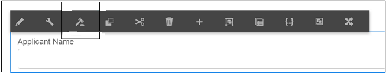

# Aanbevolen vooraf ingevulde en verzendworkflows voor gegevensbronnen voor adaptieve formulieren {#recommended-data-source-btased-prefill-and-submit-workflows-for-adaptive-forms}

U kunt de volgende gegevensbronnen gebruiken met adaptieve formulieren die zijn geconverteerd met AFCS (Automatede form conversion Service):

* Formuliergegevensmodel, OData of een andere service van derden
* JSON-schema
* XSD-schema

Op basis van de gegevensbron kunt u desgewenst een adaptief formulier genereren met of zonder gegevensmodel.

In dit artikel worden de aanbevolen workflows beschreven voor het vooraf invullen van veldwaarden en verzendopties nadat u een gegevensbron hebt geselecteerd en een adaptief formulier hebt gegenereerd met behulp van de conversieservice.

<table> 
 <tbody> 
  <tr> 
   <th><strong>Data Source</strong></th> 
   <th><strong>Aanbevolen workflow</strong></th> 
  </tr> 
  <tr> 
   <td><p>Formuliergegevensmodel, OData of een andere service van derden</p></td> 
   <td> 
    <p><strong> Optie 1 </strong>: U selecteert het model van vormgegevens, OData, of een andere derdedienst als gegevensbron. U <a href="#generate-adaptive-forms-with-no-data-binding"> produceert een adaptieve vorm zonder gegevensband </a> gebruikend de dienst van de Automatede form conversion (AFCS). U bindt de adaptieve formuliervelden handmatig aan entiteiten van het formuliergegevensmodel en gebruikt de optie Vooraf ingevulde service formuliergegevensmodel om veldwaarden vooraf in te vullen. Met de optie Verzenden met gebruik van het formuliergegevensmodel kunt u het aangepaste formulier verzenden.</p></td> 
  </tr>
  <tr> 
   <td></td> 
   <td> 
   <p><strong> Optie 2 </strong>: U selecteert het model van vormgegevens, OData, of een andere derdedienst als gegevensbron. U <a href="#generate-adaptive-forms-with-no-data-binding"> produceert een adaptieve vorm zonder gegevensband </a> gebruikend de dienst van de Automatede form conversion (AFCS). U bindt de aangepaste formuliervelden met de regeleditor aan het vooraf invullen van veldwaarden. Wijzig, indien nodig, de veldwaarden en verzend gegevens naar de crx-repository.</p>
    </td> 
  </tr>
  <tr> 
   <td></td> 
   <td> 
    <p>Voor stap-voor-stap instructies om deze werkschema's uit te voeren, zie {het gegevensbestand van het 0} Gebruik, OData, of om het even welke derdedienst als gegevensbron.</a><a href="#sqldatasource"></p> </td> 
  </tr>
  <tr>
  <td><p>JSON Schema</p></td> 
   <td> 
    <p>U selecteert JSON-schema als gegevensbron. Gebaseerd op de geselecteerde gegevensbron:</p></td> 
  </tr>
  <tr>
  <td></td> 
   <td> 
    <p><strong> Optie 1 </strong>: U <a href="#generate-adaptive-forms-with-no-data-binding"> produceert een adaptieve vorm zonder gegevensband </a> gebruikend de dienst van de Automatede form conversion (AFCS) en vormt het schema JSON als gegevensbron. U bindt de adaptieve vormgebieden aan schema JSON manueel en <a href="https://helpx.adobe.com/experience-manager/6-5/forms/using/prepopulate-adaptive-form-fields.html#Supportedprotocolsforprefillinguserdata" target="_blank"> gebruikt om het even welke gesteunde protocollen </a> om gebiedswaarden vooraf in te vullen. Wijzig, indien nodig, de veldwaarden en verzend gegevens naar de crx-repository.</p></td> 
  </tr>
  <tr>
  <td></td> 
   <td> 
    <p>Voor geleidelijke instructies om de werkschema's uit te voeren, zie <a href="#jsondatasource"> het schema van JSON van het Gebruik als gegevensbron.</p></td> 
  </tr>
  <tr>
  <td></td> 
   <td> 
    <p><strong> Optie 2 </strong>: U <a href="#generate-adaptive-forms-with-json-binding"> produceert een adaptieve vorm met gegevens JSON die </a> de dienst van de Automatede form conversion gebruiken (AFCS) binden. De Prefill-service en het verzenden van formulieren werken naadloos. U hebt geen configuratiestappen nodig.</p> </td> 
  </tr>
   <tr>
  <td></td> 
   <td> 
    <p>Voor stap-voor-stap instructies om de werkschema's uit te voeren, zie <a href="#jsonwithdatabinding"> het schema van JSON van het Gebruik als gegevensbron.</a></p> </td> 
  </tr>
  <tr>
  <td><p>XSD-schema</p></td> 
   <td> 
    <p>U selecteert XSD-schema als gegevensbron. Gebaseerd op de geselecteerde gegevensbron, produceert u <a href="#generate-adaptive-forms-with-no-data-binding"> een adaptieve vorm zonder gegevensband </a> gebruikend de dienst van de Automatede form conversion (AFCS) en vormt XSD schema als gegevensbron. U bindt manueel de adaptieve vormgebieden aan XSD schema en <a href="https://helpx.adobe.com/experience-manager/6-5/forms/using/prepopulate-adaptive-form-fields.html#Supportedprotocolsforprefillinguserdata" target="_blank"> gebruikt om het even welke gesteunde protocollen </a> om gebiedswaarden vooraf in te vullen. Wijzig, indien nodig, de veldwaarden en verzend gegevens naar de crx-repository.</p>
    </td> 
  </tr>
  <tr>
  <td></td> 
   <td> 
    <p>Voor geleidelijke instructies om de werkschema's uit te voeren, zie <a href="#xsddatasource"> schema van het Gebruik XSD als gegevensbron.</a></p>
    </td> 
  </tr>
 </tbody> 
</table>


Raadpleeg de volgende artikelen voor meer informatie over de service Automatede form conversion (AFCS):

* [Inleiding tot de dienst van de Automatede form conversion](introduction.md)
* [De service Automatede form conversion configureren](configure-service.md)
* [Afdrukformulieren converteren naar aangepaste formulieren](convert-existing-forms-to-adaptive-forms.md)
* [Omgezette formulieren controleren en corrigeren](review-correct-ui-edited.md)

De in dit artikel verstrekte informatie is gebaseerd op de veronderstelling dat iedereen die het leest basiskennis heeft van concepten van adaptieve formulieren.

## Voorwaarden {#pre-requisites}

* Vorm een [ AEM auteursinstantie ](https://helpx.adobe.com/experience-manager/6-5/sites/deploying/using/deploy.html)
* Vorm {de dienst van de Automatede form conversion 0} (AFCS) op de AEM auteursinstantie ](configure-service.md)[

## Monster van adaptief formulier {#sample-adaptive-form}

Download het volgende voorbeeldbestand voor het PDF om de gebruiksgevallen voor het vooraf invullen van veldwaarden in een adaptief formulier uit te voeren en deze naar de gegevensbron te verzenden.

Voorbeeldformulier voor het aanvragen van een lening

[Bestand ophalen](assets/sample_loan_application_form.pdf)

Het PDF-bestand fungeert als invoer voor de AFCS-service (Automatede form conversion Service). De service converteert dit bestand naar een adaptief formulier. In de volgende afbeelding wordt de voorbeeldtoepassing met een PDF-indeling weergegeven.


## Gegevens voorbereiden voor formuliermodel {#prepare-data-for-form-model}

Met AEM Forms Data Integration kunt u verschillende gegevensbronnen configureren en verbinden. Nadat u een adaptief formulier hebt gegenereerd met behulp van het conversieproces, kunt u het formuliermodel definiëren op basis van een formuliergegevensmodel, XSD of een JSON-schema. U kunt een database, Microsoft Dynamics of een andere service van derden gebruiken om een formuliergegevensmodel te maken.

Deze zelfstudie gebruikt de MySQL-database als bron voor het maken van een formuliergegevensmodel. Creeer a **ladingsToepassing** schema in het gegevensbestand en voeg een **aanvrager** lijst aan het schema toe dat op de gebieden wordt gebaseerd die in de adaptieve vorm beschikbaar zijn.


U kunt de volgende verklaring gebruiken DDL om de **aanvrager** lijst in gegevensbestand tot stand te brengen.

```sql
CREATE TABLE `applicant` (
   `name` varchar(45) DEFAULT NULL,
   `address` varchar(45) DEFAULT NULL,
   `phonenumber` int(11) NOT NULL,
   `email` varchar(45) DEFAULT NULL,
   `occupation` varchar(45) DEFAULT NULL,
   `annualsalary` varchar(45) DEFAULT NULL,
   `familymembers` int(11) DEFAULT NULL,
   PRIMARY KEY (`phonenumber`)
 ) ENGINE=InnoDB DEFAULT CHARSET=utf8
```

Als u een XSD-schema gebruikt als formuliermodel voor het uitvoeren van de use cases, maakt u een XSD-bestand met de volgende tekst:

```xml
<?xml version="1.0" encoding="utf-8" ?>
    <xs:schema targetNamespace="http://adobe.com/sample.xsd"
                    xmlns="http://adobe.com/sample.xsd"
                    xmlns:xs="http://www.w3.org/2001/XMLSchema">

<xs:element name="sample" type="SampleType"/>

  <xs:complexType name="SampleType">
    <xs:sequence>
      <xs:element name="name" type="xs:string"/>
   <xs:element name="address" type="xs:string"/>
   <xs:element name="phonenumber" type="xs:int"/>
   <xs:element name="email" type="xs:string"/>
   <xs:element name="occupation" type="xs:string"/>
   <xs:element name="annualsalary" type="xs:string"/>
   <xs:element name="familymembers" type="xs:string"/>
 </xs:sequence>
  </xs:complexType>

  </xs:schema>
```

Of download het XSD-schema naar het lokale bestandssysteem.

Voorbeeld van XSD-schema voor toepassing van een lening

[Bestand ophalen](assets/loanapplication.xsd)

Voor meer informatie bij het gebruiken van schema XSD als vormmodel in adaptieve vormen, zie [ Creërend adaptieve vormen gebruikend het schema van XML ](https://helpx.adobe.com/experience-manager/6-5/forms/using/adaptive-form-xml-schema-form-model.html).

Als u een JSON-schema gebruikt als formuliermodel voor het uitvoeren van de use cases, maakt u een JSON-bestand met de volgende tekst:

```JSON
{
    "$schema": "http://json-schema.org/draft-04/schema#",
    "definitions": {
        "loanapplication": {
            "type": "object",
            "properties": {
                "name": {
                    "type": "string"
                },
                "address": {
                    "type": "string"
                },
    "phonenumber": {
                    "type": "number"
                },
    "email": {
                    "type": "string"
                },
    "occupation": {
                    "type": "string"
                },
    "annualsalary": {
                    "type": "string"
                },
    "familymembers": {
                    "type": "number"
                }
            }
        }
 },
 "type": "object",
    "properties": {
        "employee": {
            "$ref": "#/definitions/loanapplication"
        }
    }
}
```

Of download het JSON-schema naar het lokale bestandssysteem.

JSON-schema voor voorbeeldtoepassing

[Bestand ophalen](assets/demo_schema.json)

Voor meer informatie bij het gebruiken van schema JSON als vormmodel in adaptieve vormen, zie [ Creërend adaptieve vormen gebruikend schema JSON ](https://helpx.adobe.com/experience-manager/6-5/forms/using/adaptive-form-json-schema-form-model.html).

## Aangepaste formulieren zonder gegevensbinding genereren {#generate-adaptive-forms-with-no-data-binding}

Gebruik de [ dienst van de Automatede form conversion om ](convert-existing-forms-to-adaptive-forms.md) de [ vorm van de de toepassingstoepassing van de steekproeflening ](#sample-adaptive-form) in een adaptieve vorm zonder gegevensband om te zetten. Schakel het selectievakje **[!UICONTROL Generate adaptive form(s) without data bindings]** in om het adaptieve formulier zonder gegevensbinding te genereren.


Nadat u een adaptief formulier zonder gegevensbinding hebt gegenereerd, selecteert u een gegevensbron voor het adaptieve formulier:

* [Database, OData of een service van derden](#sqldatasource)
* [JSON-schema](#jsondatasource)
* [XSD-schema](#xsddatasource)

>[!NOTE]
> Als het adaptieve formulier dat u met AFCS (Automatede form conversion Service) converteert meerdere velden met dezelfde naam bevat, moet u ervoor zorgen dat deze velden zijn gebonden aan gegevensbronentiteiten om een mogelijk gegevensverlies tijdens de verzending te voorkomen.
>

### Gebruik gegevensbestand, OData, of om het even welke derdedienst als gegevensbron {#sqldatasource}

Hoofdlettergebruik: u genereert een adaptief formulier zonder gegevensbinding met AFCS (Automatede form conversion Service) en configureert de MYSQL-database als gegevensbron. U bindt de adaptieve formuliervelden handmatig aan formuliergegevensmodelentiteiten en gebruikt de optie **[!UICONTROL Form Data Model Prefill Service]** om veldwaarden vooraf in te vullen. U gebruikt de optie **[!UICONTROL Submit using Form Data Model]** om het aangepaste formulier te verzenden.

Voordat u het gebruiksgeval uitvoert:

* [ vorm MySQL gegevensbestand als gegevensbron ](https://helpx.adobe.com/experience-manager/6-5/forms/using/configure-data-sources.html#configurerelationaldatabase)
* [ creeer het model van vormgegevens ](https://helpx.adobe.com/experience-manager/6-5/forms/using/work-with-form-data-model.html)

Gebaseerd op het gebruiksgeval, creeer het **model van de landingsgegevens van de 0} toepassing {en verbind het argument van de leesdienst aan een **[!UICONTROL Literal]**waarde.** De letterlijke waarde van het telefoonaantal moet van één van de verslagen zijn die in het **worden gevormd aanvrager** schema van het gegevensbestand MySQL. De diensten gebruiken de waarde als argument om details van de gegevensbron te halen. U kunt ook [ Attribuut van het Profiel van de Gebruiker of Attribuut van het Verzoek ](https://helpx.adobe.com/experience-manager/6-5/forms/using/work-with-form-data-model.html#bindargument) van de **[!UICONTROL Binding To]** drop-down lijst selecteren

 vormen

>[!NOTE]
>
>Zorg ervoor dat u **toevoegt** en **neem** diensten aan het model van vormgegevens op, vorm, en test de diensten alvorens het gebruiksgeval uit te voeren.

Voer de volgende stappen uit:

1. Selecteer de omgezette **vorm van de steekproeflening** beschikbaar in de **[!UICONTROL output]** omslag en tikken **[!UICONTROL Properties]**.
1. Tik op het **[!UICONTROL Form Model]** lusje, selecteer **[!UICONTROL Form Data Model]** van de **[!UICONTROL Select From]** drop-down lijst, en tik **[!UICONTROL Select Form Data Model]** om het **ladingstoepassing** model van vormgegevens te selecteren. Tik op **[!UICONTROL Save & Close]** om het formulier op te slaan.
1. Selecteer de **vorm van de de steekproeflening** en tikken **[!UICONTROL Edit]**.
1. Tik op het tabblad **[!UICONTROL Content]** op het configuratiepictogram:

    vormen

   1. Selecteer **[!UICONTROL Form Data Model Prefill service]** in de vervolgkeuzelijst **[!UICONTROL Prefill Service]** in de sectie **[!UICONTROL Basic]** .

   1. Selecteer **[!UICONTROL Submit using Form Data Model]** in de vervolgkeuzelijst **[!UICONTROL Submit Action]** in de sectie **[!UICONTROL Submission]** .

   1. Selecteer het gegevensmodel met behulp van het veld **[!UICONTROL Data Model to submit]** .
   1. Tik  om de eigenschappen te bewaren.

1. Tik het de tekstvakje van de Naam van de Aanvrager en selecteer  (vorm).

   1. Op het Bind gebied van de Verwijzing, uitgezochte **Aanvrager** > **Naam**, en onttrokken  om de eigenschappen te bewaren. Op dezelfde manier creeer een gegevensband voor het **Adres**, **Aantal van de Telefoon**, **E-mail**, **Bezetting**, **Jaarlijkse Salaris (in dollars)**, en **Nr. van afhankelijke familieleden** gebieden met de modelentiteiten van vormgegevens.

   

1. Tik op **[!UICONTROL Preview]** om de vooraf ingevulde aangepaste waarden voor formuliervelden weer te geven.
1. Wijzig, indien nodig, de veldwaarden en verzend het adaptieve formulier. De veldwaarden worden verzonden naar de MySQL-database. U kunt de **aanvrager** lijst in het gegevensbestand verfrissen om de bijgewerkte waarden in de lijst te bekijken.

**Geval van het Gebruik:** u produceert een adaptieve vorm zonder gegevensband gebruikend de dienst van de Automatede form conversion (AFCS) en vormt MYSQL gegevensbestand als gegevensbron. U bindt de aangepaste formuliervelden met de regeleditor aan het vooraf invullen van veldwaarden. Wijzig, indien nodig, de veldwaarden en verzend gegevens naar de crx-repository.

Voer de volgende stappen uit om [ regelredacteur ](https://helpx.adobe.com/experience-manager/6-5/forms/using/rule-editor.html) te gebruiken om de modeldienst van vormgegevens aan te halen om gebieden en vooraf ingevulde waarden in een adaptieve vorm te binden:

1. Selecteer de **vorm van de steekproeflening** in de **[!UICONTROL output]** omslag en tik **[!UICONTROL Edit]**.
1. Tik op het tabblad **[!UICONTROL Content]** op het configuratiepictogram:

    vormen

   Selecteer **[!UICONTROL Form Data Model Prefill service]** in de vervolgkeuzelijst **[!UICONTROL Prefill Service]** in de sectie **[!UICONTROL Basic]** .

1. Tik op het tekstvak **[!UICONTROL Applicant Name]** en tik op **[!UICONTROL Edit Rules]** .

    tot stand te brengen

1. Tik op **[!UICONTROL Create]** op de pagina Regeleditor.
1. Op de pagina **[!UICONTROL Rule Editor]** :

   1. Selecteer een status voor het tekstvak Naam aanvrager. Bijvoorbeeld **[!UICONTROL is initialized]** , wat resulteert in de uitvoering van de voorwaarde **[!UICONTROL Then]** wanneer u het formulier in de modus **[!UICONTROL Preview]** rendert.

   1. Selecteer **[!UICONTROL Invoke Service]** in de vervolgkeuzelijst **[!UICONTROL Select Action]** in de sectie **[!UICONTROL Then]** . Alle services op uw Forms-instantie worden weergegeven in de vervolgkeuzelijst.

   1. Selecteer een **[!UICONTROL Get]** -service in de sectie met de formuliergegevensmodellen. Het gebied van de Input toont **phonenumber**, dat de primaire sleutel is die voor het **wordt bepaald aanvrager** gegevensmodel. Het systeem haalt de waarden in het adaptieve formulier voor velden op in de sectie Uitvoer die op dit veld is gebaseerd en vult deze waarden vooraf in.

   1. Maak een binding voor de adaptieve formuliervelden met de entiteiten van het formuliergegevensmodel met de sectie Uitvoer. Bijvoorbeeld, verbind **[!UICONTROL Applicant Name]** adaptief vormgebied met de **naam** entiteit.

   1. Tik op **[!UICONTROL Done]**. Tik nogmaals op **[!UICONTROL Done]** op de pagina Regeleditor.

    te binden

1. Tik op **[!UICONTROL Preview]** om de vooraf ingevulde aangepaste waarden voor formuliervelden weer te geven.

   >[!NOTE]
   >
   >Zorg ervoor dat het **[!UICONTROL Return Array]** Bezit aan weg voor **wordt geplaatst krijgt** de dienstbezit in het model van vormgegevens verbonden aan de adaptieve vorm.

1. Wijzig, indien nodig, de veldwaarden en verzend het adaptieve formulier. De ingediende gegevens zijn beschikbaar op de volgende locatie in de crx-gegevensopslagruimte:

   `http://host name:port/crx/de/index.jsp#/content/forms/fp/admin/submit/data/latest file available in the folder`

### JSON-schema gebruiken als gegevensbron {#jsondatasource}

**Geval van het Gebruik:** u produceert een adaptieve vorm zonder gegevensband gebruikend de dienst van de Automatede form conversion (AFCS) en vormt het schema JSON als gegevensbron. U bindt de adaptieve vormgebieden aan schema JSON manueel en gebruikt de **Voorproef met gegevens** optie om gebiedswaarden vooraf in te vullen. Wijzig, indien nodig, de veldwaarden en verzend gegevens naar de crx-repository.

Controleer voordat u het gebruiksgeval uitvoert of:

* [een geldig JSON-schema dat voldoet aan de JSON-schemastructuur](#prepare-data-for-form-model)
* [een adaptief formulier zonder gegevensbinding](#generate-adaptive-forms-with-no-data-binding)

Voer de volgende stappen uit:

1. Selecteer de omgezette **vorm van de steekproeflening** beschikbaar in de **3} omslag van de output {en tikken **[!UICONTROL Properties]**.**
1. Tik op het **[!UICONTROL Form Model]** lusje, selecteer **[!UICONTROL Schema]** van de **[!UICONTROL Select From]** drop-down lijst, en tik **[!UICONTROL Select Schema]** om het **demo.schema JSON** schema te uploaden dat op het lokale dossiersysteem wordt opgeslagen. Tik op **[!UICONTROL Save & Close]** om het formulier op te slaan.
1. Selecteer de **vorm van de de steekproeflening** en tikken **[!UICONTROL Edit]**.
1. Tik het de tekstvakje van de Naam van de Aanvrager en selecteer  (vorm).

   Op het Bind gebied van de Verwijzing, uitgezochte **Aanvrager** > **Naam**, en onttrokken  om de eigenschappen te bewaren. Op dezelfde manier creeer een gegevensband voor het **Adres**, **Aantal van de Telefoon**, **E-mail**, **Bezetting**, **Jaarlijkse Salaris (in dollars)**, en **Nr. van afhankelijke familieleden** gebieden met de JSON schemaentiteiten.

1. Selecteer opnieuw de omgezette **vorm van de steekproeflening** beschikbaar in de **[!UICONTROL output]** omslag en selecteer **[!UICONTROL Preview]** > **[!UICONTROL Preview with Data]**.</br>

   Voorbeeldgegevensbestand downloaden </br>

   [ krijgt Dossier ](assets/json_data_file.txt)</br>

1. Wijzig, indien nodig, de veldwaarden en verzend het adaptieve formulier. De ingediende gegevens zijn beschikbaar op de volgende locatie in de crx-gegevensopslagruimte:

   `http://host name:port/crx/de/index.jsp#/content/forms/fp/admin/submit/data/latest file available in the folder`

### XSD-schema gebruiken als gegevensbron {#xsddatasource}

**Geval van het Gebruik:** u produceert een adaptieve vorm zonder gegevensband gebruikend de dienst van de Automatede form conversion (AFCS) en vormt XSD schema als gegevensbron. U bindt de adaptieve vormgebieden aan het schema XSD manueel en gebruikt **Voorproef met gegevens** om gebiedswaarden vooraf in te vullen. Wijzig, indien nodig, de veldwaarden en verzend gegevens naar de crx-repository.

Controleer voordat u het gebruiksgeval uitvoert of:

* [een geldig XSD-schema dat compatibel is met de XML-schemastructuur](#prepare-data-for-form-model)
* [een adaptief formulier zonder gegevensbinding](#generate-adaptive-forms-with-no-data-binding)

Voer de volgende stappen uit:

1. Selecteer de omgezette **vorm van de steekproeflening** beschikbaar in de **[!UICONTROL output]** omslag en tikken **[!UICONTROL Properties]**.
1. Tik op het **[!UICONTROL Form Model]** lusje, selecteer **[!UICONTROL Schema]** van de **[!UICONTROL Select From]** drop-down lijst, en tik **[!UICONTROL Select Schema]** om het **ladingstoepassing** XSD schema te uploaden dat op het lokale dossiersysteem wordt bewaard. Selecteer basiselement voor het XSD-schema en tik op **[!UICONTROL Save & Close]** om het formulier op te slaan.
1. Selecteer de **vorm van de de steekproeflening** en tikken **[!UICONTROL Edit]**.
1. Tik het de tekstvakje van de Naam van de Aanvrager en selecteer  (vorm).
Op het Bind gebied van de Verwijzing, uitgezochte **Aanvrager** > **Naam**, en Tik  om de eigenschappen te bewaren. Op dezelfde manier creeer een gegevensband voor het **Adres**, **Aantal van de Telefoon**, **E-mail**, **Bezetting**, **Jaarlijkse Salaris (in dollars)**, en **Nr. van afhankelijke familieleden** gebieden met de XSD schema-entiteiten.

1. Selecteer de omgezette **vorm van de steekproeflening** beschikbaar in de **output** omslag opnieuw en selecteer **[!UICONTROL Preview]** > **[!UICONTROL Preview with Data]**.</br>

   Voorbeeldgegevensbestand downloaden </br>

   [ krijgt Dossier ](assets/loan-application-data-xml-data.zip)</br>


1. Wijzig, indien nodig, de veldwaarden en verzend het adaptieve formulier. De ingediende gegevens zijn beschikbaar op de volgende locatie in de crx-gegevensopslagruimte:

   `http://host name:port/crx/de/index.jsp#/content/forms/fp/admin/submit/data/latest file available in the folder`

## Aangepaste formulieren genereren met JSON-binding {#generate-adaptive-forms-with-json-binding}

Gebruik de [ dienst van de Automatede form conversion (AFCS) om ](convert-existing-forms-to-adaptive-forms.md) de [ vorm van de de toepassingstoepassing van de steekproeflening ](#sample-adaptive-form) in een adaptieve vorm met gegevensband om te zetten. Zorg ervoor dat u het selectievakje **[!UICONTROL Generate adaptive form(s) without data bindings]** niet inschakelt tijdens het genereren van het adaptieve formulier.


### JSON-schema gebruiken als gegevensbron {#jsonwithdatabinding}

**Geval van het Gebruik:** u produceert een adaptieve vorm met JSON gegevens die gebruikend de dienst van de Automatede form conversion (AFCS) binden. De Prefill-service en het verzenden van formulieren werken naadloos. U hebt geen configuratiestappen nodig.

Alvorens het gebruiksgeval uit te voeren, zorg ervoor dat u [ een adaptieve vorm met gegevensband ](#generate-adaptive-forms-with-json-binding) hebt.

Voer de volgende stappen uit:

1. Selecteer opnieuw de omgezette **vorm van de steekproeflening** beschikbaar in de **[!UICONTROL output]** omslag en selecteer **[!UICONTROL Preview]** > **[!UICONTROL Preview with Data]**.</br>

   Voorbeeldgegevensbestand downloaden </br>

   [ krijgt Dossier ](assets/loan_application_data_source_json_data_binding.txt)</br>

1. Wijzig, indien nodig, de veldwaarden en verzend het adaptieve formulier. De ingediende gegevens zijn beschikbaar op de volgende locatie in de crx-gegevensopslagruimte:

   `http://host name:port/crx/de/index.jsp#/content/forms/fp/admin/submit/data/latest file available in the folder`

## Verzonden JSON-formuliergegevens converteren naar XML-indeling {#convert-submitted-adaptive-form-data-to-xml}

Wanneer u waarden invoert in adaptieve formuliervelden en deze verzendt, zijn de gegevens beschikbaar in JSON-indeling in de crx-repository. U kunt het formaat van gegevens JSON in XML of omzetten gebruikend [ org.apache.sling.commons.json.xml ](https://sling.apache.org/apidocs/sling5/org/apache/sling/commons/json/xml/XML.html#toString) API of de volgende steekproefcode:

```
import org.apache.sling.commons.json.JSONException;
import org.apache.sling.commons.json.JSONObject;
import org.apache.sling.commons.json.xml.XML;
 
public class ConversionUtils {
 
    public static String jsonToXML(String jsonString) throws JSONException {
        //https://sling.apache.org/apidocs/sling5/org/apache/sling/commons/json/xml/XML.html#toString(java.lang.Object)
        //jar - http://maven.ibiblio.org/maven2/org/apache/sling/org.apache.sling.commons.json/2.0.18/
        //Note: Need to extract boundData part before converting to XML
        return XML.toString(new JSONObject(jsonString));
    }
}
```
