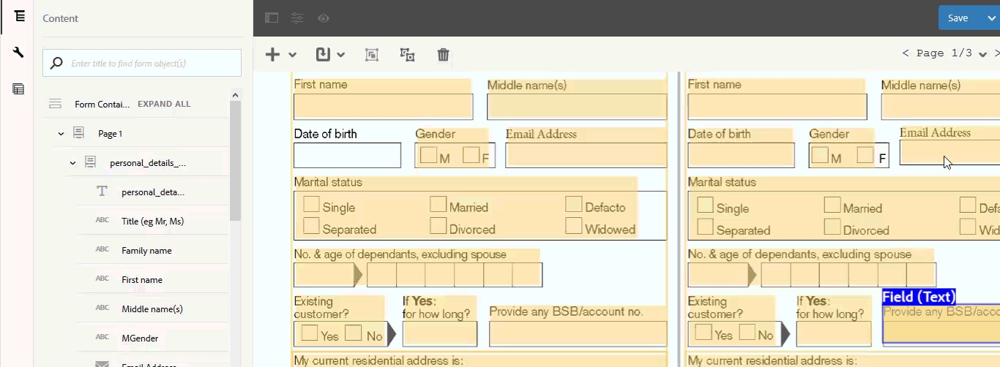

# Geconverteerde formulieren controleren en corrigeren{#review-and-correct-converted-forms}

De AEM Forms Automatede form conversion-service identificeert velden, inhoud en indeling van invoer-PDF document en converteert het PDF-document naar een adaptief formulier. Het adaptieve uitvoerformulier kan enkele ontbrekende of onjuist geconverteerde velden bevatten. U kunt de redacteur van het Overzicht en van de Correctie gebruiken om verbeteringen aan geïdentificeerde gebieden aan te brengen en het adaptieve formulier opnieuw te produceren om een output dichter aan de gewenste ervaring te krijgen. Na de eerste conversie kunt u het invoer-PDF-document in de editor openen naar:

* Alle velden en inhoud weergeven die tijdens de conversie zijn geïdentificeerd
* Identificeer de gebieden en de inhoud die tijdens omzetting worden gemist
* Verifieer het type van een gebied en verander zijn type, indien vereist
* Verifieer de geïdentificeerde lijsten, resize de kolommen, en wijzig celinhoud
* Onjuist geïdentificeerde velden verwijderen

Nadat u de vereiste wijzigingen hebt aangebracht, stuurt u de PDF forms opnieuw naar de conversieservice. Als de conversie is gelukt, worden bijgewerkte elementen, waaronder het adaptieve formulier en schema, naar uw AEM Forms-exemplaar gedownload. U kunt het proces herhalen totdat de gewenste ervaring is opgedaan. 

U hebt de browser Google Chrome, Mozilla FireFox of Microsoft Edge nodig om de revisie en juiste editor te kunnen gebruiken. De editor biedt geen ondersteuning voor Internet Explorer.

## Welkom bij Revisie en redacteur corrigeren {#welcome-to-review-and-correct-editor}

De redacteur van het Overzicht en van het Correct verstrekt een gemakkelijk te gebruiken interface. Het heeft de volgende componenten:

* Inhoudsbrowser: U kunt de inhoudbrowser gebruiken om de positie van een element te wijzigen. Met de inhoudbrowser kunt u een formulierobject slepen en neerzetten om de positie te wijzigen. U kunt bijvoorbeeld een tabel vóór een tekstvak plaatsen. Hiermee wordt de tabvolgorde van het aangepaste uitvoerformulier dienovereenkomstig gewijzigd.
* Eigenschappenbrowser: De eigenschappen van een geselecteerd veld worden weergegeven. U kunt ook de eigenschappen wijzigen.
* Werkbalk: De werkbalk bevindt zich boven aan de editor. Er worden gereedschappen weergegeven voor het toevoegen, wijzigen, groeperen, degroeperen en verwijderen van velden.
* Eigenschappen openen: De optie Eigenschappen openen wordt weergegeven wanneer u op de knop  pictogram. U kunt op eigenschappen die zijn geopend klikken om formuliereigenschappen te openen en aanvullende opties weer te geven.
* Filterknop: De filterknop  bevindt zich boven aan de editor. Hiermee kunt u de velden filteren en alleen tekst, velden, keuzegroepen, deelvensters of alle componenten weergeven.
* Opslaan, knop: De **[!UICONTROL Save]** in de rechterbovenhoek van de editor. U kunt ook de pijl naast de knop Opslaan gebruiken om de optie weer te geven waarmee het formulier voor conversie wordt verzonden.

* PDF-formulier: In de editor wordt het brondocument van de PDF weergegeven en bedekt met geïdentificeerde velden. U kunt de gereedschappen van de werkbalk gebruiken om de velden te wijzigen.
* Pagina&#39;s: Een bronformulier kan uit meerdere pagina&#39;s bestaan. De redacteur verstrekt een knoop op hoger-juiste hoek om tussen de pagina&#39;s te navigeren.

**A.** Inhoudsbrowser **B.** Eigenschappenbrowser **C.** Werkbalk **D.** Eigenschappen, knop **E.** De knop Filter **F.** Knop Opslaan **G.** PDF-formulier dat is overschreven door geïdentificeerde velden

Na de eerste geslaagde conversie bedekt de conversieservice het PDF-brondocument met geïdentificeerde velden en onderdelen. Deze velden of componenten zijn van het type: Tekst, veld, deelvenster, keuzegroep en tabel:

* Tekst: Onbewerkte tekst in het PDF-brondocument. Bijvoorbeeld de tekst van de Toepassing van de Lening in het beeld hierboven wordt getoond.
* Veld: Combinatie van tekst- of pictogramlabel die aan een waarde of invoervak is gekoppeld. Bijvoorbeeld de naam van het veld Vooraan in de bovenstaande afbeelding. Het heeft tekstlabel en een invoervak. Een veld ondersteunt gegevenstypen voor tekst, numerieke waarden, vervolgkeuzelijsten, datums, e-mail, telefoonnummer, handtekening, valuta en wachtwoorden.
* Deelvenster: Logische verzameling van inhoud en componenten. Bijvoorbeeld Persoonlijke details van Person 1 en Persoon 2 panelen in bovenstaand beeld.
* Keuzegroep: Combinatie van tekst die aan meerkeuzeopties is gekoppeld: selectievakje en keuzerondje. Bijvoorbeeld de huwelijksstatus en de bestaande klant in de bovenstaande afbeelding.\
  Op basis van het bijschrift van de keuzegroep en de meerkeuzeopties zet de conversieservice een keuzegroep automatisch om in een keuzerondje met één keuze of in een selectievakje met meerdere keuzen. Als er bijvoorbeeld **Selecteer een willekeurige** als u met het bijschrift van de keuzevroep of de meerkeuzeopties slechts één optie kunt selecteren, **Ja** of **Nee** De conversieservice zet de keuzerondje automatisch om in een keuzerondje met één keuze. En als er **Alles selecteren wat van toepassing is** of **Meerdere selecteren** als u met het bijschrift van de keuzegroep of de meerkeuzeopties meerdere opties kunt selecteren, zet de conversieservice de keuzegroep automatisch om in een selectievakje met meerdere keuzemogelijkheden.

* Tabel: Een tabel van twee rijen met informatie in kolommen en rijen. U kunt rijen of kolommen toevoegen aan of verwijderen uit een tabel.

## Bekijken van conversie starten {#start-reviewing-a-conversion}

Na de eerste geslaagde conversie bedekt de conversieservice het PDF-brondocument met geïdentificeerde velden en onderdelen. U kunt bepaalde velden verbeteren en het aangepaste formulier opnieuw genereren om de uitvoer dichter bij de gewenste ervaring te brengen. U kunt een conversie pas controleren nadat de conversie voor het eerst is gelukt.

### Voordat u begint {#before-you-start}

* De redacteur van het overzicht en van het Correct steunt geen fragmenten. Gebruik de editor niet voor het reviseren van conversies met de **Fragment extraheren** ingeschakeld tijdens conversies. U kunt de [adaptieve formuliereditor](https://helpx.adobe.com/experience-manager/6-5/forms/using/introduction-forms-authoring.html) voor dergelijke omzettingen.

* De redacteur van het overzicht en van het Correct heeft undo geen actie. Gebruik de knop Opslaan alleen voor het permanent opslaan van de wijzigingen.

### De revisie starten {#start-the-review}

Als u de conversies wilt controleren, selecteert u het brondocument voor de PDF-conversie en selecteert en tikt u op **Conversies controleren**. De redacteur van het Overzicht en van de Correctie opent in een nieuw lusje. U kunt beginnen omzettingen te herzien. Voer de volgende basiscontroles uit voordat u begint met het oplossen van andere problemen:

1. **Type van alle velden controleren**: De conversieservice kan een onjuist type aan een veld toewijzen. Typ bijvoorbeeld tekst in plaats van telefoon aan het veld Mobiele telefoon. U kunt de muisaanwijzer op een veld plaatsen om het veldtype te zoeken.

   Als u het type van een veld wilt wijzigen, selecteert u het veld, opent u de eigenschappenbrowser en selecteert u een waarde in het menu **[!UICONTROL Type]** en tikken **[!UICONTROL Save]**. Het type wordt gewijzigd.

   

1. **Extra deelvensters verwijderen**: De conversieservice kan extra deelvensters genereren. Een extra subdeelvenster is bijvoorbeeld opgenomen in het bovenliggende deelvenster, lege ruimte wordt omgezet in een deelvenster, een selectievakje wordt omgezet in een deelvenster. Controleer de grenzen van alle deelvensters en verwijder extra deelvensters. U kunt het filter gebruiken  om alle deelvensters weer te geven.

   U kunt een deelvenster verwijderen of degroeperen om het te verwijderen. Wanneer u de verwijderoptie gebruikt, worden de onderliggende velden of componenten van het deelvenster ook verwijderd:

   * Als u een deelvenster wilt verwijderen, selecteert u het deelvenster en tikt u op de knop Verwijderen  in de werkbalk. Tik in het bevestigingsvenster op **[!UICONTROL Confirm]**. Tikken **[!UICONTROL Save]** om de wijzigingen op te slaan.

   * Als u een deelvenster wilt degroeperen, selecteert u het deelvenster en tikt u op het pictogram voor degroeperen op de werkbalk. Het deelvenster wordt gedegroepeerd en onderliggende velden van het deelvenster degroeperen worden aangepast aan het bovenliggende veld. Tik **[!UICONTROL Save]**om de wijzigingen op te slaan.

1. **Logische tekstgroepen maken**: Valideer de geïdentificeerde teksten op volledigheid en juistheid. Controleer ook of de tekst logisch in de juiste deelvensters of groepen is geplaatst. Bijvoorbeeld, in een lay-out met meerdere kolommen, de teksten van één logische groep en geplaatst in een andere groep.

   * Als u de volledigheid en juistheid van de tekst wilt controleren, gebruikt u het filter  om alleen tekst weer te geven, op elke tekst te klikken en te valideren. Corrigeer eventueel de spelling, typos of grammaticale problemen.

   * Tik op + om tekst aan het formulier toe te voegen **[!UICONTROL Text]**. Teken het vak, open de eigenschappenbrowser en typ de tekst die u aan het vak Inhoud wilt toevoegen.

1. **Tabellen controleren:** Controleer of alle randen van de tabel zijn geïdentificeerd. Zorg er ook voor dat de inhoud van de cellen correct wordt geïdentificeerd.

   * Om gemiste grenzen te identificeren, gebruik **[!UICONTROL Add Column]** of **[!UICONTROL Add Row]** optie.

   * Als u extra randen wilt verwijderen, gebruikt u de opdracht **[!UICONTROL Delete Column]** of **[!UICONTROL Delete Row]** optie.

Tik op de knop **[!UICONTROL Save & Convert]** om de PDF forms naar de conversieservice te sturen. Elk veld wordt geconverteerd naar een overeenkomende adaptieve veldcomponent. Na de conversie worden de bijgewerkte elementen, inclusief het adaptieve formulier en het schema, gedownload naar uw AEM Forms-exemplaar. Afhankelijk van de complexiteit van het formulier kan het enige tijd duren voordat de conversie is voltooid.

Nadat u de basiscontroles hebt uitgevoerd, kunt u het formulier controleren om specifieke problemen in uw organisatie op te lossen. Deze problemen kunnen te maken hebben met het toevoegen van ontbrekende velden, enzovoort. U kunt de [De redacteurshulpmiddelen van het Overzicht en van het Correcte gebruiken](review-correct-ui-edited.md#use-the-review-and-correct-editor-tools) voor meer informatie over alle gereedschappen die de editor biedt om dergelijke problemen op te lossen.

U kunt ook werken aan het herkennen van identieke problemen die zich voordoen in bijna alle formulieren en dergelijke patronen rapporteren aan Adobe. Gebruik de redacteur van het Overzicht en van het Correct tot de gewenste ervaring wordt bereikt.

## De redacteurshulpmiddelen van het Overzicht en van het Correcte gebruiken {#use-the-review-and-correct-editor-tools}

Met Revisie en Correcte redacteur, kunt u:

* [Een component toevoegen aan het formulier](review-correct-ui-edited.md#add-a-component-to-the-form)
* [Een tabel toevoegen of bewerken](review-correct-ui-edited.md)
* [Het type van een component wijzigen](review-correct-ui-edited.md#change-type-a-component)

* [Een deelvenster maken of verwijderen](review-correct-ui-edited.md#create-or-remove-a-panel)
* [Een deelvenster of component verwijderen](review-correct-ui-edited.md#delete-a-panel-or-component)
* [Eigenschappen van een component instellen](review-correct-ui-edited.md#set-properties-of-a-component)
* [Een formulier verzenden voor conversie](review-correct-ui-edited.md#send-a-form-for-conversion)

### Een component toevoegen aan het formulier {#add-a-component-to-the-form}

Bepaalde componenten van het afdrukformulier worden mogelijk niet door de conversieservice geïdentificeerd. Bijvoorbeeld in een **Geboortedatum** onderdeel van een formulier wordt tijdens de conversie niet geïdentificeerd. U kunt de **+** hulpmiddel om dergelijke componenten te helpen identificeren. Met dit gereedschap kunt u tekst, velden, keuzegroep, tabel en deelvenstercomponenten toevoegen.

Tik op **[!UICONTROL +]** en tikken **[!UICONTROL Field]**. Teken een vak dat het label en het invoervak van het veld bedekt. In de bovenstaande voorbeeldafbeelding wordt bijvoorbeeld de veldcomponent gebruikt om de **Geboortedatum** label en waardevak eronder aan het formulier. Wanneer u het vak tekent, identificeert de conversieservice het type veld. U kunt het type veld desgewenst wijzigen vanuit de eigenschappenbrowser. Nadat u de component hebt gemaakt, opent u de eigenschappenbrowser en stelt u de eigenschappen van de component in.

Tikken **[!UICONTROL Save]** om de wijzigingen op te slaan of de **[!UICONTROL Save & Convert]** om de PDF forms naar de conversieservice te sturen.

### Een tabel toevoegen of bewerken {#addedittable}

Bij de conversie kunnen enkele cellen, grenzen of inhoud van een tabelcel ongeïdentificeerd blijven. Een rij van een tabel wordt bijvoorbeeld niet geïdentificeerd. U kunt de redacteur van het Overzicht &amp; van de Correctie gebruiken om dergelijke punten te identificeren. U kunt de volgende handelingen voor een tabel uitvoeren:

* Als u een tabel wilt selecteren, klikt u op een willekeurige cel van de tabel.
* Als u eigenschappen van een cel wilt wijzigen, zoals naam, titel of type, dubbelklikt u op een cel. U kunt ook dubbelklikken op de cel om de inhoud te wijzigen, een vereist veld te markeren en andere eigenschappen te selecteren.
* Als u een volledig niet-geïdentificeerde of nieuwe tabel aan het formulier wilt toevoegen of identificeren, gebruikt u de opdracht **[!UICONTROL +]** gebruiken.
* Als u het formaat van cellen of rijen van een tabel wilt wijzigen, klikt u met één klik op het lege gebied van de tabel, houdt u de muisaanwijzer boven de rij- of kolomgrens en selecteert en verplaatst u de rand wanneer de cursoraanwijzer verandert. Klik op **[!UICONTROL Done]** om de wijzigingen vast te leggen. U kunt op **[!UICONTROL ESC]** om de grootte te verwijderen.

* Als u rijen of kolommen wilt toevoegen of verwijderen, selecteert u een cel in de rij van de tabel en selecteert u de **[!UICONTROL Add Row]**, **[!UICONTROL Add Column]**, **[!UICONTROL Delete Row]**, of **[!UICONTROL Delete Column]** van de  -menu.

* Als u een cel in een tabel wilt splitsen, selecteert u de optie **[!UICONTROL Spilt Vertical]** of **[!UICONTROL Split Horizontal]** van de  -menu.

* Als u cellen van een tabel wilt samenvoegen, selecteert u de cellen die u wilt samenvoegen en selecteert u de optie **[!UICONTROL Merge Cells]** optie van  tabelmenu.

### Het type van een component wijzigen {#change-type-a-component}

De conversieservice kan bepaalde velden van een onjuist type maken. In de volgende afbeelding worden bijvoorbeeld **Geslacht** veld wordt onjuist geïdentificeerd als een **Tekst** veld. De inhoud van het label is ook onjuist. Het veld moet een keuzeveld zijn en het label moet Geslacht zijn. Het type van een component wijzigen en het label ervan corrigeren:

Selecteer het veld dat u wilt converteren, tikken  en tik op een veldtype. Het veld wordt geconverteerd naar het geselecteerde veldtype. Een veld kan alleen worden geconverteerd naar typen die in de volgende tabel worden vermeld. Een deelvenstercomponent kan alleen worden gedegroepeerd, niet worden getransformeerd.

| **Component** | **Converteert naar** |
|---|---|
| Tekst | Veld of keuzegroep |
| Veld | Tekst- of keuzegroep |
| Keuzegroep | Tekst of deelvenster |

Open na de conversie de eigenschappenbrowser, geef een label op en geef andere vereiste eigenschappen op. Tikken **[!UICONTROL Save]** om de wijzigingen op te slaan of gebruik de knop Opslaan en converteren om de PDF forms opnieuw naar de conversieservice te verzenden.

### Een deelvenster maken of verwijderen {#create-or-remove-a-panel}

De conversieservice voegt verwante componenten en inhoud van afdrukformulieren samen tot een paneel. Het formulier kan bijvoorbeeld een adresvenster hebben met velden zoals naam, naam, plotnummer, gebied, plaats, staat, postcode en land. Deze velden worden gegroepeerd in een deelvenster. Een formulier kan meerdere deelvensters hebben.

Met de conversieservice kunt u deelvensters maken die componenten hebben die geen relatie hebben met andere componenten of een relatieve component uit het deelvenster laten. Met de gereedschappen voor groepen of degroeperen kunt u dergelijke deelvensters corrigeren:

* Als u een deelvenster wilt verwijderen, selecteert u het deelvenster en tikt u op degroeperen . Het deelvenster wordt verwijderd en de onderliggende componenten van het deelvenster worden verplaatst naar de bovenliggende component. U kunt ook de opdracht [delete, component](review-correct-ui-edited.md#delete-a-panel-or-component) om een deelvenster en de onderliggende elementen te verwijderen.

* Als u een deelvenster wilt maken, gebruikt u de Ctrl-toets (in Windows of Linux) of de Control-toets (in Mac) om verwante componenten te selecteren en tikt u op  om een deelvenster te maken. Open de eigenschappenbrowser om de eigenschappen van het deelvenster op te geven.

Tikken **[!UICONTROL Save]** om de wijzigingen op te slaan of de **[!UICONTROL Save & Convert]** om de PDF forms naar de conversieservice te sturen.

### Een deelvenster of component verwijderen {#delete-a-panel-or-component}

De conversieservice kan enkele onjuiste deelvensters of componenten identificeren. De meeste van deze componenten van deze deelvensters zijn niet gerelateerd. U kunt dergelijke deelvensters of componenten verwijderen.

Als u een deelvenster of een component wilt verwijderen, selecteert u een deelvenster of een component en tikt u op de knop Verwijderen  pictogram. Tik in het bevestigingsvenster op **[!UICONTROL Confirm]**. Het geselecteerde deelvenster of de geselecteerde component wordt verwijderd. Wanneer u een deelvenster verwijdert, worden ook alle onderliggende elementen van het deelvenster verwijderd. U kunt de Ctrl-toets (in Windows of Linux) of de Control-toets (in Mac) gebruiken om meerdere componenten of deelvensters te selecteren.

### Eigenschappen van een component instellen {#set-properties-of-a-component}

Elke component van het formulier heeft een set eigenschappen, zoals naam, titel en type. Als u de eigenschappen van een component wilt instellen, selecteert u de component en tikt u op de browser met de eigenschappen. Eigenschappen van de geselecteerde component worden weergegeven. Wijzig de eigenschappen of stel deze in.

Tikken **[!UICONTROL Save]** om de wijzigingen op te slaan of de **[!UICONTROL Save & Convert]** om de PDF forms naar de conversieservice te sturen.

### Een formulier verzenden voor conversie {#send-a-form-for-conversion}

Als u alle vereiste wijzigingen hebt aangebracht in de redacteur voor revisie en correctie, kunt u het formulier opnieuw verzenden voor conversie. Tik op **[!UICONTROL Save & Convert]**. De **[!UICONTROL Sent for conversion label]** wordt toegepast op de map met het brondocument en het bijgewerkte bronformulier wordt geüpload naar de conversieservice die wordt uitgevoerd op Adobe I/O.

Afhankelijk van de complexiteit van het formulier kan het enige tijd duren voordat het formulier wordt geconverteerd. Nadat de conversie is voltooid, worden het geconverteerde adaptieve formulier en de bijbehorende middelen naar de computer gedownload. U kunt het formulier bekijken in de editor nadat de conversie is voltooid en het aangepaste formulier openen in [adaptieve formuliereditor](https://helpx.adobe.com/experience-manager/6-5/forms/using/introduction-forms-authoring.html) voor de definitieve reeks correcties, indien vereist.

Als u een formulier opnieuw verzendt voor conversie nadat u het formulier hebt bijgewerkt in de adaptieve formuliereditor, gaan alle wijzigingen die u hebt aangebracht in het aangepaste formulier verloren. U kunt een formulier pas na een geslaagde conversie openen in de revisie en in de juiste editor.

<!--
Comment Type: draft

<h3>Open adaptive forms editor</h3>
-->

<!--
Comment Type: draft

There can be instances where you require adaptive forms editor to make the changes like, applying a different theme to the form or fixing tables. Once you have made all the required changes in Review and Correct editor and converted the form, you can open your form in adaptive forms editor to make the final set of changes.

To open the form with adaptive forms editor, tap the  icon, and tap <strong>Open Adaptive Form Editor</strong>. The form opens in adaptive form editor. 

## Previous {#previous}

[Use Automated Forms Conversion service](convert-existing-forms-to-adaptive-forms.md)
-->
