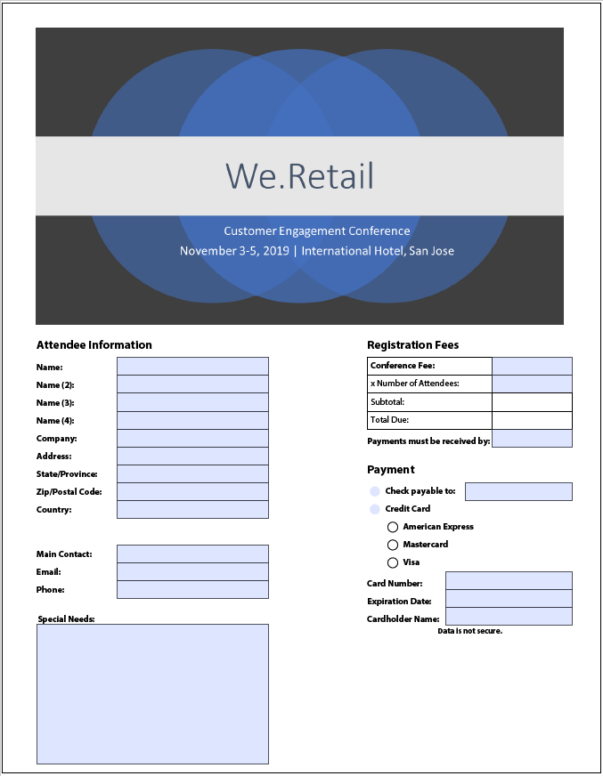
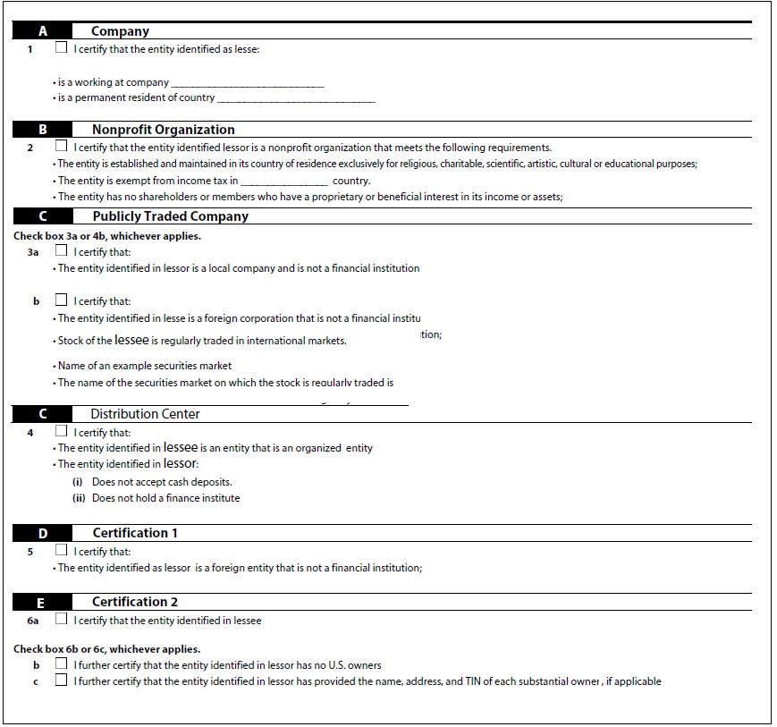

# Aanbevolen werkwijzen en bekende complexe patronen {#Best-practices-and-considerations2}

Dit document bevat richtlijnen en aanbevelingen waarmee u beheerders, auteurs en ontwikkelaars van formulieren kunt helpen bij het werken met [!DNL Automated Forms Conversion service] (AFCS). Hierin worden de beste werkwijzen besproken, van het voorbereiden van bronformulieren tot het corrigeren van complexe patronen die enige extra inspanning vereisen voor automatische conversie. Deze best practices leveren samen een bijdrage aan de algemene prestaties en uitvoer van de AFCS-bestanden ([!DNL Automated Forms Conversion service]).

## Aanbevolen procedures

De conversieservice converteert PDF forms die beschikbaar zijn op uw AEM [!DNL Forms] -exemplaar naar adaptieve formulieren. Met de onderstaande aanbevolen procedures kunt u de conversiesnelheid en nauwkeurigheid verbeteren. Bovendien helpen deze beste praktijken u tijd besparen die aan na omzettingsactiviteiten wordt doorgebracht.

### Voordat u de bron uploadt

U kunt alle PDF forms in één keer of op een gefaseerde manier uploaden, zoals vereist. Houd rekening met het volgende voordat u de formulieren uploadt:

* Houd het aantal formulieren in een map kleiner dan 15 en houd het totale aantal pagina&#39;s in een map kleiner dan 50.
* Houd de map kleiner dan 10 MB. Formulieren niet in een submap bewaren.
* Houd het aantal pagina&#39;s in een formulier kleiner dan 15.
* Indelen van brondocumenten in een batch van 8-15 documenten. Bronformulieren met algemene adaptieve formulierfragmenten in één batch bewaren.
* Upload de beveiligde formulieren niet. De service converteert formulieren die met een wachtwoord zijn beveiligd niet.
* Upload niet de [ Portfolio&#39;s van de PDF ](https://helpx.adobe.com/nl/acrobat/using/overview-pdf-portfolios.html). De service zet een PDF-Portfolio niet om in een adaptieve vorm.
* Upload geen bronformulieren met spaties in de bestandsnaam. Verwijder de ruimte uit de naam van het bestand voordat u de formulieren uploadt.
* U mag geen gescande, gevulde en formulieren uploaden in een andere taal dan Engels, Frans, Duits, Spaans, Italiaans en Portugees. Dergelijke formulieren worden niet ondersteund.

Wanneer u een XDP-formulier gebruikt voor conversie, voert u de volgende stappen uit voordat u de XDP-bronformulieren uploadt:

* Analyseer het XDP-formulier en los visuele problemen op. Zorg ervoor dat het brondocument de beoogde besturingselementen en structuren gebruikt. Het bronformulier kan bijvoorbeeld selectievakjes hebben in plaats van keuzerondjes voor één selectie. Schakel selectievakjes in op keuzerondjes om een adaptief formulier met de gewenste onderdelen te maken.
* [ voegt bindingen aan de vorm XDP ](http://www.adobe.com/go/learn_aemforms_designer_65) toe alvorens de omzetting te beginnen. Wanneer bindingen beschikbaar zijn in het XDP-bronformulier, past de service tijdens de conversie automatisch bindingen toe op de bijbehorende adaptieve formuliervelden. Hiermee bespaart u de tijd die nodig is om de bindingen handmatig toe te passen.
* [ voeg de markeringen van Adobe Sign ](https://helpx.adobe.com/sign/using/text-tag.html) aan het XDP dossier toe. De service converteert Adobe Sign-tags automatisch naar overeenkomende aangepaste formuliervelden. Adaptieve Forms ondersteunt een beperkt aantal Adobe Sign-velden. Voor de volledige lijst van gesteunde gebieden, zie [ Gebruikend Adobe Sign in een adaptieve vorm ](https://experienceleague.adobe.com/docs/experience-manager-65/forms/adaptive-forms-advanced-authoring/working-with-adobe-sign.html?lang=en) documentatie.
* Complexe tabellen in XDP-documenten indien mogelijk omzetten in eenvoudige tabellen. Een tabel met formuliervelden in tabelcellen, cellen met een oneven grootte, cellen met een rij- of kolombereik, samengevoegde cellen, gedeeltelijke randen of geen zichtbare rand wordt als een complexe tabel beschouwd. Een tabel met een van de bovenstaande items wordt als een complexe tabel beschouwd.
<!-- * Use sub-forms in XDP documents to create panels in adaptive forms. Service converts each sub-form to one or more adaptive form panels during conversion. -->

### Voordat u de conversie start

* Aangepaste formuliersjablonen maken. Sjablonen helpen u bij het opgeven van een uniforme structuur voor de vormen van uw organisatie of afdeling.
* Geef de kop- en voettekst op in de aangepaste formuliersjablonen. De service negeert de voettekst voor de koptekst van brondocumenten en gebruikt de voettekst voor de koptekst die is opgegeven in de adaptieve formuliersjabloon.
* Maak adaptieve formulierthema&#39;s. Thema&#39;s zorgen voor een uniforme vormgeving van uw organisatie of afdeling.
* Formuliergegevensmodel configureren voor opslaan en ophalen van een gegevensbron. Maak en configureer lees- en schrijfservices voor het formuliergegevensmodel.
* Maak adaptieve formulierfragmenten en configureer de service voor het gebruik van adaptieve formulierfragmenten.
* Gemeenschappelijke workflowmodellen voorbereiden voor de formulieren die automatisering van bedrijfsprocessen vereisen.
* Indien nodig Adobe Analytics configureren

## Leer complexe patronen

AEM [!DNL Forms Automated Conversion service] maakt gebruik van kunstmatige intelligentie en computerleeralgoritmen om de indeling en velden van het bronformulier te begrijpen. Elke computerleerservice leert voortdurend van brongegevens en produceert een verbeterde uitvoer bij elke klus. Deze diensten leren van ervaringen als mensen.

[!DNL Automated Forms Conversion service] wordt getraind op een groot aantal formulieren. Het identificeert gemakkelijk gebieden in een bronvorm en produceert adaptieve vormen. Er zijn echter enkele velden en stijlen in PDF forms die gemakkelijk zichtbaar zijn voor het oog, maar moeilijk te begrijpen zijn voor de service. De service kan verschillende veldtypen of deelvensters toewijzen aan bepaalde velden of stijlen. Alle dergelijke veld- en stijlpatronen worden hieronder weergegeven.

De dienst zou beginnen correcte gebieden of panelen aan deze patronen te identificeren en toe te wijzen aangezien het het leren van de brongegevens houdt. Voor het tijd zijn, kunt u [ Overzicht gebruiken en ](review-correct-ui-edited.md) redacteur verbeteren om dergelijke kwesties te bevestigen. Alvorens de kwesties te beginnen bevestigen of verder te lezen, vertrouwt me met [ aanpassende vormcomponenten ](https://helpx.adobe.com/experience-manager/6-5/forms/using/introduction-forms-authoring.html).

### Algemene patronen {#general}

| Patroon | Voorbeeld |
|--- |--- |
| **de Dienst van het Patroon**   zet geen gevulde PDF forms in een adaptieve vorm om.   **Resolutie**   gebruiken lege adaptieve vormen. |  |
| **de Dienst van het Patroon**   kan er niet in slagen om tekst en gebieden in een dichte vorm te erkennen.   **Resolutie**   vergroot de breedte tussen tekst en gebieden van een dichte vorm alvorens de omzetting te beginnen. |  |
| **de 2} Dienst van het Patroon** {steunt gescande vormen niet.     **Resolutie**   gebruikt gescande vormen niet. |  |
| **de Dienst van het Patroon  ** Patroon haalt geen beelden en tekst binnen beelden.   **Resolutie**   voegt manueel beelden of tekst aan omgezette vormen toe. |  |
| **de Lijsten van het Patroon**   met gestippelde of niet duidelijke grenzen en grenzen zetten niet om.   **Resolutie**   de lijsten van het Gebruik met duidelijke expliciete grenzen en grenzen. ondersteund. |  |
| **Patroon**   de Aangepaste vormen steunen geen verticale tekst uit de doos. De service zet verticale tekst dus niet om in de bijbehorende adaptieve Forms-tekst.   **Resolutie**   Gebruik adaptieve vormredacteur om verticale tekst toe te voegen, indien vereist. |  |

### Keuzegroep  {#choice-group}

| Patroon | Resolutie |
|--- |--- |
| **de groepsopties van het Patroon**   Keuze met vormen buiten doos of cirkel worden niet omgezet in overeenkomstige adaptieve vormcomponenten.   **Resolutie**   de keuzeopties van de Verandering vormen aan doos of cirkel of gebruiksOverzicht en Juiste redacteur om de vormen te identificeren. |  |

### Formuliervelden {#form-fields}

| Patroon | Resolutie |
|--- |--- |
| **de Dienst van het Patroon**   identificeert geen gebieden zonder duidelijke grenzen.   **Resolutie**   het Overzicht en Juiste redacteur van het Gebruik om dergelijke gebieden te identificeren. |  |
| **de Dienst van het Patroon**   kan sommige gebieden van de keuzesegrootte met titels bij de bodem of de rechterkant van een vorm niet identificeren.   **Resolutie**   het Overzicht en Juiste redacteur van het Gebruik om dergelijke gebieden te identificeren |  |
| **de Dienst van het Patroon**   voegt of wijst een verkeerd type aan sommige vormgebieden toe die zeer dicht bij elkaar worden geplaatst of geen duidelijke grenzen hebben.   **Resolutie**   het Overzicht en Juiste redacteur van het Gebruik om dergelijke gebieden te identificeren. |  |
| **de Dienst van het Patroon**   kan er niet in slagen om gebieden met ver wegtitels of een gestippelde lijn tussen de titel en inputgebied te erkennen.   **Resolutie**   Gebruik vormgebieden met duidelijke grenzen of gebruik Overzicht en Juiste redacteur om dergelijke kwesties te bevestigen. |  |

### Lijsten {#lists}

| Patroon | Resolutie |
|--- |--- |
| **  Lijsten die van het Patroon** bevatten worden de lijsten samengevoegd of niet omgezet in overeenkomstige adaptieve vormcomponenten   **Resolutie**   van het Gebruik vormgebieden met duidelijke grenzen of gebruikOverzicht en Juiste redacteur om dergelijke kwesties te bevestigen. |  bevatten |
| **de Dienst van het Patroon**   kan een paar genestelde lijsten   **niet geïdentificeerde Resolutie** verlaten   het Overzicht en Juiste redacteur van het Gebruik om dergelijke kwesties te bevestigen. |  bevatten |
| **de Dienst van het Patroon**   voegt sommige lijsten samen die keuzesegroepen met elkaar   **Resolutie** bevatten   het Overzicht en Juiste redacteur van het Gebruik om dergelijke kwesties te bevestigen. |  bevatten |

<!--
Comment Type: draft

<h3>Choice groups</h3>
-->

<!--
Comment Type: draft

<ul>
<li>Lists with form fields, nested lists, and nested choice groups are not supported.</li>
<li>Form fields with captions at bottom or right are not supported.</li>
<li>Form fields without borders are not supported.</li>
<li>Hidden form fields are not supported.</li>
<li>Button in PDF forms are not converted to adaptive form buttons.  </li>
<li>Tables with clear explicit boundaries and borders are supported.</li>
<li>Fields with far away captions are not supported.  </li>
<li>Choice groups with only box or circle shaped selectors are supported. </li>
</ul>
-->
