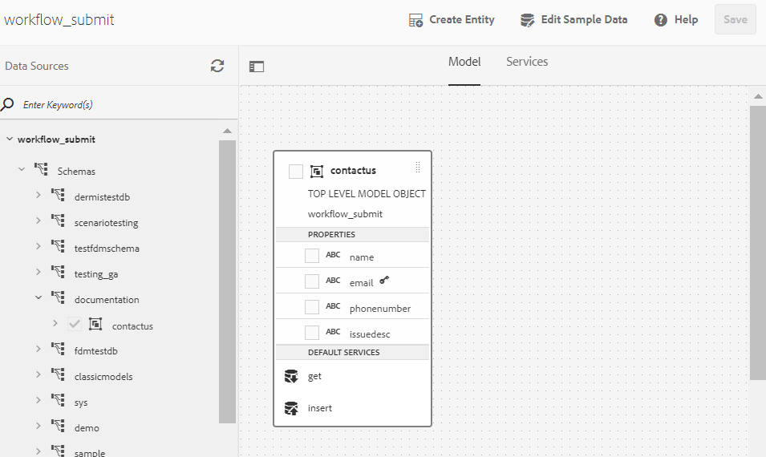

# Aangepast formulier integreren met database via AEM workflow {#submit-forms-to-database-using-forms-portal}

Met AFCS (automatede form conversion Service) kunt u een niet-interactief PDF-formulier, een Acro-formulier of een XFA-formulier converteren naar een adaptief formulier. Tijdens het starten van het conversieproces kunt u een adaptief formulier genereren, met of zonder gegevensbindingen.

Als u een adaptief formulier wilt genereren zonder gegevensbindingen, kunt u het geconverteerde adaptieve formulier na conversie integreren met een formuliergegevensmodel, XML-schema of JSON-schema. Voor het formuliergegevensmodel moet u adaptieve formuliervelden handmatig binden met het formuliergegevensmodel. Als u echter een adaptief formulier genereert met gegevensbindingen, koppelt de conversieservice de adaptieve formulieren automatisch aan een JSON-schema en wordt een gegevensbinding gemaakt tussen de velden die beschikbaar zijn in het adaptieve formulier en het JSON-schema. Vervolgens kunt u het aangepaste formulier integreren met een door u gewenste database, gegevens in het formulier invullen en naar de database verzenden. Op dezelfde manier kunt u, nadat u de integratie met de database hebt voltooid, velden in het geconverteerde adaptieve formulier configureren om waarden op te halen uit de database en aangepaste formuliervelden vooraf invullen.

In de volgende afbeelding ziet u de verschillende fasen van het integreren van een geconverteerd adaptief formulier in een database:


In dit artikel worden de stapsgewijze instructies beschreven om al deze integratiefasen met succes uit te voeren.

## Voorwaarden {#pre-requisites}

* Een AEM 6.4- of 6.5-auteurinstantie instellen
* Installeer [ recentste de dienstpak ](https://helpx.adobe.com/experience-manager/aem-releases-updates.html) voor uw AEM instantie
* Laatste versie van het AEM Forms-invoegpakket
* Vorm [ de dienst van de Automatede form conversion ](configure-service.md)
* Stel een database in. De database die wordt gebruikt in de voorbeeldimplementatie is MySQL 5.6.24. U kunt het geconverteerde adaptieve formulier echter integreren met elke gewenste database.

## Monster van adaptief formulier {#sample-adaptive-form}

Als u geconverteerde adaptieve formulieren met een AEM workflow wilt integreren in de database, downloadt u het volgende voorbeeldbestand voor de PDF.

U kunt het voorbeeld van het contactformulier downloaden met:

[Bestand ophalen](assets/sample_contact_us_form.pdf)

Het PDF-bestand fungeert als invoer voor de AFCS-service (Automatede form conversion Service). De service converteert dit bestand naar een adaptief formulier. De volgende afbeelding toont de voorbeeldcontactgegevens van een formulier in PDF-indeling.


## Het bestand mysql-connector-java-5.1.39-bin.jar installeren {#install-mysql-connector-java-file}

Voer de volgende stappen uit, op alle auteur- en publicatieinstanties, om het bestand mysql-connector-java-5.1.39-bin.jar te installeren:

1. Ga naar `http://server:port/system/console/depfinder` en zoek naar het pakket com.mysql.jdbc.
1. Controleer in de kolom Geëxporteerd door of het pakket wordt geëxporteerd door een willekeurige bundel. Ga door als het pakket niet door enige bundel wordt uitgevoerd.
1. Ga naar `http://server:port/system/console/bundles` en klik op **[!UICONTROL Install/Update]** .
1. Klik op **[!UICONTROL Choose File]** en blader naar het bestand mysql-connector-java-5.1.39-bin.jar en selecteer dit. Selecteer ook de selectievakjes **[!UICONTROL Start Bundle]** en **[!UICONTROL Refresh Packages]** .
1. Klik op **[!UICONTROL Install]** of **[!UICONTROL Update]** . Start de server opnieuw als de bewerking is voltooid.
1. (Alleen Windows) Schakel de systeemfirewall van uw besturingssysteem uit.

## Gegevens voorbereiden voor formuliermodel {#prepare-data-for-form-model}

Met AEM Forms Data Integration kunt u verschillende gegevensbronnen configureren en verbinden. Nadat u een adaptief formulier hebt gegenereerd met behulp van het conversieproces, kunt u het formuliermodel definiëren op basis van een formuliergegevensmodel, XSD of een JSON-schema. U kunt een database, Microsoft Dynamics of een andere service van derden gebruiken om een formuliergegevensmodel te maken.

Deze zelfstudie gebruikt de MySQL-database als bron voor het maken van een formuliergegevensmodel. Creeer een schema in het gegevensbestand en voeg **contactus** lijst aan het schema toe dat op de gebieden wordt gebaseerd die in de adaptieve vorm beschikbaar zijn.


U kunt de volgende verklaring gebruiken DDL om de **contactus** lijst in gegevensbestand tot stand te brengen.

```sql
CREATE TABLE `contactus` (
   `name` varchar(45) NOT NULL,
   `email` varchar(45) NOT NULL,
   `phonenumber` varchar(10) DEFAULT NULL,
   `issuedesc` varchar(1000) DEFAULT NULL,
   PRIMARY KEY (`email`)
 ) ENGINE=InnoDB DEFAULT CHARSET=utf8
```

## Verbinding tussen AEM instantie en database configureren {#configure-connection-between-aem-instance-and-database}

Voer de volgende configuratiestappen uit om een verbinding tussen AEM instantie en het gegevensbestand tot stand te brengen MYSQL:

1. Ga naar AEM webconsoleconfiguratiepagina op `http://server:port/system/console/configMgr` .
1. Zoek en klik om **[!UICONTROL Apache Sling Connection Pooled DataSource]** te openen in de bewerkingsmodus in de configuratie van de webconsole. Geef de waarden voor de eigenschappen op zoals in de volgende tabel wordt beschreven:

   <table> 
    <tbody> 
    <tr> 
    <th><strong>Eigenschap</strong></th> 
    <th><strong>Waarde</strong></th> 
    </tr> 
    <tr> 
    <td><p>Naam gegevensbron</p></td> 
    <td><p>Een gegevensbronnaam voor het filtreren bestuurders van de gegevensbronpool.</p></td>
    </tr>
    <tr> 
    <td><p>JDBC-stuurprogrammaklasse</p></td> 
    <td><p>com.mysql.jdbc.Driver</p></td>
    </tr>
    <tr> 
    <td><p>URI voor JDBC-verbinding</p></td> 
    <td><p>jdbc:mysql://[host]:[poort]/[schema_name]</p></td>
    </tr>
    <tr> 
    <td><p>Gebruikersnaam</p></td> 
    <td><p>Een gebruikersnaam om handelingen voor databasetabellen te verifiëren en uit te voeren</p></td>
    </tr>
    <tr> 
    <td><p>Wachtwoord</p></td> 
    <td><p>Aan de gebruikersnaam gekoppeld wachtwoord</p></td>
    </tr>
    <tr> 
    <td><p>Transactieisolatie</p></td> 
    <td><p>READ_COMTED</p></td>
    </tr>
    <tr> 
    <td><p>Max. actieve verbindingen</p></td> 
    <td><p>1000</p></td>
    </tr>
    <tr> 
    <td><p>Max. aantal inactieve verbindingen</p></td> 
    <td><p>100</p></td>
    </tr>
    <tr> 
    <td><p>Min. onbelaste verbindingen</p></td> 
    <td><p>10</p></td>
    </tr>
    <tr> 
    <td><p>Oorspronkelijke grootte</p></td> 
    <td><p>10</p></td>
    </tr>
    <tr> 
    <td><p>Max. wachttijd</p></td> 
    <td><p>100000</p></td>
    </tr>
     <tr> 
    <td><p>Testen op lenen</p></td> 
    <td><p>Ingeschakeld</p></td>
    </tr>
     <tr> 
    <td><p>Testen tijdens inactiviteit</p></td> 
    <td><p>Ingeschakeld</p></td>
    </tr>
     <tr> 
    <td><p>Validatiezoekopdracht</p></td> 
    <td><p>Voorbeelden zijn SELECT 1(mysql), select 1 vanuit dual (oracle), SELECT 1 (MS Sql Server) (validationQuery)</p></td>
    </tr>
     <tr> 
    <td><p>Time-out voor validatiezoekopdracht</p></td> 
    <td><p>10000</p></td>
    </tr>
    </tbody> 
    </table>

## Formuliergegevensmodel maken {#create-form-data-model}

Nadat u MYSQL als gegevensbron hebt geconfigureerd, voert u de volgende stappen uit om een formuliergegevensmodel te maken:

1. Navigeer in AEM auteurinstantie naar **[!UICONTROL Forms]** > **[!UICONTROL Data Integrations]** .

1. Tik op **[!UICONTROL Create]** > **[!UICONTROL Form Data Model]** .

1. In de **[!UICONTROL Create Form Data Model]** tovenaar, specificeer **workflow_submit** als naam voor het model van vormgegevens. Tik op **[!UICONTROL Next]** .

1. Selecteer de MYSQL-gegevensbron die u in de vorige sectie hebt geconfigureerd en tik op **[!UICONTROL Create]** .

1. Tik **[!UICONTROL Edit]** en breid de gegevensbron uit die in de linkerruit wordt vermeld om **contactus** lijst, **[!UICONTROL get]**, en **[!UICONTROL insert]** diensten te selecteren, en te tikken **[!UICONTROL Add Selected]**.

   

1. Selecteer het gegevensmodelobject in het rechterdeelvenster en tik op **[!UICONTROL Edit Properties]** . Selecteer **[!UICONTROL get]** en **[!UICONTROL insert]** in de vervolgkeuzelijsten **[!UICONTROL Read Service]** en **[!UICONTROL Write Service]** . Geef de argumenten voor de leesservice op en tik op **[!UICONTROL Done]** .

1. Selecteer op het tabblad **[!UICONTROL Services]** de service **[!UICONTROL get]** en tik op **[!UICONTROL Edit Properties]** . Selecteer de **[!UICONTROL Output Model Object]** , schakel de **[!UICONTROL Return array]** -toets uit en tik **[!UICONTROL Done]** .

1. Selecteer de service **[!UICONTROL Insert]** en tik op **[!UICONTROL Edit Properties]** . Selecteer **[!UICONTROL Input Model Object]** en tik **[!UICONTROL Done]**.

1. Tik op **[!UICONTROL Save]** om het formuliergegevensmodel op te slaan.

U kunt het model met voorbeeldformuliergegevens downloaden:

[Bestand ophalen](assets/DownloadedFormsPackage_1497728018502500.zip)

## Aangepaste formulieren genereren met JSON-binding {#generate-adaptive-forms-with-json-binding}

Gebruik de [ dienst van de Automatede form conversion (AFCS) om ](convert-existing-forms-to-adaptive-forms.md) de [ vorm van het Contact van Us ](#sample-adaptive-form) in een adaptieve vorm met gegevensband om te zetten. Zorg ervoor dat u het selectievakje **[!UICONTROL Generate adaptive form(s) without data bindings]** niet inschakelt tijdens het genereren van het adaptieve formulier.


Selecteer de omgezette **vorm van het Contact van het Contact** beschikbaar in de **[!UICONTROL output]** omslag in **[!UICONTROL Forms & Documents]** en tikken **[!UICONTROL Edit]**. Tik op **[!UICONTROL Preview]** en geef waarden op in de aangepaste formuliervelden. Tik vervolgens op **[!UICONTROL Submit]** .

Logon aan **crx-bewaarplaats** en navigeer aan */content/forms/fp/admin/submit/data* om de voorgelegde waarden in formaat te bekijken JSON. Het volgende is de steekproefgegevens in formaat JSON wanneer u het omgezette **Aangepaste vorm van het Contact van ons** voorlegt:

```json
{
  "afData": {
    "afUnboundData": {
      "data": {}
    },
    "afBoundData": {
      "data": {
        "name1": "Gloria",
        "email": "abc@xyz.com",
        "phone_number": "2346578965",
        "issue_description": "Test message"
      }
    },
    "afSubmissionInfo": {
      "computedMetaInfo": {},
      "stateOverrides": {},
      "signers": {},
      "afPath": "/content/dam/formsanddocuments/docs_conversion/output/sample_form_json",
      "afSubmissionTime": "20191204014007"
    }
  }
}
```

U moet nu een workflowmodel maken dat deze gegevens kan verwerken en verzenden naar de MYSQL-database met behulp van het formuliergegevensmodel dat u in de vorige secties hebt gemaakt.

## Een workflowmodel maken voor het verwerken van JSON-gegevens {#create-workflow-model}

Voer de volgende stappen uit om een workflowmodel te maken voor het verzenden van de adaptieve formuliergegevens naar de database:

1. Open de console Workflowmodellen. De standaard-URL is `https://server:port/libs/cq/workflow/admin/console/content/models.html/etc/workflow/models` .

1. Selecteer **[!UICONTROL Create]** en vervolgens **[!UICONTROL Create Model]** . Het dialoogvenster **[!UICONTROL Add Workflow Model]** wordt weergegeven.

1. Voer de opties **[!UICONTROL Title]** en **[!UICONTROL Name]** (optioneel) in. Bijvoorbeeld, **workflow_json_submit**. Tik op **[!UICONTROL Done]** om het model te maken.

1. Selecteer het workflowmodel en tik op **[!UICONTROL Edit]** om het model te openen in de bewerkingsmodus. Tik op + en voeg **[!UICONTROL Invoke Form Data Model Service]** -stap toe aan het workflowmodel.

1. Tik de **[!UICONTROL Invoke Form Data Model Service]** stap en de tikken .

1. Selecteer op het tabblad **[!UICONTROL Form Data Model]** het formuliergegevensmodel dat u in het **[!UICONTROL Form Data Model path]** -veld hebt gemaakt en selecteer **[!UICONTROL insert]** in de vervolgkeuzelijst **[!UICONTROL Service]** .

1. In het **[!UICONTROL Input for Service]** lusje, uitgezochte **[!UICONTROL Provide input data using literal, variable, or a workflow metadata, and a JSON file]** van de drop-down lijst, selecteert **[!UICONTROL Map input fields from input JSON]** checkbox, selecteert **[!UICONTROL Relative to payload]**, en verstrekt **data.xml** als waarde voor het **[!UICONTROL Select input JSON document using]** gebied.

1. Geef in de sectie **[!UICONTROL Service Arguments]** de volgende waarden op voor de argumenten van het formuliergegevensmodel:

    aan

   Bericht dat de modelgebieden van vormgegevens, bijvoorbeeld, contactus puntnaam, aan **afData.afBoundData.data.name1** in kaart wordt gebracht, die naar de JSON schemabindingen voor de voorgelegde adaptieve vorm verwijst.

## Aangepaste formulierverzending configureren {#configure-adaptive-form-submission}

Voer de volgende stappen uit om het aangepaste formulier te verzenden naar het workflowmodel dat u in de vorige sectie hebt gemaakt:

1. Selecteer het geconverteerde contactformulier dat beschikbaar is in de map **[!UICONTROL output]** in **[!UICONTROL Forms & Documents]** en tik op **[!UICONTROL Edit]** .

1. Open adaptieve vormeigenschappen door te tikken **[!UICONTROL Form Container]** en dan te tikken .

1. In de **[!UICONTROL Submission]** sectie, selecteer **[!UICONTROL Invoke an AEM workflow]** van de **[!UICONTROL Submit Action]** drop-down lijst, selecteer het werkschemamodel dat u in de vorige sectie creeerde, en specificeer **data.xml** op het **[!UICONTROL Data File Path]** gebied.

1. Tik  om de eigenschappen te bewaren.

1. Tik op **[!UICONTROL Preview]** en geef waarden op in de aangepaste formuliervelden. Tik vervolgens op **[!UICONTROL Submit]** . De voorgelegde waarden tonen nu in de MYSQL- gegevensbestandlijst in plaats van **crx-bewaarplaats**.

## Aangepast formulier configureren om waarden vooraf in te vullen vanuit de database

Voer de volgende stappen uit om adaptief formulier te configureren voor het vooraf invullen van waarden uit de MYSQL-database op basis van de primaire sleutel die in de tabel is gedefinieerd (in dit geval per e-mail):

1. Tik het **E-mail** gebied in de adaptieve vorm en tik  uit.

1. Tik **[!UICONTROL Create]** en selecteer **[!UICONTROL is changed]** in de vervolgkeuzelijst **[!UICONTROL Select State]** in de sectie **[!UICONTROL When]** .

1. In de **[!UICONTROL Then]** sectie, uitgezochte **[!UICONTROL Invoke Service]** en **krijgen** als dienst voor het model van vormgegevens dat u in een vorige sectie van dit artikel hebt gecreeerd.

1. Selecteer **E-mail** in de **[!UICONTROL Input]** sectie en de rest drie gebieden van het model van vormgegevens, **Naam**, **Aantal van de Telefoon**, en **Beschrijving van de Uitgave** in de **[!UICONTROL Output]** sectie. Tik op **[!UICONTROL Done]** om de instellingen op te slaan.

   

   Op basis van bestaande e-mailgegevens in de MYSQL-database kunt u daarom de waarden voor de overige drie velden vooraf invullen in de modus **[!UICONTROL Preview]** van het adaptieve formulier. Bijvoorbeeld, als u aya.tan@xyz.com op het **E-mail** gebied (dat op bestaande gegevens in [ wordt gebaseerd vormt het model van vormgegevens ](#prepare-data-for-form-model) sectie van dit artikel) en lusje uit het gebied specificeert, de rest drie gebieden, **Naam**, **Aantal van de Telefoon**, en **de vertoning van de Beschrijving van de Uitgave** automatisch in de adaptieve vorm.

U kunt het geconverteerde adaptieve voorbeeldformulier downloaden met:

[Bestand ophalen](assets/DownloadedFormsPackage_1498226829041200.zip)
