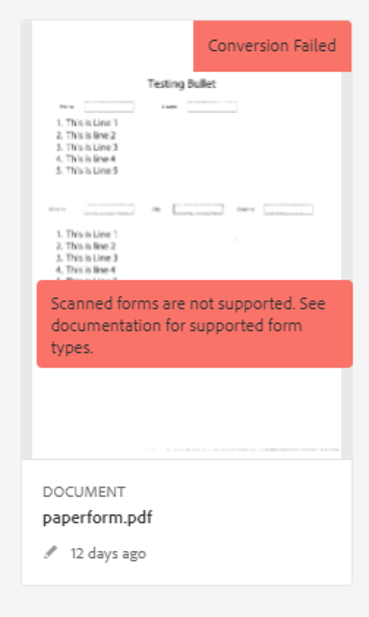

# Problemen oplossen voor de service voor automatische conversie van formulieren

Het document bevat basisstappen voor het oplossen van veelvoorkomende problemen.

<!--The article provides information on installation, configuration and administration issues that may arise in an Automated Forms Conversion Service production environment. -->

## Veelvoorkomende fouten {#commonerrors}

| Fout | Voorbeeld |
|--- |--- |
| **Foutbericht**   Koptekst van toegangstoken is niet beschikbaar.    **Reden**   Een beheerder heeft meerdere IMS-configuraties gemaakt of IMS-configuratie kan de AFCS-service op Adobe Cloud niet bereiken.   **Oplossing**   Als er meerdere configuraties zijn, verwijder dan alle configuraties en [maak een nieuwe configuratie aan](configure-service.md#obtainpubliccertificates).   Als er één configuratie is, gebruik dan **Statuscontrole** om [de verbinding te controleren](configure-service.md#createintegrationoption). |  |
| **Foutbericht**  Kan geen verbinding maken met de service.    **Reden**   Onjuiste service-URL of er wordt geen service-URL vermeld in de Cloud-services van de service voor de automatische conversie van formulieren.   **Oplossing**   Pas de [service-URL](configure-service.md#configure-the-cloud-service) aan in de Cloud-services van de service voor de automatische conversie van formulieren. |  |
| **Foutbericht**   De service kan het formulier niet converteren.    **Reden**   U heeft problemen met netwerkverbinding, de service is niet beschikbaar vanwege gepland onderhoud of u ziet een onderbreking op Adobe Cloud.   **Oplossing**   Los problemen met uw netwerkverbinding op en controleer de status van de service op https://status.adobe.com/ voor geplande of ongeplande onderbrekingen. |  |
| **Foutbericht**   Er zijn meer dan 15 pagina&#39;s.    **Reden**   Het bronformulier bestaat uit meer dan 15 pagina&#39;s.    **Oplossing**   Gebruik Adobe Acrobat om formulieren van meer dan 15 pagina&#39;s te splitsen. Zorg dat het aantal pagina&#39;s van een formulier minder dan 15 is. |  |
| **Foutbericht**   Er zijn meer dan 15 bestanden.    **Reden**    De map bevat meer dan 15 formulieren.   **Oplossing**   Zorg dat er 15 of minder formulieren in de map zitten. Zorg dat het totale aantal pagina&#39;s in een map minder dan 50 is. Zorg dat de map minder dan 10 MB groot is. Bewaar formulieren niet in submappen. Organiseer bronformulieren in een reeks van 8-15 formulieren. |  |
| **Foutbericht**   De indeling van het bronbestand wordt niet ondersteund.    **Reden**   De map met bronformulieren bevat niet-ondersteunde bestanden.   **Oplossing**   De service ondersteunt alleen .xdp- en .pdf-bestanden. Verwijder bestanden met een andere extensie uit de map en voer de conversie uit. |  |
| **Foutbericht**   Gescande formulieren worden niet ondersteund.    **Reden**   Het PDF-formulier bevat alleen gescande afbeeldingen van het formulier en bevat geen inhoudsstructuur.   **Oplossing**   De service biedt geen ondersteuning voor het converteren van gescande formulieren of een afbeelding van een formulier naar een adaptief standaardformulier. Met Adobe Acrobat kunt u de afbeelding van een formulier echter converteren naar een PDF-formulier. Gebruik vervolgens de service om het PDF-formulier naar een adaptief formulier te converteren. Zorg dat de afbeelding van het formulier altijd van hoge kwaliteit is als u het wilt converteren in Acrobat. Dit verbetert de kwaliteit van de conversie. |  |
| **Foutbericht**   Versleuteld PDF-formulier wordt niet ondersteund.    **Reden**  De map bevat versleutelde PDF-formulieren.   **Oplossing**   De service biedt geen ondersteuning voor het converteren van een versleuteld PDF-formulier naar een adaptief formulier. Verwijder de versleuteling, upload het niet-versleutelde formulier en voer de conversie uit. |  |
| **Foutbericht**   Kan meta-model JSON-schema niet parseren.    **Reden**   Het JSON-schema dat aan de service wordt geleverd is niet correct geformatteerd, bevat ongeldige tekens of gebruikt ongeldige syntaxis om componenten toe te wijzen.    **Oplossing**   Controleer de formattering van het JSON-bestand. U kunt elke online JSON-validatie gebruiken om de opmaak en structuur van het schema te controleren. Raadpleeg het artikel [Het standaard meta-model uitbreiden](extending-the-default-meta-model.md) voor meer informatie over meta-model-syntaxis. |  |
| **Fout (alleen in omgevingen op locatie)**   De **[!UICONTROL Source Language]** wordt niet de juiste taal van een adaptief formulier weergegeven.   **Reden**   De eigenschap jcr:language van het adaptieve formulier wordt niet correct ingesteld.    **Resolutie**   CRX-DE-lijst openen, navigeren naar `/content/forms/af/`, opent u de `jcr:content` en stel de waarde van het knooppunt in op de juiste taal. Voor de lijst met ondersteunde talen raadpleegt u [Ondersteuning voor lokalisatie toevoegen voor niet-ondersteunde landinstellingen](https://experienceleague.adobe.com/docs/experience-manager-65/forms/manage-administer-aem-forms/supporting-new-language-localization.html#add-localization-support-for-non-supported-locales). |  |

<!--

<table>
<thead>
<tr>
<th>Error</th>
<th>Example</th>
</tr>
</thead>
<tbody>
<tr>
<td><strong>Error Message</strong> 
 The access token header is not available. 
 <strong>Reason</strong>   An administrator has created multiple IMS configurations or IMS configuration is not able to reach AFCS service on Adobe Cloud.   <strong>Resolution</strong>   If there are multiple configurations, delete all the configurations and <a href="configure-service.md#obtainpubliccertificates">create a new configuration</a>.   If there is a single configuration, use <strong> Health Check </strong> to <a href="configure-service.md#createintegrationoption">check connectivity</a>.</td>
<td></td>
</tr>
<tr>
<td><strong>Error Message</strong>   Unable to connect to the service.    <strong>Reason</strong>   Incorrect service URL or no service URL is mentioned in Automated Forms Conversion Service cloud services.   <strong>Resolution</strong>   Correct <a href="configure-service.md#configure-the-cloud-service">Service URL</a> in Automated Forms Conversion Service Cloud services.</td>
<td></td>
</tr>
<tr>
<td><strong>Error Message</strong>   The service failed to convert the form.    <strong>Reason</strong>   Network connectivity issues at your end, the service is down due to scheduled maintenance, or outage on Adobe Cloud.   <strong>Resolution</strong>   Resolve network connectivity issues at your end and check the status of the service on <a href="https://status.adobe.com/">https://status.adobe.com/</a> for a planned or unplanned outage.</td>
<td></td>
</tr>
<tr>
<td><strong>Error Message</strong>   The number of pages is more than 15.    <strong>Reason</strong>   The source form is more than 15 pages long.    <strong>Resolution</strong>   Use Adobe Acrobat to split forms with more than 15 pages. Bring the number of pages in a form to less than 15.</td>
<td></td>
</tr>
<tr>
<td><strong>Error Message</strong>   The number of files is more than 15.    <strong>Reason</strong>    The folder contains more than 15 forms.   <strong>Resolution</strong>   Bring the number of forms in a folder to less than or equal to 15. Bring the total number of pages in a folder less than 50. Bring the size of the folder to less than 10 MB. Do not keep forms in a sub-folder. Organize source forms into a batch of 8-15 forms.</td>
<td></td>
</tr>
<tr>
<td><strong>Error Message</strong>   The source file format is not supported.    <strong>Reason</strong>   The folder containing source forms have some unsupported files.   <strong>Resolution</strong>   The service supports only .xdp and .pdf files. Remove files with any other extension from the folder and run the conversion.</td>
<td></td>
</tr>
<tr>
<td><strong>Error Message</strong>   Scanned forms are not supported.    <strong>Reason</strong>   The PDF form contains only scanned images of the form and contains no content structure.   <strong>Resolution</strong>   The service does not support converting scanned forms or an image of a form to an adaptive out-of-the-box. However, you use Adobe Acrobat to convert the image of a form to a PDF Form. Then, use the service to convert the PDF Form to an adaptive form. Always use a high-quality image of the form for conversion in Acrobat. It improves the quality of the conversion.</td>
<td></td>
</tr>
<tr>
<td><strong>Error Message</strong>   Encrypted PDF form is not supported.    <strong>Reason</strong>   The folder contains encrypted PDF forms.   <strong>Resolution</strong>   The service does not support converting an encrypted PDF form to an adaptive form. Remove the encryption, upload the non-encrypted form, and run the conversion.</td>
<td></td>
</tr>
<tr>
<td><strong>Error Message</strong>   Unable to parse meta-model JSON schema.    <strong>Reason</strong>   The JSON schema supplied to the service is not properly formatted, contains invalid characters, or uses invalid syntax to map components.    <strong>Resolution</strong>   Check the formatting of the JSON file. You can use any online JSON validator to check the formatting and structure of the schema. See, <a href="extending-the-default-meta-model.md">Extend the default meta-model</a> article for information on meta-model syntax.</td>
<td></td>
</tr>
</tbody>
</table>
-->
